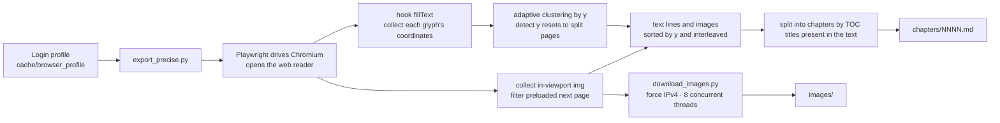
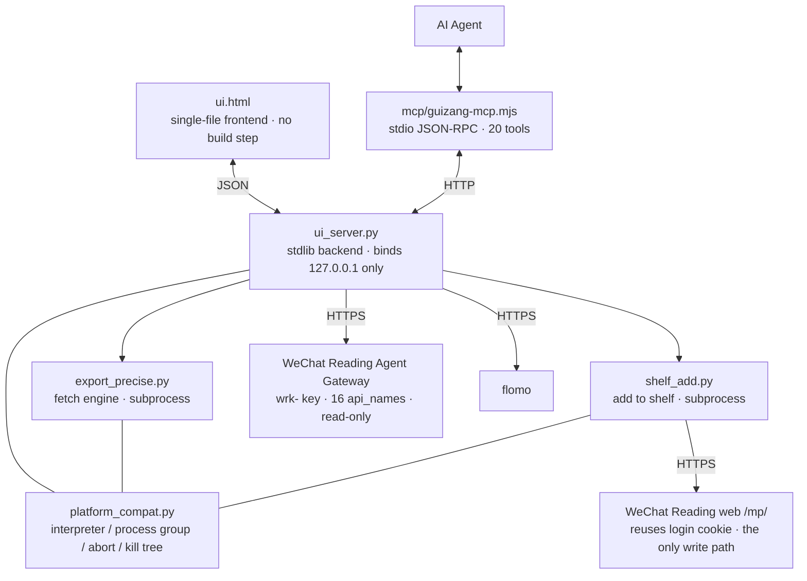

[中文](README.md) | **English** | [日本語](README.ja.md)

# Guizang · weread-guizang

Export WeChat Reading data to your local machine: whole-book export to Markdown, a local multi-format reader, shelf and note management, and an MCP adapter for AI agents. Everything runs locally; the server binds to `127.0.0.1` only.

## Problem

WeChat Reading exposes its reading data through an Agent Gateway — a skill interface that provides shelf, store search, book detail, highlights, thoughts, reading stats and recommendations via a `skill_version` and a set of `api_name` endpoints, authenticated with a key of the form `wrk-…`. It has two constraints:

- **Read-only.** The whitelist contains no write endpoint, so you cannot add a book or modify the shelf.
- **Agent-only.** There is no user-facing interface.

As a result, you cannot obtain the full text of a book, and you cannot use this data without writing code.

## Solution

Guizang reconstructs that gateway as a usable local tool and fills the gaps it leaves:

- For data the official gateway exposes, it provides a local web UI: shelf, store search, book detail, reading stats, recommendations, and all highlights and thoughts.
- For what the gateway omits — full-text export, image download, adding books to the shelf — it reuses your logged-in session to call the web endpoints directly.
- For agents, it ships a zero-dependency MCP adapter (20 tools) alongside the UI.

All three capabilities run locally. The server binds to `127.0.0.1` and never contacts a third-party server.

## Features

- **Whole-book export to Markdown**: text and illustrations interleaved in reading order, images downloaded with 8 concurrent threads, written chapter by chapter, resumable.
- **Local multi-format reader**: read exported books in the UI with left/right panes, a table of contents that highlights on scroll, and keyboard chapter navigation; imported EPUB / TXT / PDF files use the same interface.
- **Ask the AI from a selection while reading**: select a passage in the text and a small bar pops up with "copy / translate to Chinese / ask the assistant", so you can hand that sentence straight to the in-reader agent. Requires your own AI model API key, set in the settings.
- **Foreign-language reading support**: long-select any passage to translate it to Chinese or copy the original; single-click an English word to get a pop-up with its meaning and usage (click-to-look-up is English-only; other languages use long-select).
- **Dual-source reading time**: WeChat Reading time and local (Guizang) time are tracked separately and merged into a single unified total, shown side by side so you can see how the parts combine.
- **Standalone local shelf**: displayed separately from the WeChat Reading shelf, listing both exported and imported books; locate any book's file in one click, and import your own Markdown / TXT / EPUB / PDF.
- **EPUB / PDF export**: convert exported books to general e-book formats; EPUB preserves illustrations and chapter structure.
- **WebDAV / OneDrive cloud sync**: sync reading time, reading records, and book files to your own cloud drive (Jianguoyun, Nextcloud, OneDrive, and other WebDAV services); the three categories can be toggled separately, and credentials stay on your machine.
- **In-app AI agent assistant**: call it from a bubble in the lower-right corner; ask from a selection without copy-pasting.
- **View data without opening WeChat Reading**: store search, book summaries, author and publisher, category, reading progress and last-read time are all shown locally.
- **Search and fetch in one step**: search results convert directly into export tasks; all highlights are indexed for full-text search.
- **Highlight review and Anki export**: draw random cards from all highlights; export highlights to `.apkg`.
- **MCP integration**: 20 tools; fetching is a long task that does not block the call, and the adapter starts the server if it is not running.
- **Highlight migration to flomo**: forward selected highlights in bulk, with the original text wrapped in 「」 and annotated with book title and tags.
- **Bundled skills**: the in-repo [`skills/`](skills/) install directly; the UI provides a "one-click MCP setup" that copies the integration prompt to your agent.

## Requirements

- Python 3.10+ (3.9+ when using the packaged macOS app)
- Node (required only for the MCP adapter; `node -v` must print a version)
- A valid WeChat Reading account with access to the target books (unlimited plan or purchased)

## Installation

### Option 1: Download the macOS app

[**Download Guizang-0.9.6.dmg**](安装包/归藏-0.9.6.dmg) (about 2 MB; requires macOS 13 or later; supports Intel and Apple silicon)

1. Double-click the dmg and drag **归藏.app** into Applications.
2. On first launch, if you see **"归藏" is damaged and can't be opened. You should move it to the Trash.**, this is macOS blocking an unsigned app, not a corrupted file. Run:

   ```bash
   xattr -dr com.apple.quarantine /Applications/归藏.app
   ```

   Adjust the path if installed elsewhere; prepend `sudo` if you get `Operation not permitted`. Alternatively, open **System Settings → Privacy & Security → Security**, find the blocked item, and click **Open Anyway**.

3. The first screen is a setup page. Click 「我思故我在」 to initialize: create a virtual environment, install dependencies, and download Chromium (about 370 MB; internet access required). If you use a proxy, enable "system proxy" in your proxy client and the app will inherit it. A browser then opens for QR-code login. After that, every launch goes straight to the UI.

   Python 3.9+ must be installed; get it from <https://www.python.org/downloads/>. No restart is needed after installation. The package also includes a read-me file. See [部署说明.md](部署说明.md) for details and alternatives.

### Option 2: Run from source

#### macOS / Linux

```bash
git clone https://github.com/KEQingFeng/weread-guizang.git
cd weread-guizang
python3 -m venv .venv
.venv/bin/pip install -r requirements.txt
.venv/bin/python -m playwright install chromium     # about 368 MB
.venv/bin/python ui_server.py --port 8770
```

You can also double-click `启动归藏.command`: it detects the directory, creates the virtual environment and installs dependencies if missing, and opens the UI if the server is already running.

To build a double-clickable macOS app:

```bash
./shell/build_macos.sh          # produces dist/归藏.app
```

Drag `dist/归藏.app` into Applications. The shell is a native Swift + WKWebView app; the UI still uses `ui.html` unchanged. The first launch shows the setup page with the same initialization and QR-code flow. Building requires only CommandLineTools, not full Xcode.

Files the app needs at runtime (virtual environment, caches, login state) are stored in `~/Library/Application Support/归藏/`, so the app bundle stays read-only and can be moved anywhere. Exported books and imported books are stored under `~/Documents/归藏/` (created automatically on install).

To build a dmg for distribution:

```bash
./shell/make_dmg.sh             # produces ~/Desktop/归藏-<version>.dmg
```

#### Windows

```bat
git clone https://github.com/KEQingFeng/weread-guizang.git
cd weread-guizang
py -3 -m venv .venv
.venv\Scripts\python.exe -m pip install -r requirements.txt
.venv\Scripts\python.exe -m playwright install chromium
.venv\Scripts\python.exe ui_server.py --port 8770
```

You can also double-click `启动归藏.bat`, which runs the four steps above.

Then open <http://127.0.0.1:8770>.

### First run

1. Gear icon (top-left) → **Connect account** → scan the QR code with WeChat in the browser window that opens. The session persists in `cache/browser_profile/` and is reused afterwards.
2. Enter the **API Key**: in WeChat Reading web, go to Settings → Open API, and copy the key of the form `wrk-…` into the field and save. The key is stored locally in `cache/config.json` (mode 600); the UI shows only the last 4 characters. The shelf, notes, stats, recommendations, store search and book detail all depend on it. Without it, only locally exported books are listed.
3. To import highlights into flomo, fill in the **flomo** field (flomo web → Settings → API, of the form `https://flomoapp.com/iwh/xxxx/`). flomo PRO is required.
4. To use **translate-a-selection / click-a-word lookup / ask-the-assistant** while reading, fill in the **AI assistant** section in the settings: an OpenAI-compatible endpoint (address up to `/v1`), key, and model name. The address and key stay on your machine and the UI only shows whether they are set; selected text is sent to that endpoint only when you ask.

## Command line

The following commands work without starting the UI.

```bash
# macOS / Linux
.venv/bin/python export_precise.py <book URL or ID>       # the URL form extracts the ID automatically
.venv/bin/python export_precise.py <ID> --headed          # show the page-turning process
EXPORT_DEBUG=1 .venv/bin/python export_precise.py <ID>    # dump the Python stack every 60s when stuck

# Windows
.venv\Scripts\python.exe export_precise.py <book URL or ID>
.venv\Scripts\python.exe export_precise.py <ID> --headed
set EXPORT_DEBUG=1 && .venv\Scripts\python.exe export_precise.py <ID>
```

Login and shelf-adding can also run standalone: `login.py` (login and login-state detection), `shelf_add.py <store id>`.

## AI agent integration (MCP)

The repo ships a zero-dependency Node adapter (`mcp/guizang-mcp.mjs`, stdio + JSON-RPC 2.0). Add an entry to your MCP configuration, replacing the path with your Guizang directory:

```json
"guizang": {
  "type": "stdio",
  "command": "node",
  "args": ["<guizang dir>/mcp/guizang-mcp.mjs"],
  "timeout": 180000,
  "env": { "GUIZANG_REPO": "<guizang dir>" }
}
```

For Qoder CN, write it under `mcpServers`; for ZCode, under `mcp.servers` in `config.json`. Restart the agent after configuring (MCP loads at startup and does not hot-reload).

The adapter locates the project directory in this order: the `GUIZANG_REPO` environment variable → inferring from "this file lives under the project's `mcp/`" → common-path fallback. It selects the interpreter per platform (`.venv\Scripts\python.exe` on Windows, `.venv/bin/python` on macOS / Linux) and falls back to the system `python`. It starts the server if it is not running.

**20 tools**, in four groups:

| Group | Tools |
| --- | --- |
| Shelf and status | `shelf_list`, `app_status`, `task_log`, `book_files`, `folder_create`, `book_move` |
| Fetching | `book_fetch`, `task_stop`, `batch_fetch`, `account_connect` |
| Books and notes | `book_detail`, `search_books`, `notes_index`, `notes_search`, `notes_random`, `book_mark`, `shelf_add` |
| Export | `apkg_export`, `zip_export`, `cache_delete` |

Two constraints are written into the adapter's tool descriptions and are visible to the agent:

- Fetching is a minute-to-hour long task. `book_fetch` / `batch_fetch` return immediately; poll progress with `app_status` / `task_log`. Do not wait for completion inside a tool call, or it will time out.
- `shelf_add` is the only write operation and modifies your real WeChat Reading shelf. `cache_delete` lists by default and deletes only with `confirm=true`.

## Bundled skills

The [`skills/`](skills/) directory contains skills for reading and studying. Copy the relevant folder into your skills directory (Qoder CN uses `~/.qoder-cn/skills/`; other platforms use their own):

| Skill | Purpose |
| --- | --- |
| [`skills/guizang/`](skills/guizang/) | Connects Guizang as a reading assistant: check status first, issue long tasks once and poll, and perform only the explicitly requested write; includes the full action sequence for find → fetch → search highlights → draw cards → export Anki, plus troubleshooting guidance |
| [`skills/book-speedrun/`](skills/book-speedrun/) | Explains a whole book in one pass: lead-in map → core lecture → full walkthrough → one-page recap and tiered action list, each part ending with an immediately executable action. Includes a complete worked example |

Division of labor: for **content** (explain a book thoroughly, ready to use after reading), use `book-speedrun`; for **data** (bring a book local, search your highlights, export Anki), use `guizang`. The two compose: fetch with Guizang, then explain with `book-speedrun`.

> `grace-coach`, `learn-from-materials` and `learn-anything-skill`, mentioned in `book-speedrun`, are other skills in the same ecosystem, **not in this repository**, and are referenced only to delineate responsibilities.

The UI's "**one-click MCP setup**" copies the integration prompt to the clipboard; paste it to your agent. The prompt contains no local paths, usernames or ports, so it can be shared directly.

## Output layout

Books are stored under `~/Documents/归藏/`. Books fetched from WeChat Reading are named by book id; imported books are named `imp_<name fragment>_<random string>`. Both share the same structure, so the reader, EPUB/PDF export and file-locating features treat them identically.

```
~/Documents/归藏/
├── <book-id>/                # fetched from WeChat Reading
│   ├── chapters/NNNN.md      # chapter text, text and images interleaved
│   ├── images/               # illustrations chXXXX_imgNN.jpg
│   ├── raw/NNNN.json         # image URLs and word counts per chapter
│   ├── _catalog.json         # table-of-contents titles (used to detect end of book)
│   ├── _progress.json        # fetch progress (source of the UI progress bar)
│   └── meta.json             # title/author/export completed
├── imp_<name>_<str>/         # imported books (MD / TXT / EPUB / PDF), same structure
│   └── meta.json             # adds source:"local" and format fields
├── <title>.md                # merged file (image paths are relative; copying it alone breaks images)
└── <title>.apkg              # Anki deck (highlight export)
```

Images in the merged `.md` file are relative `images/…` paths; copying the file alone breaks them. The "complete package" ZIP in the UI flattens text and images together.

Open the merged `.md` in Typora / Obsidian to read a complete illustrated book.

## How it works





Key decisions in the fetch engine and their reasons:

- **Chapter splitting uses the table-of-contents titles actually drawn in the text**, not the header bar. The header changes on every page turn; early versions therefore piled an entire batch under one title and left the remaining sections empty. Each TOC title appears exactly once, which deduplicates naturally.
- **Page turns use the arrow keys only, never a click on the body center.** The click triggers WeChat Reading's "return to last reading position", and jumping to the beginning from the TOC does not update the reading record, so "click → settle → jump back" never converges; the symptom was that the first several chapters were lost entirely.
- **Every page turn has a hard timeout.** Playwright's `page.evaluate` has no default timeout, so a frozen renderer process hangs the call forever; `asyncio.wait_for` does not help against calls that ignore cancellation, so the engine uses `asyncio.wait` to return on timeout and then kills the browser to reclaim the connection.
- **Image downloads force IPv4.** On macOS, urllib tries IPv6 first; when the route is unavailable, every image stalls for about 120 seconds.

## Changelog

**0.9.6**

- Ask the AI from a selection while reading: select a passage and a bar pops up with "copy / translate to Chinese / ask the assistant", handing that sentence directly to the in-reader agent.
- Foreign-language reading support: long-select to copy or translate to Chinese; single-click an English word for a pop-up definition (other languages use long-select).
- Dual-source reading time: WeChat Reading and local time are counted separately and merged into one unified total, with the sources shown side by side.
- Cloud sync: added WebDAV and OneDrive, each able to sync reading time / reading records / book files independently; credentials stay on your machine.
- Further reader UI polish: smoother page turns, selection and pop-up animations.
- Stability fixes: race conditions and lost updates when writing local ledgers concurrently, and connections dropped by malformed request bodies (stress suite: 48/48 passing).

**0.9.3**

- Added a multi-format built-in reader: native Markdown reading, plus imported EPUB / TXT / PDF, with a table of contents that highlights on scroll, keyboard chapter navigation, and left/right panes.
- Added a standalone local shelf: displayed separately from WeChat Reading, listing existing local books (including imported ones); one-click locate-file, and import of Markdown / TXT / EPUB / PDF.
- Added EPUB / PDF export: exported books convert to general e-book formats; EPUB preserves illustrations and chapter structure.
- Added an app folder: `~/Documents/归藏` is created automatically on install, and exported books are stored there.
- Upgraded reader interaction: smoother chapter navigation, scrolling and hover feedback.
- Refined the Markdown reading experience: pane switching, font size and line spacing.

**0.9.2 and earlier**

- Built-in Markdown reader (0.9.2): read exported books directly in the UI.
- In-app AI agent assistant (0.9.1): call it from the lower-right bubble.
- Visual and motion system, modal settings, and other UI refinements.

## Troubleshooting

**Clicking "Connect account" or another button does nothing.**
Check the window that started the server; it prints the actual "interpreter" and "browser" paths, which are the starting point for diagnosis. On a real error, the backend does not drop the connection; it writes the exception and the last few stack lines to the "progress" panel in the UI, and the page shows the error in red.

**Adding a book to the shelf fails with "login timeout".**
The web `/mp/` endpoints validate two cookies: `wr_vid` (long-term identity) and `wr_skey` (roughly 30-day session). When `wr_skey` expires, the server returns **HTTP 200** with a body of `{"errcode":-2012,"errmsg":"登录超时"}`. Open any WeChat Reading page with the same profile and the server reissues `wr_skey`; the script also renews once and retries. Copy the server's `errmsg` verbatim; do not guess what a code means.

**Fetching stops responding midway.**
Each page turn has a 45-second hard timeout; on timeout the browser is reopened and fetching resumes, so the whole run is not lost. Set `EXPORT_DEBUG=1` to dump the Python stack every 60 seconds, and the log has a heartbeat every 10 pages. A pause of tens of seconds during a session switch is expected behavior (12 pages without new content, then the browser is reopened).

**Fewer chapters exported than the table of contents.**
Text extraction depends on hooking Canvas, and the reader reuses already-drawn cache, so a full-book fetch is not guaranteed to be 100%. The engine splits by TOC titles and supports resumption; running it again usually fills the gaps.

**The shelf is empty.**
The API Key is not filled in. Once set, the shelf, notes, stats and recommendations appear; without it, locally exported books are still listed.

**The project does not appear in search engines.**
The repository is named `weread-guizang`; the project is called 归藏 (Guizang).

## Known limitations

- A valid WeChat Reading account is required, with access to the target books (unlimited plan or purchased).
- Some publishers restrict web reading (showing "read in the app"); such books cannot be exported.
- Fetching is not guaranteed to be 100%: the reader reuses already-drawn cache, so some pages genuinely do not trigger `fillText`, and chapter assignment can differ slightly between two exports (different drawing batches), though the total amount of text is stable.
- In image-gallery-only chapters with dense images, a caption and its image occasionally end up off by one; in body chapters, an image's position relative to paragraphs is accurate.
- Export speed is about 1.1 seconds per page (A/B test on the same 14-page book: fixed 2.12s/page → 1.08s/page as-soon-as-drawn, with per-page text identical 14/14). Compressing further means shortening the "wait for this screen to finish drawing" check, which starts dropping characters.
- Per-character Canvas extraction still drops a few characters across line breaks (e.g. `multi-agent` truncated to `ulti`).
- The official gateway does not expose a "book list" endpoint, so the panel has no book lists; the closest is "recommendations".
- The flomo request format has no official example; here it sends JSON by convention and falls back to form encoding on failure. **Real delivery is not verified** (no usable webhook token for end-to-end testing).
- Translate-a-selection / word lookup / ask-the-assistant rely on the OpenAI-compatible endpoint you configure yourself; this parses the common `/chat/completions` response shape and has **not been tested against each vendor individually**, so unusual response formats may fail.
- Cloud sync is implemented against the public WebDAV and Microsoft Graph APIs and has **not been verified end-to-end with a real cloud account**; for a first sync, try one small book before syncing everything.
- Cross-platform: the Windows branch runs in unit tests with a mocked platform flag, but has **not been verified end-to-end on a real Windows machine**.

## Source and license

The fetch engine (`export_precise.py`, `download_images.py`) comes from [lbq110/weread-exporter](https://github.com/lbq110/weread-exporter) and has been further developed on top of it.

**The upstream repository declares no open-source license.** Therefore no authorization decision is made for upstream here: the copyright and license status of those files are governed by upstream, and you should confirm with upstream before redistributing or using them commercially.

The parts added by Guizang — `ui_server.py`, `ui.html`, `mcp/guizang-mcp.mjs`, `platform_compat.py`, `shelf_add.py`, `login.py`, `skills/`, `tools/`, the launcher scripts and the documentation — are used under **MIT**.

The repository root **deliberately has no `LICENSE` file**: a root LICENSE would cover the entire repository, and the license of the upstream code is not decided here. Once upstream grants a clear license, an appropriate one can be added.

## Disclaimer

For personal study and research, and for backing up content **you have purchased**. Do not redistribute exported content or use it commercially; respect copyright and the platform's terms of service. The tool binds only to the loopback address and never sends your account, key or book content to any third-party server.
