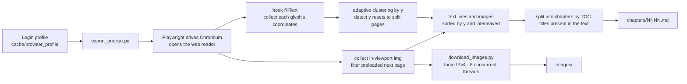
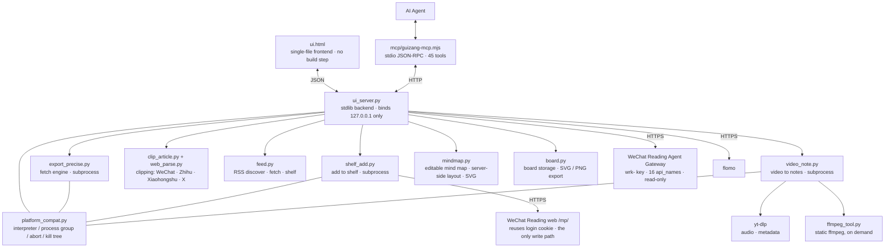

[中文](README.md) | **English** | [日本語](README.ja.md)

# Guizang · weread-guizang

Export WeChat Reading data to your local machine, and pull outside content (WeChat Official Account articles, Zhihu / Xiaohongshu / X posts, RSS feeds, videos) into the same local shelf: whole-book export to Markdown, a local multi-format reader, shelf and note management, and an MCP adapter for AI agents. Everything runs locally; the server binds to `127.0.0.1` only.

## Problem

WeChat Reading exposes its reading data through an Agent Gateway — a skill interface that provides shelf, store search, book detail, highlights, thoughts, reading stats and recommendations via a `skill_version` and a set of `api_name` endpoints, authenticated with a key of the form `wrk-…`. It has two constraints:

- **Read-only.** The whitelist contains no write endpoint, so you cannot add a book or modify the shelf.
- **Agent-only.** There is no user-facing interface.

As a result, you cannot obtain the full text of a book, and you cannot use this data without writing code.

## Solution

Guizang reconstructs that gateway as a usable local tool and fills the gaps it leaves:

- For data the official gateway exposes, it provides a local web UI: shelf, store search, book detail, reading stats, recommendations, and all highlights and thoughts.
- For what the gateway omits — full-text export, image download, adding books to the shelf — it reuses your logged-in session to call the web endpoints directly.
- For agents, it ships a zero-dependency MCP adapter (45 tools) alongside the UI.

All three capabilities run locally. The server binds to `127.0.0.1` and never contacts a third-party server.

## Features

- **Whole-book export to Markdown**: text and illustrations interleaved in reading order, images downloaded with 8 concurrent threads, written chapter by chapter, resumable.
- **Local multi-format reader**: read exported books in the UI with left/right panes, a table of contents that highlights on scroll, and keyboard chapter navigation; an in-chapter outline (press O) lists the headings of the current chapter and jumps to the one you pick; reopening a book returns to the exact line you stopped at, not just the chapter; imported EPUB / TXT / PDF files use the same interface.
- **Ask the AI from a selection while reading**: select a passage in the text and a small bar pops up with "copy / translate to Chinese / ask the assistant", so you can hand that sentence straight to the in-reader agent. Requires your own AI model API key, set in the settings.
- **Foreign-language reading support**: long-select any passage to translate it to Chinese or copy the original; single-click an English word to get a pop-up with its meaning and usage (click-to-look-up is English-only; other languages use long-select).
- **Dual-source reading time**: WeChat Reading time and local (Guizang) time are tracked separately and merged into a single unified total, shown side by side so you can see how the parts combine.
- **Standalone local shelf**: displayed separately from the WeChat Reading shelf, listing both exported and imported books; locate any book's file in one click, and import your own Markdown / TXT / EPUB / PDF.
- **Article clipping**: paste a WeChat Official Account article link and its main text is parsed into the shelf as a book. Clipped articles run through the same chapter splitting and table of contents as fetched books, so EPUB / PDF export, locating the file and every reader interaction work on them too, and you can jump back to the original link after reading. Beyond WeChat, **Zhihu / Xiaohongshu / X (Twitter)** each have a dedicated parser: X posts come through directly; Zhihu and Xiaohongshu need the site to let you in — when logged out they usually return a CAPTCHA page, and Guizang says so plainly instead of storing that page as an article.
- **RSS subscriptions**: a three-pane subscription reader, not a subscription list. Paste any URL or feed address (a site's home page is enough — Guizang picks the best feed out of `<link rel="alternate">` itself, and understands RSS / Atom / JSON Feed). The left pane manages the sources (groups, renaming, unsubscribing, refresh progress), the middle is the entry list (unread / all / this group / by tag, plus search, ticking a few to mark them read in a batch, clicking a tag chip to edit it), and the right pane reads the article body directly (fetched content is rendered as data, never executed as instructions). A long list gets a "load more", and the list's own polling patches only the rows that need to change — it will not drag the entry you are reading back to the top. A single entry can be pushed to the local shelf in one click: entries that carry full text go straight in, summary-only ones are refetched from the source, and the same entry is never added twice. OPML import and export for the whole set (export lays the text out for you first), and cleanup reports its counts before deleting anything, with an undo afterwards.
- **Video to notes**: paste a Bilibili / YouTube link and Guizang pulls the audio with yt-dlp, transcribes it with local Whisper (mlx-whisper / faster-whisper) or a cloud endpoint, has the AI shape it into notes and a mind map, and lands it on the local shelf as a book you then read and annotate like any other. For multi-part videos only the part you picked is transcribed, and the UI says which one. Audio lives in a temp directory and is deleted as soon as it is done. After transcription there is a **transcript workbench**: the segments listed one by one (240 to a screen, filterable by keyword), with edit, delete and insert, and a live count of how many changes are pending; before anything is written back, the full unfiltered transcript is fetched and merged by id — the screen often carries a filter while the write port overwrites the whole book, so saving while filtered to one word cannot reduce the transcript to that one segment. When you are done editing, "rebuild chapters" makes the book text follow your changes (the previous draft is kept as a backup), and SRT subtitles can be exported; clicking a segment's timestamp copies `mm:ss`, or jumps straight back to that moment of the video.
- **Notes while reading**: select a passage in the text to highlight, bold, underline or strike it, or attach an annotation. The note rail on the right and the body jump to each other — clicking a note returns you to the exact sentence without losing your place. Both the rail and the table of contents collapse away, leaving only the text.
- **Two kinds of notes, kept apart**: quick highlights with a one-line thought (light, in bulk) and standalone note entries (long, able to quote other passages in the book). Select-and-note: write the thought in the floating panel and the original text plus its position are attached when you save.
- **Highlight colours are semantic tags**: point / question / quotable / to-check / idea, one colour each. The colour says what you intend to do with the sentence, it is not decoration.
- **Templates, mind map, export**: start from an official or your own reading-note template, draw the whole set of notes as one mind map (SVG) from its outline, and export to Markdown. Notes are written into the book's own folder (`notes.json` / `notes.md` / `mindmap.svg`) rather than a database, so copying the book copies its notes.
- **Editable mind map**: the map the notes pane computes from the outline is read-only; this one is yours, stored in `mindmap.json` in the same folder, and the two files never overwrite each other. Four shapes — tree / radial / fishbone / concept map; switching shape re-lays-out the same tree rather than just renaming it. Nodes can be renamed in place, gain a child or a sibling, fold a branch away, or be joined by an edge carrying a relation label (that is what the concept map is for). Coordinates are computed on the server, so a position you dragged to stays put, and undo / redo, zoom and "fit" are all there. A map with no nodes does not get a line of small print, it gets a clickable card sitting in the middle of the canvas: start from a root, or turn this book's notes into a tree. Copy it out as a Markdown outline, or save an SVG to send to someone.
- **Drawing board**: one book can hold several boards; draw while you read and merge the result into your notes. The canvas library is the bundled fabric.js (never a CDN). Five paper styles — blank / grid / dots / ruled / black — with pen, highlighter (text underneath stays readable through it), eraser, straight line and arrow, text boxes, colours and stroke widths all present; a "black paper with dark ink" combination, where you drew something and cannot see it, is corrected to the opposite ink by itself and says so. What each board stores is canvas JSON, which is why it stays editable forever; SVG / PNG exports land under `boards/` in the book's folder and are pulled into the notes' Markdown — and when the image did not travel with the book, that place gets a plain sentence instead of a link that opens a broken picture.
- **Two shelf layouts**: waterfall (the scroll unfurls card by card) and stack (one book enlarged, opening and closing left and right like a folding screen, driven by the arrow keys). The stack is left-right symmetric: three cards sit fanned out on each side of the current book, visible and clickable, so clicking one to the left pages backwards and one to the right pages forwards rather than only being able to push in one direction; only the cards actually thrown outside the stage stop accepting clicks and drop out of the accessibility tree. Hovering a card only plays the animation; a second click reveals "Fetch" and "Details".
- **EPUB / PDF export**: convert exported books to general e-book formats; EPUB preserves illustrations and chapter structure.
- **WebDAV / OneDrive cloud sync**: sync reading time, reading records, and book files to your own cloud drive (Jianguoyun, Nextcloud, OneDrive, and other WebDAV services); the three categories can be toggled separately, and credentials stay on your machine.
- **In-app AI agent assistant**: call it from a bubble in the lower-right corner; ask from a selection without copy-pasting.
- **View data without opening WeChat Reading**: store search, book summaries, author and publisher, category, reading progress and last-read time are all shown locally.
- **Search and fetch in one step**: search results convert directly into export tasks; all highlights are indexed for full-text search.
- **Highlight review and Anki export**: draw random cards from all highlights; export highlights to `.apkg`.
- **MCP integration**: 45 tools; fetching is a long task that does not block the call, and the adapter starts the server if it is not running.
- **Highlight migration to flomo**: forward selected highlights in bulk, with the original text wrapped in corner brackets and annotated with book title and tags.
- **Bundled skills**: the in-repo [`skills/`](skills/) install directly; the UI provides a "one-click MCP setup" that copies the integration prompt to your agent.

## Requirements

- Python 3.10+ (3.9+ when using the packaged macOS app)
- Node (required only for the MCP adapter; `node -v` must print a version)
- **WeChat Reading account (optional)**: needed only to fetch WeChat Reading books and to view highlights, notes and stats, and the account must have access to the target books (unlimited plan or purchased). Clipping, RSS subscriptions and video-to-notes do not depend on it.
- **ffmpeg (video-to-notes only)**: no need to install it beforehand. The "Install ffmpeg" button downloads a static build into Guizang's own data directory without touching the system; an existing system ffmpeg is reused.
- **Transcription engine (video-to-notes only; local or cloud)**: use mlx-whisper locally (Apple silicon, fastest) or faster-whisper (portable), or point the settings at an OpenAI-compatible transcription endpoint. Local engines are not part of the default dependencies; if one is missing, the UI tells you exactly which to install.

## Installation

### Option 1: Download the macOS app

[**Download Guizang-0.9.9.dmg**](安装包/归藏-0.9.9.dmg) (about 2 MB; requires macOS 13 or later; supports Intel and Apple silicon)

1. Double-click the dmg and drag **归藏.app** into Applications.
2. On first launch, if you see **"归藏" is damaged and can't be opened. You should move it to the Trash.**, this is macOS blocking an unsigned app, not a corrupted file. Run:

   ```bash
   xattr -dr com.apple.quarantine /Applications/归藏.app
   ```

   Adjust the path if installed elsewhere; prepend `sudo` if you get `Operation not permitted`. Alternatively, open **System Settings → Privacy & Security → Security**, find the blocked item, and click **Open Anyway**.

3. The first screen is a setup page. Click "我思故我在" to initialize: create a virtual environment, install dependencies, and download Chromium (about 370 MB; internet access required). If you use a proxy, enable "system proxy" in your proxy client and the app will inherit it. A browser then opens for QR-code login. After that, every launch goes straight to the UI.

   Python 3.9+ must be installed; get it from <https://www.python.org/downloads/>. No restart is needed after installation. The package also includes a read-me file. See [部署说明.md](docs/部署说明.md) for details and alternatives.

### Option 2: Run from source

#### macOS / Linux

```bash
git clone https://github.com/KEQingFeng/weread-guizang.git
cd weread-guizang
python3 -m venv .venv
.venv/bin/pip install -r requirements.txt
.venv/bin/python -m playwright install chromium     # about 368 MB
.venv/bin/pip install mlx-whisper                  # optional: local transcription for video-to-notes (Apple silicon)
.venv/bin/python ui_server.py --port 8770
```

On other platforms use `faster-whisper` instead of `mlx-whisper` (mlx runs on Apple silicon only). You can skip both and set a transcription endpoint under AI assistant in the settings to use the cloud instead. ffmpeg needs no prior install: the "Install ffmpeg" button fetches a static build for you.

You can also double-click `启动归藏.command`: it detects the directory, creates the virtual environment and installs dependencies if missing, and opens the UI if the server is already running.

To build a double-clickable macOS app:

```bash
./shell/build_macos.sh          # produces dist/归藏.app
```

Drag `dist/归藏.app` into Applications. The shell is a native Swift + WKWebView app; the UI still uses `ui.html` unchanged. The first launch shows the setup page with the same initialization and QR-code flow. Building requires only CommandLineTools, not full Xcode.

Files the app needs at runtime (virtual environment, caches, login state) are stored in `~/Library/Application Support/归藏/`, so the app bundle stays read-only and can be moved anywhere. Exported books and imported books are stored under `~/Documents/归藏/` (created automatically on install).

To build a dmg for distribution:

```bash
./shell/make_dmg.sh             # produces ~/Desktop/归藏-<version>.dmg
```

#### Windows

```bat
git clone https://github.com/KEQingFeng/weread-guizang.git
cd weread-guizang
py -3 -m venv .venv
.venv\Scripts\python.exe -m pip install -r requirements.txt
.venv\Scripts\python.exe -m playwright install chromium
.venv\Scripts\python.exe -m pip install faster-whisper   :: optional: local transcription for video-to-notes
.venv\Scripts\python.exe ui_server.py --port 8770
```

You can also double-click `启动归藏.bat`, which runs the four steps above.

Then open <http://127.0.0.1:8770>.

### First run

1. Gear icon (top-left) → **Connect account** → scan the QR code with WeChat in the browser window that opens. The session persists in `cache/browser_profile/` and is reused afterwards.
2. Enter the **API Key**: in WeChat Reading web, go to Settings → Open API, and copy the key of the form `wrk-…` into the field and save. The key is stored locally in `cache/config.json` (mode 600); the UI shows only the last 4 characters. The shelf, notes, stats, recommendations, store search and book detail all depend on it. Without it, only locally exported books are listed.
3. To import highlights into flomo, fill in the **flomo** field (flomo web → Settings → API, of the form `https://flomoapp.com/iwh/xxxx/`). flomo PRO is required.
4. To use **translate-a-selection / click-a-word lookup / ask-the-assistant** while reading, fill in the **AI assistant** section in the settings: an OpenAI-compatible endpoint (address up to `/v1`), key, and model name. The address and key stay on your machine and the UI only shows whether they are set; selected text is sent to that endpoint only when you ask.

## Command line

The following commands work without starting the UI.

```bash
# macOS / Linux
.venv/bin/python export_precise.py <book URL or ID>       # the URL form extracts the ID automatically
.venv/bin/python export_precise.py <ID> --headed          # show the page-turning process
EXPORT_DEBUG=1 .venv/bin/python export_precise.py <ID>    # dump the Python stack every 60s when stuck

# Windows
.venv\Scripts\python.exe export_precise.py <book URL or ID>
.venv\Scripts\python.exe export_precise.py <ID> --headed
set EXPORT_DEBUG=1 && .venv\Scripts\python.exe export_precise.py <ID>
```

Login and shelf-adding can also run standalone: `login.py` (login and login-state detection), `shelf_add.py <store id>`.

Clipping, subscriptions and video each have a command you can run directly to debug without the UI (use `.venv/bin/python` on macOS / Linux, `.venv\Scripts\python.exe` on Windows):

```bash
.venv/bin/python clip_article.py <article URL>       # see what this article yields (WeChat / Zhihu / Xiaohongshu / X routed automatically)
.venv/bin/python web_parse.py <URL>                  # see which platform it is routed to and the first 1200 characters
.venv/bin/python feed.py <site or feed URL>          # find the feed behind any URL
.venv/bin/python feed.py --list                     # current subscriptions and each entry's fetch state
.venv/bin/python feed.py --refresh                  # refresh all subscriptions
.venv/bin/python video_note.py <video URL> [out dir] # print the video info, then run the whole pipeline
.venv/bin/python video_note.py --task <URL>          # the path the UI uses: options come from GUIZANG_VIDEO_OPTS, result on one ##GUIZANG## line
.venv/bin/python ffmpeg_tool.py --status            # check whether ffmpeg is ready
.venv/bin/python ffmpeg_tool.py --ensure            # download a static ffmpeg into the data directory
```

## AI agent integration (MCP)

The repo ships a zero-dependency Node adapter (`mcp/guizang-mcp.mjs`, stdio + JSON-RPC 2.0). Add an entry to your MCP configuration, replacing the path with your Guizang directory:

```json
"guizang": {
  "type": "stdio",
  "command": "node",
  "args": ["<guizang dir>/mcp/guizang-mcp.mjs"],
  "timeout": 180000,
  "env": { "GUIZANG_REPO": "<guizang dir>" }
}
```

For Qoder CN, write it under `mcpServers`; for ZCode, under `mcp.servers` in `config.json`. Restart the agent after configuring (MCP loads at startup and does not hot-reload).

The adapter locates the project directory in this order: the `GUIZANG_REPO` environment variable → inferring from "this file lives under the project's `mcp/`" → common-path fallback. It selects the interpreter per platform (`.venv\Scripts\python.exe` on Windows, `.venv/bin/python` on macOS / Linux) and falls back to the system `python`. It starts the server if it is not running.

**45 tools**, in nine groups:

| Group | Tools |
| --- | --- |
| Shelf and status | `shelf_list`, `app_status`, `task_log`, `book_files`, `folder_create`, `book_move` |
| Fetching and account | `book_fetch`, `task_stop`, `batch_fetch`, `account_connect` |
| Books and notes | `book_detail`, `search_books`, `notes_index`, `notes_search`, `notes_random`, `book_mark` |
| Write-back and export | `shelf_add`, `apkg_export`, `zip_export`, `cache_delete` |
| Clipping | `clip_url` |
| Subscriptions | `feed_list`, `feed_discover`, `feed_add`, `feed_entries`, `feed_entry`, `feed_refresh`, `feed_to_shelf`, `feed_remove` |
| Video to notes | `video_capability`, `video_plan`, `video_to_shelf`, `video_books`, `video_transcript`, `video_transcript_save`, `video_rebuild`, `video_export` |
| Mind map | `map_show`, `map_from_notes`, `map_save` |
| Drawing board | `board_list`, `board_show`, `board_new`, `board_save`, `board_delete` |

Four constraints are written into the adapter's tool descriptions and are visible to the agent:

- Fetching, batch fetching, video-to-notes and refreshing subscriptions are all minute-to-hour long tasks (video also downloads audio and then transcribes). `book_fetch` / `batch_fetch` / `video_to_shelf` / `feed_refresh` return immediately; poll progress with `app_status` / `task_log`. Do not wait for completion inside a tool call, or it will certainly time out.
- All three backend write ports overwrite the **whole book / whole object**. To change a transcript, use only `video_transcript_save`'s `edits` / `drop` / `add` — report just which segments changed and the adapter reads the whole transcript back before writing it, because the screen carries a filter while the write port replaces everything. `map_save` without `nodes` changes only the title and the shape; `board_save` without `canvas` leaves the drawing untouched. Typing the whole object out and sending it back, or wiping what the user drew by hand on the way past, is precisely the accident this layer exists to block.
- `shelf_add` is the only operation that writes to your **real WeChat Reading shelf**. `cache_delete` lists by default and deletes only with `confirm=true`. `board_delete` cannot be undone. `feed_add` / `feed_remove` / `feed_refresh` / `feed_to_shelf` only touch local subscriptions and the local shelf.
- The video path needs its toolchain first: `video_capability` reports what is still missing (yt-dlp / ffmpeg / a local transcription engine). Fill the gap before starting a job instead of firing blind.

## Bundled skills

The [`skills/`](skills/) directory contains skills for reading and studying. Copy the relevant folder into your skills directory (Qoder CN uses `~/.qoder-cn/skills/`; other platforms use their own):

| Skill | Purpose |
| --- | --- |
| [`skills/guizang/`](skills/guizang/) | Connects Guizang as a reading assistant: check status first, issue long tasks once and poll, and perform only the explicitly requested write; includes the full action sequence for find → fetch → search highlights → draw cards → export Anki, plus troubleshooting guidance |
| [`skills/book-speedrun/`](skills/book-speedrun/) | Explains a whole book in one pass: lead-in map → core lecture → full walkthrough → one-page recap and tiered action list, each part ending with an immediately executable action. Includes a complete worked example |

Division of labor: for **content** (explain a book thoroughly, ready to use after reading), use `book-speedrun`; for **data** (bring a book local, search your highlights, export Anki), use `guizang`. The two compose: fetch with Guizang, then explain with `book-speedrun`.

> `grace-coach`, `learn-from-materials` and `learn-anything-skill`, mentioned in `book-speedrun`, are other skills in the same ecosystem, **not in this repository**, and are referenced only to delineate responsibilities.

The UI's "**one-click MCP setup**" copies the integration prompt to the clipboard; paste it to your agent. The prompt contains no local paths, usernames or ports, so it can be shared directly.

## Output layout

Books are stored under `~/Documents/归藏/`, all with the same structure, so the reader, EPUB/PDF export, file-locating and notes treat them identically. The name prefix tells you where a book came from:

| Source | Folder name | `meta.json` `source` |
| --- | --- | --- |
| Fetched from WeChat Reading | `<book id>` | none (named by book id) |
| Imported | `imp_<name>_<str>` | `local` |
| Clipped article | `clip_<name>_<str>` | `clip` |
| RSS entry | `feed_<name>_<str>` | `feed` |
| Video to notes | `video_<name>_<str>` | `video` |

```
~/Documents/归藏/
├── <book-id>/                # fetched from WeChat Reading
│   ├── chapters/NNNN.md      # chapter text, text and images interleaved
│   ├── images/               # illustrations chXXXX_imgNN.jpg
│   ├── raw/NNNN.json         # image URLs and word counts per chapter
│   ├── _catalog.json         # table-of-contents titles (used to detect end of book)
│   ├── _progress.json        # fetch progress (source of the UI progress bar)
│   └── meta.json             # title/author/export completed
├── imp_<name>_<str>/         # imported books (MD / TXT / EPUB / PDF), same structure
├── clip_<name>_<str>/        # clipped articles; meta adds url (jump back to the source)
├── feed_<name>_<str>/        # feed entries; meta adds feed_id / feed_title / date
├── video_<name>_<str>/       # video notes; meta adds url / asr_engine / duration
│   ├── transcript.json       # the full timestamped transcript (this is what the workbench edits, segment by segment)
│   ├── transcript.txt        # the same text as plain prose, for reading straight through
│   └── exports/*.srt         # exported subtitles
├── <title>.md                # merged file (image paths are relative; copying it alone breaks images)
└── <title>.apkg              # Anki deck (highlight export)
```

Those five kinds of folder have **the same shape**, so every one of them can carry the same set of note files: `notes.json` (highlight thoughts and standalone entries), `notes.md` (the exported draft), `mindmap.svg` (the read-only map computed from the outline), `mindmap.json` (the one you drew, in any of the four shapes), and `boards/<id>.json` together with the `.svg` / `.png` of the same name (the drawing board: the JSON is the truth, the pictures are exports).

Every kind except fetched WeChat Reading books carries a `format` field in `meta.json` (`local` / `clip` / `feed` / `video`); the UI groups the shelf by source accordingly.

Images in the merged `.md` file are relative `images/…` paths; copying the file alone breaks them. The "complete package" ZIP in the UI flattens text and images together.

Open the merged `.md` in Typora / Obsidian to read a complete illustrated book.

## How it works





Key decisions in the fetch engine and their reasons:

- **Chapter splitting uses the table-of-contents titles actually drawn in the text**, not the header bar. The header changes on every page turn; early versions therefore piled an entire batch under one title and left the remaining sections empty. Each TOC title appears exactly once, which deduplicates naturally.
- **Page turns use the arrow keys only, never a click on the body center.** The click triggers WeChat Reading's "return to last reading position", and jumping to the beginning from the TOC does not update the reading record, so "click → settle → jump back" never converges; the symptom was that the first several chapters were lost entirely.
- **Every page turn has a hard timeout.** Playwright's `page.evaluate` has no default timeout, so a frozen renderer process hangs the call forever; `asyncio.wait_for` does not help against calls that ignore cancellation, so the engine uses `asyncio.wait` to return on timeout and then kills the browser to reclaim the connection.
- **Image downloads force IPv4.** On macOS, urllib tries IPv6 first; when the route is unavailable, every image stalls for about 120 seconds.
- **A feed is recognised only when the root element is a feed.** Blog footers often embed a Creative Commons `<rdf:RDF>` licence block (sometimes inside an HTML comment). Matching a bare `<rdf` would take the whole HTML page for a feed and push the real source pointed at by `<link rel="alternate">` out of the way. The test is now: no `<!doctype` / `<html` may appear before the feed's root element.
- **Zhihu / Xiaohongshu / X each get their own extractor and do not go through the generic parser.** X's text is not on the page at all (it comes from the public syndication endpoint), Xiaohongshu buries it in a `window.__INITIAL_STATE__` blob inside `<script>`, and Zhihu serves text sometimes and a CAPTCHA page other times. These differences are "one site, one method"; folding them into the generic parser would break clipping for every other site, so they live in their own module — when one site changes, only that section moves, and the comment there records the current state so no shell that looks fine but always throws is left behind.
- **Only the video part you picked is transcribed.** Transcribing a whole multi-part video can take hours, and what you want is usually one episode; the link check lists the parts first and hands only the selected one to yt-dlp. Audio exists only in a temp directory and is deleted afterwards — what you want is the book, not the soundtrack.
- **The transcription engine is honoured as named.** If you asked for mlx and it is not installed, you get a plain explanation rather than a silent downgrade to faster — having "use the large model" quietly swapped for a small one is more infuriating than an error.
- **Saving a transcript always starts from the unfiltered full text.** The backend write port overwrites the whole book, while the screen usually carries a filter — you filter down to one word just to fix a sentence or two. Saving "the segments currently visible" would leave the whole transcript reduced to those segments. So a save is: fetch everything → merge the changes by id → write the whole thing back, and the front end submits only "which segments changed / which to delete / insert one after which". The MCP layer wraps `map_save` and `board_save` the same way for the same reason: no `nodes` means only the title and the shape change, no `canvas` means the drawing is untouched — a picture the user drew by hand must not be overwritable a second time.
- **Mind map coordinates are computed on the server, all of them.** The command line, the MCP adapter and the self-tests under `tests/` have no browser, yet every one of them has to produce a picture; if the front end laid the map out again by itself there would be two sources of truth, and the coordinates saved back would drift further from what is on screen the more you used it. The front end only draws what `boxes` / `edges` describe and reports the edit actions back.
- **The board stores JSON, not pictures.** The JSON is the truth (re-editable at any time), the SVG / PNG are only exports; the backend never parses the canvas blob — `board.py` just files it as data into `boards/<id>.json` in the book's folder, so the fabric.js version, its object model and its path syntax stay its own business. There is exactly one place to audit path discipline: a board id always goes through `slug()` first, and artifacts may only land under `boards/`.
- **Data travels with the book, never into a database.** `notes.json` / `notes.md` / `mindmap.svg` / `mindmap.json` / `boards/` are all written inside that one book's own directory, so copying the book copies every note and board it has. The hand-drawn map (`mindmap.json`) and the outline-generated one (`mindmap.svg`) are two different file names, each written on its own — an automatic map overwriting a hand-drawn one is the least acceptable accident of this round.

## Repository layout

```
root       Runtime code: backend ui_server.py, interface ui.html, the engine and feature modules
           (fetch: export_precise.py; clipping: clip_article.py / web_parse.py;
            feeds: feed.py; video: video_note.py / ffmpeg_tool.py;
            mind map: mindmap.py; drawing board: board.py)
           —— this level is deliberately flat: task subprocesses run with the data
              directory as cwd and locate sibling modules via dirname(__file__);
              moving them breaks the installed app
tests/     Verification gates. One command runs all of them: bash tests/run_all.sh
           (--fast stops after the static checks)
tools/     Development-machine only: icon generation, source zip, window screenshots
docs/      Four documents: deployment, architecture and module map, development conventions, handover
shell/     macOS native shell and packaging: Swift shell → dist/归藏.app → 安装包/*.dmg
mcp/       MCP stdio adapter: exposes the local API as 45 tools for agents
skills/    Instructions written for agents (no executable logic)
vendor/    Bundled third-party frontend libraries (markdown-it, fabric.js) and their
           licenses — the interface never reaches for a CDN
安装包/    Only the newest dmg is kept
```

| Document | When to read it |
| --- | --- |
| [部署说明.md](docs/部署说明.md) | Installing, running, troubleshooting, wiring up MCP |
| [架构与模块地图.md](docs/架构与模块地图.md) | Before changing code: who calls whom, where data lands, the two book-id namespaces, the shortest path to add a feature |
| [开发规范.md](docs/开发规范.md) | Before proposing a change: directory and path contract, single sources of truth, zero emoji, privacy red lines, verification gates, release flow |
| [交接说明.md](docs/交接说明.md) | When taking over the project: what this round fixed, the root cause of each bug, and what remains unverified |

## Changelog

**0.9.9**

- Outside content now lands on the same shelf. This round opens three more ways to pull content in, all of it ending up in the one library under `~/Documents/归藏/`, and read, annotated and exported like any fetched book:
  - **Clipping extended to Zhihu / Xiaohongshu / X.** WeChat Official Accounts work as before; Zhihu, Xiaohongshu and X each get a dedicated parser (X via the public syndication endpoint, Xiaohongshu by reading the `window.__INITIAL_STATE__` blob, Zhihu within what is readable while logged out). Logged out, the latter two usually return a CAPTCHA page; Guizang says plainly that it could not get the text rather than storing that page as an article.
  - **RSS subscriptions.** Paste a URL, or just a site's home page — Guizang picks the best feed from `<link rel="alternate">` itself (RSS / Atom / JSON Feed, with a fallback for old GBK sites). The list refreshes and reads entry by entry; a single entry goes to the local shelf in one click. Full-text entries are used as-is, summary-only ones are refetched from the source, and the same entry is never added twice.
  - **Video to notes.** Paste a Bilibili / YouTube link → yt-dlp pulls the audio → local Whisper (mlx-whisper / faster-whisper) or a cloud endpoint transcribes it → the AI shapes notes and a mind map → it lands on the local shelf as a book. Multi-part videos transcribe only the part you picked, and the UI says which one. Audio lives in a temp directory and is deleted when done. If no LLM is configured the book is still usable: the transcript is kept and the task result states why the AI stage was skipped.
- The video toolchain is filled in on demand: ffmpeg needs no prior install (the "Install ffmpeg" button downloads a static build into Guizang's own data directory, leaving the system alone and reusing an existing binary); yt-dlp and feedparser joined the default dependencies; transcription engines stay optional because of their size and platform split (mlx runs on Apple silicon only), and the UI names the one to install when it is missing.
- The MCP adapter grew from 20 tools to 32: clipping 1 (`clip_url`), subscriptions 8 (`feed_list` / `feed_discover` / `feed_add` / `feed_entries` / `feed_entry` / `feed_refresh` / `feed_to_shelf` / `feed_remove`), video 3 (`video_capability` / `video_plan` / `video_to_shelf`). A tool note now states that video-to-notes is a long task like fetching: `video_to_shelf` returns immediately, poll with `app_status` / `task_log`.
- UI: two new views, Subscriptions and Video to notes, plus their settings (engine, language, ffmpeg status); the clipping box now spells out the difference between the four platforms, which one works logged out and which needs the site to let you in.
- Fixed: feed detection mistook a whole HTML page for a feed. Blog footers often carry a Creative Commons `<rdf:RDF>` licence block (sometimes inside an HTML comment); matching a bare `<rdf` made the page itself look like the subscription, hiding the real source behind `<link rel="alternate">` and returning zero entries on refresh. The test is now "no `<!doctype` / `<html` before the feed root", with a regression case.
- Fixed: the "how many parts" hint on the video link check never appeared — the module returns `pages` / `count` while the UI read `parts`, so the value was always empty. It now reports the total from `count` and matches the returned URL to name which part is being transcribed.
- Fixed: the video "Transcription settings" button closed as soon as it opened — the button sits outside the popup and the global "click elsewhere to close" listener shut it immediately; `stopPropagation` now stops it, the same treatment as the gear button.
- Fixed: the video shelf's empty state never rendered — an empty list has an empty signature, which equals the initial value, so a change was never detected; the signature now includes the count.
- Gates: new offline suites `tests/check_web_parse.py`, `tests/check_feed.py`, `tests/check_ffmpeg_tool.py`, `tests/check_video_note.py` (the live pipeline needs `GUIZANG_VIDEO_LIVE=1`) and the browser suite `tests/check_media_views.py` (the two new screens, overflow, the multi-part card). All 18 gates pass.
- All of this leans on existing projects rather than reinventing: feedparser for feeds, yt-dlp for downloads, MLX Whisper / faster-whisper for transcription, and the repo's own notes and mind-map layer (`book_notes.py` / `notes.json` / `mindmap.svg`) for the rest.
- Fixed: a fetch that stalls halfway and never moves again. Measured on 《你身体里的奥秘》: it froze at 84 / 223 — the reader's own "last read" mark sat at a spot that could no longer produce any content, so a rerun landed on the very same point, and the outer loop quit as soon as a pass wrote no new chapter, leaving it stuck for good. After a zero-chapter pass Guizang now uses the catalog to pin the landing point to the item right after the last one actually written, and carries on from there, so every pass moves forward. This is **not gap-filling**: most "missing" catalog items are headings the body never rendered on their own (their text already sits inside a neighbouring chapter), and restarting from the first gap would rewrite whole chapters that were already written. If the last catalog item is done, it wraps up instead of spinning.
- Fixed: "Write a thought" under a highlight in the notes pane did nothing. The button showed the small strip synchronously inside its click, and that same click kept bubbling to the document-level "click elsewhere to dismiss" listener — opened and dismissed within one event. It now opens one frame later, the same as the selection path.
- Fixed: a shelf fetch that failed was reported as "the shelf is empty", making users think their books were gone. The three causes now read differently — filtered away / not connected yet / this fetch failed; a skeleton is shown while the fetch is in flight (no more flashing "shelf is empty" before cards replace it), and a failed fetch says so plainly with a "Try again" button.
- Fixed: clicking the sidebar quickly made the screen flash several times. Every click started a fresh entrance animation from `opacity:0` on the same pane, and several stacked up into a flicker; click faster still and the pane was dragged back to semi-transparent, looking like the books never loaded. A pane now keeps a single animation — one already entering is left to finish instead of being restarted.
- Fixed: each keystroke in the filter box left behind an unmanaged `IntersectionObserver` (the "load more" button gets a new node on every repaint, and the old observer still watched a node no longer in the document). It is now disconnected before the node is swapped.
- Gates: added `tests/check_resume.py` (12 checks on resume-anchor semantics: the frontier is the item after the last written one, mid-catalog gaps are not backfilled, a finished catalog means wrap up, no catalog means give up); `tests/check_notes_editor.py` gained a real-mouse walkthrough of "write a thought" (hover the row → click the button → strip opens / carries the source line / focus lands in the textarea / saves / the button relabels to "Edit thought" / reopening brings the saved line back). That walkthrough deliberately lets the event bubble as it really does, which is what lets it catch the bug above. All 19 gates in the repo pass.

This round finished Subscriptions and Video to notes off as two real features, added a mind map you can edit and a board you can draw on, and cleared out a batch of interaction and display accidents that only surfaced on a real machine.

- **Subscriptions became a three-pane reader**: the left pane manages the sources (groups, renaming a source, unsubscribing, refresh progress), the middle is the entry list (unread / all / this group / by tag, plus search; ticking entries reveals a row of batch actions, and a tag chip can be clicked straight into editing), and the right pane reads the body there (rendered by the bundled markdown-it with `html:false` — content that came back from the network is treated as data). The list is patched **in place**: polling only touches the rows that need to change, so it never drags the 30th entry — the one you are reading — back to the top; long lists get a "load more", and a narrow window collapses to a single column and gives up the filter bar. "Mark all read" appears only when the cut is safe to make (filtered to the unread tab alone, with no search term or tag in the way) — the backend makes that cut per source or per group, so pressing it while filtered would mark entries you never saw. Cleanup runs `dry_run` and reports its counts before touching anything, and a deletion can be undone. OPML export lays the text out for you first (someone pasting it into another reader cannot take a path with them), and importing the same file again does not subscribe the same source twice.
- **The video screen became a transcript workbench**: the task area (capability lights / paste a link / progress) on top, the left pane for choosing the book (both readable ones and already-transcribed ones count; a video book's one-line identity is site · which part · duration · engine · edited or not), and the right pane listing the segments — 240 to a screen, filterable by keyword, where edit, delete and insert all count toward "how many changes are pending", and a newly inserted segment with no reliable timestamp takes its time from its neighbours. Before anything is saved, the **full unfiltered transcript** is fetched and merged by id: the screen carries a filter while the write port overwrites the whole book, so saving through the filter would wipe every segment that did not match. Afterwards you can rebuild the chapters so the book text follows (the old draft keeps a backup), export SRT, and click a timestamp to copy `mm:ss` or jump back to that sentence in the source video (Bilibili needs `p=`; on a multi-part video, leaving it off lands you back on part 1).
- **Editable mind map** (`mindmap.py`): the outline-computed map inside the notes is read-only, this one is yours and is stored in `mindmap.json` in the same folder — two file names, each written on its own, because an automatic map overwriting a hand-drawn one was the least acceptable accident of this round. Tree / radial / fishbone / concept map, and coordinates are always computed on the server before the front end draws them (the command line, the MCP adapter and the self-tests have no browser yet all of them have to produce a picture; if the front end laid it out again that would be a second source of truth, and the saved coordinates would drift further from the ones on screen the more you used it). Rename in place, Tab adds a child, Enter adds a sibling, fold a branch away, draw an edge carrying a relation label, dragged positions stay pinned (honoured in the concept map only — letting the user place things is what that shape exists for), undo / redo / zoom / "fit", and over-limit trimming that says plainly how many it cut. Copy out as a Markdown outline, or save an SVG.
- **Drawing board** (`board.py` plus the bundled fabric.js 5.3.0, MIT, no CDN): one board is one canvas at `boards/<id>.json` in the book's folder — the JSON is the truth (re-editable at any time) and the SVG / PNG are exports. Five papers (blank / grid / dots / ruled / black), with pen, highlighter, eraser, straight line and arrow, text boxes, colours and stroke widths all present. "Merge into notes" writes the image to disk first and only then lets the backend assemble that Markdown line from what is actually on disk — reverse the order and you have left a link in `notes.md` that opens a broken picture, and that md is a file other software will read. Up to 200 boards per book, every id through `slug()` first, artifacts only ever under `boards/`.
- **The shelf stack is now left-right symmetric**: placement depends only on how many cards away from the current book a card sits, so `d=±1..±3` are all fanned inside the stage — visible and clickable, and clicking one pages that way instead of nudging one card at a time; only the cards actually thrown outside (`d>3` / `d<-3`) stop accepting clicks and drop out of the accessibility tree. Card width and fan step are now computed from **the stage itself** (in container-width units) rather than from the viewport; at window widths up to 560 Guizang prefers to fan one card fewer rather than make someone click where nothing is. The six cards spread to either side no longer print the title and "N chapters fetched" — stacked up like that it is nothing but blurred text, so words go only to the card facing front.
- The MCP adapter grew from 32 to **45 tools**: video 5 (`video_books` / `video_transcript` / `video_transcript_save` / `video_rebuild` / `video_export`), mind map 3 (`map_show` / `map_from_notes` / `map_save`), drawing board 5 (`board_list` / `board_show` / `board_new` / `board_save` / `board_delete`). The three "whole book / whole object overwrite" backend write ports are now wrapped at the adapter layer: transcript changes take only `edits` / `drop` / `add`, `map_save` without `nodes` changes only the title and the shape, and `board_save` without `canvas` leaves the drawing alone. The tool count in the UI's "one-click MCP setup" prompt is now **read from the adapter source at run time** — the previous version hardcoded 20, and when the count rose to 45 this round it was still saying 20, which misleads worse than saying nothing.
- Fixed: in a narrow window (≤840px) the reader's progress line, resume-reading and space-to-page all failed at once. That media query released the `overflow` on `#rdScroll`, so the whole document scrolled instead: the container's `scrollTop` stayed at 0, the `scroll` event landed on `document`, and the capture listener attached inside the container never received it. The test now reads the CSS that is actually in effect (`overflow-y: visible` means "does not scroll itself") instead of copying the number 840, so changing the breakpoint cannot leave this spot behind; the vertical coordinates were unified as well (when the page scrolls as a whole, `scrollTop` is already the document-absolute position, and subtracting the container's top edge a second time offset it by a full screen).
- Fixed: "one Esc press and the whole reader disappeared". The floating panel closed its topmost layer during the capture phase, but the same event kept bubbling into the reader's handler, whose last statement is "go back to the previous view". Now closing a layer swallows that event. Two more of the same family: while typing on the board, Esc means "I am done typing", and that listener sat on the capture phase — hearing it earlier than fabric's own handler does; and Esc in the assistant's input box means "never mind", not "close the window".
- Fixed: none of the Subscriptions dialogs (new group / rename source / attach tag / export OPML) could accept text. The line that lifted the read-only state wrote `el.readonly`, and the DOM has no such property (only `readOnly`), so assigning the lowercase one just hung a field nobody reads onto the object while `readonly` stayed on the tag — which defaults to `readonly` plus `hidden`. The self-check read the same lowercase name, so the implementation and the check missed it together. Also fixed "the row of batch buttons never once appeared": ticking a checkbox called `fePick`, a function that had never been written, throwing `ReferenceError` on the spot. The gate opened for this, `tests/check_js_refs.py`, treats both rules as hard failures: calling a function that does not exist, and misspelled DOM properties like `readonly` / `contenteditable` that read back as undefined without ever complaining.
- Fixed: saving while filtered reduced the whole transcript to one segment — the workbench's most likely accident, and one that can only be verified down to the disk on a real machine, since only the front end has the filter and the pending queue; "3 pending changes" over-counted (a newly inserted segment is itself one pending change, and recording it in `edits` as well counted it twice); the book that had just finished did not appear in the left pane (the list only accepted the `mode=books` detail, so a changed stamp needs a refetch); and after an export the "1 exported" light waited for the next poll before coming on.
- Fixed: on the mind map you could not hit a node and could not click an edge. Releasing a drag repainted inside `mouseup`, which replaced that node wholesale, so the `click` immediately following landed on nothing. Separately, the black-paper-with-dark-ink combination ("drew something, cannot see it") originally only corrected the case where the ink was still the default dark one, so a colour the user had picked themselves — that dark red, say — still came out black; paper and ink are now compared by sRGB relative luminance. A map with no nodes used to write one line of small print at the very bottom, and users stared at a white sheet assuming it was still loading; it is now a card centred on the canvas with two buttons that work. "Copy as text" used to open an empty dialog containing nothing at all, which is worse than a failure; it now reuses the long-selection copy path (and falls back to a textarea on its own when the clipboard is blocked).
- Fixed: on the mind map, picking a different layout sprang back to the tree shape after a second and a half of not touching anything — and the spring-back was what got written to disk, so the button read fishbone while the canvas drew tree. The shape lived only in the view's own state, never in the document; the debounced save still sent the old document, and the layout the backend recomputed from `doc.form` pulled the screen and `mindmap.json` back together. The shape is now part of the document (changing it writes both places), and after saving — and after undo / redo — the view defers to what is on disk, so a shape the backend normalised away, or nodes trimmed by the limit, moves the highlighted button too. The walk-through gained a hard assertion: switch to fishbone → wait past the autosave → screen, document and disk must agree.
- Fixed: the in-chapter outline listed only 60 headings — a lecture-style chapter can carry over a hundred sub-headings, and everything past the cut simply did not exist in the outline, so readers worked through the whole list without finding the section they wanted. Raised to 200, and re-measured after font-size or line-height changes (otherwise "currently reading" points at the wrong section; with the panel closed it measured nothing at all). An image that did not travel with the book used to leave a transparent hole in the page; it is now a plain sentence, and the "already broken" check is attached separately depending on whether `src` gets rewritten, because a 404 served from cache will not fire `error` again and can only be judged on the spot. The selection strip is no longer dismissed by scrolling while the pointer is still resting on it or while "Note it" has taken focus — typing while scrolling down is the normal case, and dismissing once loses an unsaved thought.
- Gates: 7 new suites — `tests/check_mindmap.py` (sanitising / limits / cycle detection / coordinate differentials across the four shapes / SVG escaping), `tests/check_board.py` (stores, reads back, exports, deletes, and never escapes its directory), `tests/check_board_map_ui.py` (a real-machine walkthrough of the mind map and the board), `tests/check_video_workbench.py` (edit → save → rebuild → export, counting segments on disk at both ends), `tests/check_feed_ui.py` (starts its own server in its own sandbox and uses Subscriptions as a tool), `tests/check_mcp_tools.py` (reads `tools/list` live, walks each of the three new lines and checks the three guard rails, and verifies that the tool count and list in the integration docs follow the code), and `tests/check_js_refs.py`. All 26 gates in the repo pass.

**0.9.8**

- Article clipping added: paste a WeChat Official Account link and the main text is parsed into the shelf and read directly. Clipping feeds the existing chapter-splitting and catalog pipeline, so EPUB / PDF export, file location and the whole reader work on clipped articles as well. Only the body text is taken: scripts and styles are dropped wholesale, script-style URLs (`javascript:` / `data:` / `vbscript:`) are discarded, localhost and private-network addresses are refused, and anti-bot interstitials are recognised and reported instead of being filed as content.
- Right-hand note rail in the reader: select a passage to highlight, bold, underline or strike it, or leave an annotation. The rail and the body jump to each other without losing your place, and both the rail and the table of contents collapse to leave only the text.
- Two kinds of notes kept apart: quick highlights with a one-line thought, versus standalone entries that can run long and quote other passages. Select-and-note writes the thought straight into a floating panel and attaches the source text and its chapter on save.
- Highlight colours act as semantic tags: point / question / quotable / to-check / idea.
- Markdown in notes: headings levels 1-5, bold, strikethrough and tables (pick the grid of rows and columns), with a floating toolbar on a long selection. Official or self-made templates, an SVG mind map generated from the outline, and Markdown export. Everything is written into the book's own directory (`notes.json` / `notes.md` / `mindmap.svg`), never into a database.
- Shelf display switch added: waterfall (card-by-card scroll unfurl) and stack (one book enlarged, opening and shutting left and right like a folding screen, arrow keys included). Hovering a card gives motion only; clicking again reveals Fetch and Details.
- Detail page slimmed down: the complete package plus the Text / EPUB / PDF / Contents buttons are gone — those actions now live in the reader.
- Fixed: stopping a fetch still reported the book as already exported and blocked a retry. The completion flag is now set only when every chapter file is actually on disk. Afterwards the card offers Resume, and the detail page and the task log offer Re-fetch from scratch, which deletes the partial files and the leftover browser temporary files first.
- Details: the reader footer degrades in three tiers by column width, the minimum window size is raised to 480x620, and the stacked-card fan narrows to the stage width so no card sits outside the window while the hint tells you to click it.
- Views no longer flash an empty frame. A pane visited for the first time paints a skeleton shaped like its real content (stat boxes, cards, rows of underlines) and the data slots into it in place instead of repainting the whole view. Measured over a 600ms gateway round trip: the stats blank gap goes 714ms → 3ms, "recommend for me" 1637ms → 1ms (the two requests that used to queue are now fired together, so content lands in 1640ms → 708ms), notes 20ms → 1ms, search 7ms → 2ms; revisited panes land in 0-2ms.
- Hovering counts as intent: resting the pointer on a nav item or card for 90ms prefetches that view's data, with a 10s window before it asks again, so the click usually reads from cache instead of waiting.
- Opaque paper for writing: the Markdown editor and note surfaces sit on solid paper (`#fff` / `#f7f8fc` light, `#1e2229` / `#242935` dark) so body text can no longer bleed through the page you are typing on. That layer deliberately ignores the frost slider.
- Fewer glass layers: a closed floating panel is now hidden by `visibility`, not only by opacity, because every `backdrop-filter` layer holds its own offscreen buffer. Under the same probe, nodes carrying a filter drop 103 → 37, the ones actually composited drop 56 → 8, and painted area per frame 2.84 → 2.18 megapixels.
- Chapter turns are cheaper: the fade-in plays through the Web Animations API instead of "remove class, read offsetWidth to force a reflow, add it back". Over a loop of eight turns, layouts drop 39 → 32, script time 56ms → 50ms and main-thread task time 748ms → 685ms. The added cost is stated plainly: roughly 3ms per chapter, spent on saving the reading position and building that chapter's outline.
- The reader resumes on the exact line you stopped at, not just the chapter. A new in-chapter outline (`O`) marks the section you are in as you scroll; jump to one and it stays marked next time.
- Stat numbers roll up into place on a cold visit (ease-out, computed once) and honour the system "reduce motion" setting. The roll starts only after the values arrive and never changes again afterwards.
- Added gate `tests/check_reader_flow.py` (24 checks over resume position, in-chapter outline and the number roll); the full suite is 13 gates, all passing.
- Borrowed from mature projects: opaque content tokens follow VitePress, the skeleton shimmer follows Element Plus, and in-chapter heading targeting follows the VS Code Outline panel and markdown-it-anchor.

**0.9.7**

- Reader typography overhaul: paragraphs no longer leave single-word last lines, CJK punctuation hangs at the margins, headings no longer strand at the end of a passage, and long lines mixing English/links wrap more gracefully.
- Chapter loading now uses an inline width-matched skeleton instead of a static "loading…" line, so the content height no longer collapses then re-expands.
- Smoother scrolling: progress is throttled per frame, the top/bottom bars cast a faint shadow once the body scrolls, and the body, code block and table-of-contents scrollbars are unified into one thin style.
- Images fade in rather than snapping open; wide tables inside the body scroll horizontally instead of breaking the text column on narrow or focus layouts.
- Keyboard: added PageUp / PageDown paging, consistent with Space, Shift+Space and Home/End.

**0.9.6**

- Ask the AI from a selection while reading: select a passage and a bar pops up with "copy / translate to Chinese / ask the assistant", handing that sentence directly to the in-reader agent.
- Foreign-language reading support: long-select to copy or translate to Chinese; single-click an English word for a pop-up definition (other languages use long-select).
- Dual-source reading time: WeChat Reading and local time are counted separately and merged into one unified total, with the sources shown side by side.
- Cloud sync: added WebDAV and OneDrive, each able to sync reading time / reading records / book files independently; credentials stay on your machine.
- Further reader UI polish: smoother page turns, selection and pop-up animations.
- Stability fixes: race conditions and lost updates when writing local ledgers concurrently, and connections dropped by malformed request bodies (stress suite: 48/48 passing).

**0.9.3**

- Added a multi-format built-in reader: native Markdown reading, plus imported EPUB / TXT / PDF, with a table of contents that highlights on scroll, keyboard chapter navigation, and left/right panes.
- Added a standalone local shelf: displayed separately from WeChat Reading, listing existing local books (including imported ones); one-click locate-file, and import of Markdown / TXT / EPUB / PDF.
- Added EPUB / PDF export: exported books convert to general e-book formats; EPUB preserves illustrations and chapter structure.
- Added an app folder: `~/Documents/归藏` is created automatically on install, and exported books are stored there.
- Upgraded reader interaction: smoother chapter navigation, scrolling and hover feedback.
- Refined the Markdown reading experience: pane switching, font size and line spacing.

**0.9.2 and earlier**

- Built-in Markdown reader (0.9.2): read exported books directly in the UI.
- In-app AI agent assistant (0.9.1): call it from the lower-right bubble.
- Visual and motion system, modal settings, and other UI refinements.

## Troubleshooting

**Clicking "Connect account" or another button does nothing.**
Check the window that started the server; it prints the actual "interpreter" and "browser" paths, which are the starting point for diagnosis. On a real error, the backend does not drop the connection; it writes the exception and the last few stack lines to the "progress" panel in the UI, and the page shows the error in red.

**Adding a book to the shelf fails with "login timeout".**
The web `/mp/` endpoints validate two cookies: `wr_vid` (long-term identity) and `wr_skey` (roughly 30-day session). When `wr_skey` expires, the server returns **HTTP 200** with a body of `{"errcode":-2012,"errmsg":"登录超时"}`. Open any WeChat Reading page with the same profile and the server reissues `wr_skey`; the script also renews once and retries. Copy the server's `errmsg` verbatim; do not guess what a code means.

**Fetching stops responding midway.**
Each page turn has a 45-second hard timeout; on timeout the browser is reopened and fetching resumes, so the whole run is not lost. Set `EXPORT_DEBUG=1` to dump the Python stack every 60 seconds, and the log has a heartbeat every 10 pages. A pause of tens of seconds during a session switch is expected behavior (12 pages without new content, then the browser is reopened).

**Fewer chapters exported than the table of contents.**
Text extraction depends on hooking Canvas, and the reader reuses already-drawn cache, so a full-book fetch is not guaranteed to be 100%. The engine splits by TOC titles and supports resumption; running it again usually fills the gaps.

**The shelf is empty.**
The API Key is not filled in. Once set, the shelf, notes, stats and recommendations appear; without it, locally exported books are still listed.

**The project does not appear in search engines.**
The repository is named `weread-guizang`; the project is called 归藏 (Guizang).

## Known limitations

- Fetching WeChat Reading books requires a valid account with access to the target books (unlimited plan or purchased); clipping, RSS subscriptions and video-to-notes need no WeChat Reading login.
- Some publishers restrict web reading (showing "read in the app"); such books cannot be exported.
- Fetching is not guaranteed to be 100%: the reader reuses already-drawn cache, so some pages genuinely do not trigger `fillText`, and chapter assignment can differ slightly between two exports (different drawing batches), though the total amount of text is stable.
- In image-gallery-only chapters with dense images, a caption and its image occasionally end up off by one; in body chapters, an image's position relative to paragraphs is accurate.
- Export speed is about 1.1 seconds per page (A/B test on the same 14-page book: fixed 2.12s/page → 1.08s/page as-soon-as-drawn, with per-page text identical 14/14). Compressing further means shortening the "wait for this screen to finish drawing" check, which starts dropping characters.
- Per-character Canvas extraction still drops a few characters across line breaks (e.g. `multi-agent` truncated to `ulti`).
- The official gateway does not expose a "book list" endpoint, so the panel has no book lists; the closest is "recommendations".
- The flomo request format has no official example; here it sends JSON by convention and falls back to form encoding on failure. **Real delivery is not verified** (no usable webhook token for end-to-end testing).
- Translate-a-selection / word lookup / ask-the-assistant rely on the OpenAI-compatible endpoint you configure yourself; this parses the common `/chat/completions` response shape and has **not been tested against each vendor individually**, so unusual response formats may fail.
- The Zhihu / Xiaohongshu / X parsers depend on how those sites serve their pages **today** and can break at any time. Logged out, Zhihu and Xiaohongshu mostly return a CAPTCHA page — a platform limit, not a bug that can be worked around; Guizang reports it honestly and does not attempt login bypass (which also means your cookies are never uploaded anywhere).
- RSS covers the minimal loop "subscribe → read → push to shelf": no read/unread sync, no two-way sync, no background polling (hit refresh for new entries).
- Video-to-notes supports Bilibili and YouTube in this first version. Transcription uses a general Whisper model, so accuracy on proper nouns, multi-speaker audio and heavy accents is not guaranteed; local transcription downloads a model on first use (large-v3-turbo is about 1.5 GB) and keeps it afterwards.
- yt-dlp is the kind of tool that must be updated as platforms change: if a video will not come down, run `.venv/bin/pip install -U yt-dlp` and retry.
- The AI notes and mind map for videos depend on the OpenAI-compatible endpoint you configure. Without it only the transcript is stored — deliberately, so your audio or text is never sent to a third party you did not set up.
- Cloud sync is implemented against the public WebDAV and Microsoft Graph APIs and has **not been verified end-to-end with a real cloud account**; for a first sync, try one small book before syncing everything.
- Cross-platform: the Windows branch runs in unit tests with a mocked platform flag, but has **not been verified end-to-end on a real Windows machine**.

## Source and license

The fetch engine (`export_precise.py`, `download_images.py`) comes from [lbq110/weread-exporter](https://github.com/lbq110/weread-exporter) and has been further developed on top of it.

**The upstream repository declares no open-source license.** Therefore no authorization decision is made for upstream here: the copyright and license status of those files are governed by upstream, and you should confirm with upstream before redistributing or using them commercially.

The parts added by Guizang — `ui_server.py`, `ui.html`, `mcp/guizang-mcp.mjs`, `platform_compat.py`, `shelf_add.py`, `login.py`, `skills/`, `tools/`, `tests/`, `docs/`, the launcher scripts and the documentation — are used under **MIT**.

The repository root **deliberately has no `LICENSE` file**: a root LICENSE would cover the entire repository, and the license of the upstream code is not decided here. Once upstream grants a clear license, an appropriate one can be added.

## Disclaimer

For personal study and research, and for backing up content **you have purchased**. Do not redistribute exported content or use it commercially; respect copyright and the platform's terms of service. The tool binds only to the loopback address and never sends your account, key or book content to any third-party server — **the only outbound traffic is to endpoints you configured yourself**: translate-a-selection / ask-the-assistant sends the passage you selected to the AI endpoint in your settings, and video-to-notes sends the audio to your transcription endpoint when cloud transcription is chosen and hands the transcript to your AI endpoint when one is set. Those addresses are all entered by you; Guizang preinstalls none of them and forwards nothing on its own.
