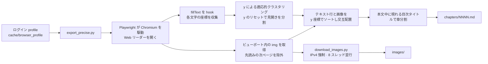
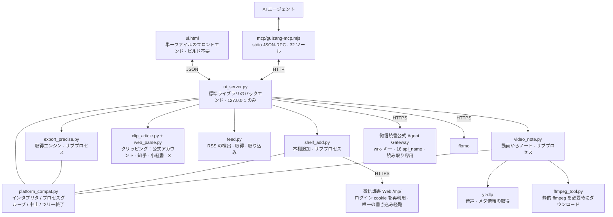

[中文](README.md) | [English](README.en.md) | **日本語**

# 帰蔵 · weread-guizang

微信読書の閲覧データをローカルにエクスポートし、さらに外部のコンテンツ（WeChat 公式アカウントの記事、知乎 / 小紅書 / X の投稿、RSS フィード、動画）を同じローカル本棚に取り込みます。書籍全体の Markdown 出力、ローカルのマルチフォーマットリーダー、本棚とノートの管理、AI エージェント向けの MCP アダプタを提供します。すべて本機で動作し、サーバは `127.0.0.1` のみをリッスンします。

## 課題

微信読書は閲覧データを AI エージェント専用のインターフェース（Agent Gateway）として公開しています。`skill_version` と一連の `api_name` により、本棚・ストア検索・書籍詳細・ハイライト・アイデア・閲覧統計・レコメンドなどのデータを、`wrk-…` 形式のキーで認証して提供します。これには二つの制約があります。

- **読み取り専用**：ホワイトリストに書き込み用のエンドポイントがなく、書籍の追加や本棚の変更ができません。
- **エージェント専用**：人間向けのインターフェースがありません。

そのため、書籍の全文を取得できず、コードを書かずにこのデータを利用することもできません。

## 解決策

帰蔵はこのインターフェースを実用的なローカルツールとして再構築し、不足している部分を補います。

- 公式 Gateway が提供するデータは、ローカルの Web UI として提供します：本棚、ストア検索、書籍詳細、閲覧統計、レコメンド、すべてのハイライトとアイデア。
- Gateway が提供しない機能（全文エクスポート、画像のダウンロード、本棚への追加）は、ログインセッションを再利用して Web 側のエンドポイントを直接呼び出します。
- エージェント向けに、UI とは別にゼロ依存の MCP アダプタ（32 ツール）を同梱します。

三つの機能はすべて本機で完結し、サーバは `127.0.0.1` のみをリッスンして、サードパーティのサーバを経由しません。

## 機能

- **書籍全体を Markdown に出力**：本文と挿絵を閲覧順に交互配置し、画像は 8 スレッドで並行ダウンロード、章ごとに保存、レジューム対応。
- **ローカルのマルチフォーマットリーダー**：取り込んだ書籍を UI 上で閲覧。左右分割、スクロール追従の目次ハイライト、キーボードでの章移動。章内アウトライン（O キー）はその章の見出しを並べ、選んだ位置までスクロールします。本を開き直すと「章」だけでなく最後に読んだ行に戻ります。インポートした EPUB / TXT / PDF も同じ操作で読めます。
- **閲覧中に選択範囲で AI に質問**：本文で一節を選択すると「コピー / 中国語に翻訳 / アシスタントに質問」のバーが表示され、その文をそのままリーダー内のエージェントに渡せます。AI モデルの API キーは設定で自身で入力します。
- **外国語リーディングの最適化**：任意の段落を長押し選択すると中国語訳または原文コピーができます。英語本文では単語をワンクリックすると意味と用法がポップアップ表示されます（ワンクリック辞書は英語のみ、他言語は長押し選択）。
- **閲覧時間の二重記録**：微信読書の時間とローカル（帰蔵）の時間を別々に記録し、自動で 1 つの統合時間にまとめます。2 つの内訳を並べて表示し、どこから統合されたかが分かります。
- **独立したローカル本棚**：微信読書とは別に表示し、取り込み済みと自作インポートの書籍をまとめて一覧。ワンクリックでファイルの場所へ移動でき、Markdown / TXT / EPUB / PDF をインポートできます。
- **記事のクリッピング**：WeChat 公式アカウント記事のリンクを貼り付けると、本文を解析して本棚に追加します。取得した書籍と同じ章分割・目次の流程を通るので、EPUB / PDF 出力もファイル位置の特定もリーダーの操作もそのまま使え、閲覧後に元のリンクへ戻ることもできます。WeChat 以外に、**知乎 / 小紅書 / X（Twitter）**にもそれぞれ専用の解析があります。X の投稿はそのまま取得でき、知乎と小紅書は相手が通してくれる必要があります（未ログインでは「安全検証」ページしか返らないことが多く、その場合は取得できなかったと正直に伝え、検証ページを本文として本棚に保存することはしません）。
- **RSS 購読**：URL を貼るだけで、サイトのトップページだけでも構いません（`<link rel="alternate">` から購読フィードを自分で見つけます）。購読リストは更新でき、1 件ずつ読め、1 件をワンクリックでローカル本棚へ入れられます。全文が十分にあるものはそのまま、要約だけのものは元へ取りに行きます。同じ項目が二重に入ることはありません。
- **動画からノート**：Bilibili / YouTube のリンクを貼ると、yt-dlp で音声を取り、ローカルの Whisper（mlx-whisper / faster-whisper）またはクラウドで文字起こしし、AI がノートとマインドマップにまとめ、1 冊の本としてローカル本棚に並べます。以降は取り込んだ書籍と同じように読め、メモも取れます。複数パートの動画は選んだパートだけを文字起こしし、UI にどのパートか明記します。音声は一時ディレクトリに置かれ、終わると削除されます。
- **読みながらメモ**：本文を選択するとハイライト・太字・下線・取り消し線・コメントを付けられます。右欄のメモと本文はお互いにジャンプするので、メモをクリックすると該当の文へ戻ります。右欄も目次もたたんで本文だけ残せます。
- **2 種類のメモを分けて保管**：軽くてまとめて使える「ハイライト ＋ 一言」と、長く書けて他の箇所を引用できる「独立したメモ項目」を分けて扱います。選択即メモ：フローティングパネルに想法を書くだけで、原文と位置が保存時に自動で添付されます。
- **ハイライトの色は意味のタグ**：論点 / 疑問 / 引用できる / 後で調べる / ひらめきの 5 色。色は装飾ではなく「この文をどう使うか」を示します。
- **テンプレート・マインドマップ・出力**：公式または自作の読書メモテンプレートから書き始め、メモ全体をアウトラインから 1 枚のマインドマップ（SVG）に描き、Markdown へ出力できます。データはその書籍自身のフォルダ（notes.json / notes.md / mindmap.svg）に書き、データベースには入れないので、本をコピーすればメモもコピーされます。
- **本棚の 2 種類の並び**：瀑布（羊皮紙が一枚ずつ開く）とスタック（1 冊を拡大し、折り屏風のように左右へ開閉、矢印キーでも操作）。カードにマウスを載せるとアニメーションだけで、もう一度クリックして「取得 / 詳細を見る」が表示されます。
- **EPUB / PDF のエクスポート**：取り込んだ書籍を汎用の電子書籍形式に変換。EPUB は挿絵と章構成を保持します。
- **WebDAV / OneDrive のクラウド同期**：閲覧時間・閲覧記録・書籍ファイルを自分のクラウドストレージ（Jianguoyun、Nextcloud、OneDrive など）に同期。3 項目は個別に切り替えでき、認証情報は端末内に留まります。
- **UI 内の AI エージェントアシスタント**：右下の吹き出しから呼び出せます。選択範囲からそのまま質問でき、コピー＆ペーストは不要です。
- **微信読書を開かずにデータを閲覧**：ストア検索、書籍の概要、著者と出版社、カテゴリ、閲覧進捗と最終閲覧日時をローカルで表示します。
- **検索から直接取得**：検索結果をそのままエクスポートタスクに変換。すべてのハイライトを索引化し全文検索できます。
- **ハイライトの復習と Anki エクスポート**：すべてのハイライトからランダムにカードを引き、`.apkg` にエクスポートできます。
- **MCP 連携**：32 ツール。取得は長いタスクですが呼び出しをブロックせず、サーバが起動していなければアダプタが自動で起動します。
- **ハイライトを flomo へ移行**：選択したハイライトを一括転送。原文を「」で囲み、書名とタグを付与します。
- **同梱スキル**：リポジトリ内の [`skills/`](skills/) をそのままインストールできます。UI の「ワンクリック MCP 設定」で連携プロンプトをエージェントにコピーできます。

## 動作要件

- Python 3.10 以上（パッケージ済みの macOS アプリを使用する場合は 3.9 以上）
- Node（MCP アダプタのみで必要。`node -v` がバージョンを返せれば可）
- **微信読書アカウント（任意）**：微信読書の書籍取得と、ハイライト・ノート・統計の閲覧にのみ必要で、対象書籍の閲覧権限（読み放題または購入済み）が要ります。クリッピング・RSS 購読・動画ノートはこれに依存しません。
- **ffmpeg（動画ノートのみ）**：事前インストールは不要です。UI の「ffmpeg をインストール」で静的なビルドを帰蔵自身のデータディレクトリに落とします（システムには触れません）。システムに既にあればそれを使います。
- **文字起こしエンジン（動画ノートのみ、ローカルまたはクラウド）**：ローカルは mlx-whisper（Apple シリコン、最速）または faster-whisper（移植性が高い）、設定で OpenAI 互換の文字起こしエンドポイントを指定してクラウドも使えます。ローカルエンジンは既定の依存には含まれず、無い場合は UI がどれを入れるべきか明示します。

## インストール

### 方法 1：macOS アプリをダウンロード

[**帰蔵-0.9.9.dmg をダウンロード**](安装包/归藏-0.9.9.dmg)（約 2 MB、macOS 13 以上、Intel と Apple シリコンに対応）

1. dmg をダブルクリックし、**帰蔵.app** を「アプリケーション」にドラッグします。
2. 初回起動時に **「帰蔵」は壊れているため開けません。ゴミ箱に入れる必要があります。** と表示される場合、これは未署名アプリに対する macOS の既定のブロックであり、ファイルの破損ではありません。次を実行します。

   ```bash
   xattr -dr com.apple.quarantine /Applications/归藏.app
   ```

   別の場所にインストールした場合はパスを置き換えます。`Operation not permitted` と表示されたら先頭に `sudo` を付けます。または **システム設定 → プライバシーとセキュリティ → セキュリティ** でブロックされた項目を探し、「このまま開く」をクリックします。

3. 初回はセットアップ画面です。「我思故我在」をクリックして初期化を開始します。仮想環境の作成、依存関係のインストール、Chromium のダウンロード（約 370 MB、インターネット接続が必要）を行います。プロキシを使う場合はプロキシクライアントで「システムプロキシ」を有効にすると、アプリがそれを引き継ぎます。続いてブラウザが開き、QR コードでログインします。以降の起動は直接 UI に入ります。

   Python 3.9 以上がインストールされている必要があります。<https://www.python.org/downloads/> から入手できます。インストール後の再起動は不要です。パッケージには初回起動時の説明ファイルも同梱されています。詳細と代替手順は [部署说明.md](docs/部署说明.md) を参照してください。

### 方法 2：ソースから実行

#### macOS / Linux

```bash
git clone https://github.com/KEQingFeng/weread-guizang.git
cd weread-guizang
python3 -m venv .venv
.venv/bin/pip install -r requirements.txt
.venv/bin/python -m playwright install chromium     # 約 368 MB
.venv/bin/pip install mlx-whisper                  # 任意：動画ノートのローカル文字起こし（Apple シリコン）
.venv/bin/python ui_server.py --port 8770
```

他のプラットフォームでは `mlx-whisper` を `faster-whisper` に置き換えます（mlx は Apple シリコン専用）。どちらも入れず、設定の AI アシスタント欄に文字起こしエンドポイントを指定してクラウドを使うこともできます。ffmpeg は先に入れる必要はありません：UI の「ffmpeg をインストール」が静的ビルドを取得します。

`启动归藏.command` をダブルクリックしてもかまいません。ディレクトリを自動判別し、仮想環境がなければ作成して依存関係をインストールし、サーバが起動済みなら UI を開きます。

ダブルクリックで起動する macOS アプリをビルドする場合：

```bash
./shell/build_macos.sh          # dist/帰蔵.app を生成
```

`dist/归藏.app` を「アプリケーション」にドラッグします。シェルは Swift + WKWebView のネイティブアプリで、UI は `ui.html` をそのまま使用します。初回起動はセットアップ画面で、初期化と QR ログインの流れは同じです。ビルドには完全な Xcode は不要で、CommandLineTools があれば十分です。

実行に必要なファイル（仮想環境、キャッシュ、ログイン状態）は `~/Library/Application Support/归藏/` に保存されるため、アプリ本体は読み取り専用のまま任意の場所へ移動できます。取り込んだ書籍とインポートした書籍は `~/Documents/归藏/`（インストール時に自動作成）に保存されます。

配布用の dmg を作成する場合：

```bash
./shell/make_dmg.sh             # ~/Desktop/帰蔵-<バージョン>.dmg を生成
```

#### Windows

```bat
git clone https://github.com/KEQingFeng/weread-guizang.git
cd weread-guizang
py -3 -m venv .venv
.venv\Scripts\python.exe -m pip install -r requirements.txt
.venv\Scripts\python.exe -m playwright install chromium
.venv\Scripts\python.exe -m pip install faster-whisper   :: 任意：動画ノートのローカル文字起こし
.venv\Scripts\python.exe ui_server.py --port 8770
```

`启动归藏.bat` をダブルクリックすると、上記 4 ステップをまとめて実行します。

その後、<http://127.0.0.1:8770> を開きます。

### 初回の使用

1. 左上の歯車 → **アカウント接続** → 開いたブラウザウィンドウで微信の QR コードを読み取ります。セッションは `cache/browser_profile/` に保存され、以降は自動で再利用されます。
2. **API キー**を入力します。微信読書 Web 版の「設定 → 開放 API」で `wrk-…` 形式のキーをコピーして保存します。キーは本機の `cache/config.json`（権限 600）に保存され、UI には末尾 4 文字のみ表示されます。本棚・ノート・統計・レコメンド・ストア検索・書籍詳細はすべてこれに依存します。未入力の場合はローカルでエクスポート済みの書籍のみが表示されます。
3. ハイライトを flomo に取り込む場合は **flomo** 欄を入力します（flomo Web 版 → 設定 → API、`https://flomoapp.com/iwh/xxxx/` の形式）。flomo PRO が必要です。
4. リーディング中の**選択範囲の翻訳 / 単語クリックの辞書 / アシスタントへの質問**を使うには、設定の **AI アシスタント** 欄を入力します：OpenAI 互換のエンドポイント（アドレスは `/v1` まで）、キー、モデル名。アドレスとキーは端末内に留まり、UI には入力済みかどうかだけを表示します。選択した内容は質問したときだけそのエンドポイントに送信されます。

## コマンドライン

以下は UI を起動せずに使用できます。

```bash
# macOS / Linux
.venv/bin/python export_precise.py <書籍URLまたはID>        # URL からは ID を自動抽出
.venv/bin/python export_precise.py <ID> --headed          # ページ送りの過程を表示
EXPORT_DEBUG=1 .venv/bin/python export_precise.py <ID>    # 停止時に 60 秒ごとに Python スタックを出力

# Windows
.venv\Scripts\python.exe export_precise.py <書籍URLまたはID>
.venv\Scripts\python.exe export_precise.py <ID> --headed
set EXPORT_DEBUG=1 && .venv\Scripts\python.exe export_precise.py <ID>
```

ログインと本棚への追加も単独で実行できます：`login.py`（ログインとログイン状態の検出）、`shelf_add.py <ストア ID>`。

クリッピング・購読・動画には、UI を開かずに切り分けられるコマンドもあります（macOS / Linux は `.venv/bin/python`、Windows は `.venv\Scripts\python.exe`）。

```bash
.venv/bin/python clip_article.py <記事URL>          # この記事から何が取れるか（WeChat / 知乎 / 小紅書 / X を自動で振り分け）
.venv/bin/python web_parse.py <URL>                 # どのサイトに振り分けられたか、本文の先頭 1200 文字
.venv/bin/python feed.py <サイトまたはフィードURL>    # 任意の URL からフィードを見つける
.venv/bin/python feed.py --list                     # 現在の購読と各項目の取得状態
.venv/bin/python feed.py --refresh                  # すべての購読を更新
.venv/bin/python video_note.py <動画URL> [出力先]     # 動画情報を表示し、そのまま全工程を通す
.venv/bin/python video_note.py --task <URL>          # UI が使う経路：オプションは GUIZANG_VIDEO_OPTS、結果は ##GUIZANG## の 1 行
.venv/bin/python ffmpeg_tool.py --status            # ffmpeg が用意できているか
.venv/bin/python ffmpeg_tool.py --ensure            # 静的 ffmpeg をデータディレクトリへ取得
```

## AI エージェント連携（MCP）

リポジトリにはゼロ依存の Node アダプタ（`mcp/guizang-mcp.mjs`、stdio + JSON-RPC 2.0）が含まれます。MCP 設定に 1 項目を追加し、パスを実際の帰蔵ディレクトリに置き換えます。

```json
"guizang": {
  "type": "stdio",
  "command": "node",
  "args": ["<帰蔵ディレクトリ>/mcp/guizang-mcp.mjs"],
  "timeout": 180000,
  "env": { "GUIZANG_REPO": "<帰蔵ディレクトリ>" }
}
```

Qoder CN は設定ファイルの `mcpServers` に、ZCode は `config.json` の `mcp.servers` に記述します。設定後にエージェントを再起動してください（MCP は起動時に読み込まれ、ホットリロードには対応しません）。

アダプタは次の順序でプロジェクトディレクトリを探します：環境変数 `GUIZANG_REPO` →「本ファイルがプロジェクトの `mcp/` 配下にある」ことからの推定 → 一般的なパスへのフォールバック。インタプリタはプラットフォームごとに選択し（Windows は `.venv\Scripts\python.exe`、macOS / Linux は `.venv/bin/python`）、いずれもない場合はシステムの `python` にフォールバックします。サーバが起動していなければ自動で起動します。

**32 ツール**を 7 分類で提供します。

| 分類 | ツール |
| --- | --- |
| 本棚と状態 | `shelf_list`、`app_status`、`task_log`、`book_files`、`folder_create`、`book_move` |
| 取得 | `book_fetch`、`task_stop`、`batch_fetch`、`account_connect` |
| 書籍とノート | `book_detail`、`search_books`、`notes_index`、`notes_search`、`notes_random`、`book_mark`、`shelf_add` |
| クリッピング | `clip_url` |
| 購読 | `feed_list`、`feed_discover`、`feed_add`、`feed_entries`、`feed_entry`、`feed_refresh`、`feed_to_shelf`、`feed_remove` |
| 動画 | `video_capability`、`video_plan`、`video_to_shelf` |
| エクスポート | `apkg_export`、`zip_export`、`cache_delete` |

三つの制約はアダプタのツール説明に記載され、エージェントが読み取れます。

- 取得と動画ノートはいずれも分〜時間単位の長いタスクです（動画は音声を落としてから文字起こしもします）。`book_fetch` / `batch_fetch` / `video_to_shelf` は即座に戻り、進捗は `app_status` / `task_log` でポーリングします。ツール呼び出し内で完了を待つと、必ずタイムアウトします。
- `shelf_add` は**実際の微信読書の本棚**を変更する唯一の操作です。`cache_delete` は既定では一覧のみで、`confirm=true` を付けた場合にのみ実際に削除します。`feed_add` / `feed_remove` / `feed_refresh` / `feed_to_shelf` は本機の購読とローカル本棚だけを扱います。
- 動画の経路は先にツールチェーンが必要です。`video_capability` が不足しているもの（yt-dlp / ffmpeg / ローカル文字起こしエンジン）を報告するので、補ってから実行し、当てずっぽうに発行しないでください。

## 同梱スキル

[`skills/`](skills/) ディレクトリには読書と学習のためのスキルが含まれます。該当フォルダを自身のスキルディレクトリにコピーしてください（Qoder CN は `~/.qoder-cn/skills/`、その他のプラットフォームはそれぞれのディレクトリ）。

| スキル | 用途 |
| --- | --- |
| [`skills/guizang/`](skills/guizang/) | 帰蔵を読書アシスタントとして接続します。まず状態を確認してから実行し、長いタスクは一度だけ発行してポーリングし、書き込みは明確に要求されたものだけを実行します。書籍を探す→取得→ハイライト検索→カードを引く→Anki エクスポートの一連の手順とトラブルシューティングの指針を含みます |
| [`skills/book-speedrun/`](skills/book-speedrun/) | 一冊の本を一度に講義します。導入マップ → 核心講義 → 全体の通し解説 → 1 ページ要約と段階的な行動リスト。各部分の末尾に即実行できる項目を付けます。記入済みのサンプル付き |

役割分担の基準：**内容**（本を講義し、読後すぐ使える形にする）には `book-speedrun`、**データ**（本をローカルに取り込み、ハイライトを検索し、Anki に出力する）には `guizang` を使用します。両者は連携でき、まず帰蔵で取得し、次に `book-speedrun` で講義します。

> `book-speedrun` に登場する `grace-coach`、`learn-from-materials`、`learn-anything-skill` は同じエコシステムの別スキルで、**本リポジトリには含まれません**。役割の区別のためにのみ言及しています。

UI の「**ワンクリック MCP 設定**」は、連携プロンプトをクリップボードにコピーします。エージェントに貼り付けてください。このプロンプトには本機のパス、ユーザー名、ポートは含まれず、そのまま共有できます。

## 出力構成

書籍はすべて `~/Documents/归藏/` の下に保存され、構造は同一です。つまりリーダー、EPUB/PDF エクスポート、ファイル位置への移動、ノートなどの機能はどの書籍も同じように扱います。ディレクトリ名の接頭辞が取り込み元を示します。

| 取り込み元 | ディレクトリ名 | `meta.json` の `source` |
| --- | --- | --- |
| 微信読書から取得 | `<書籍 id>` | なし（書籍 id で命名） |
| 自行インポート | `imp_<名前の断片>_<ランダム文字列>` | `local` |
| 記事のクリッピング | `clip_<名前の断片>_<ランダム文字列>` | `clip` |
| RSS 購読 | `feed_<名前の断片>_<ランダム文字列>` | `feed` |
| 動画からノート | `video_<名前の断片>_<ランダム文字列>` | `video` |

```
~/Documents/归藏/
├── <書籍id>/                 # 微信読書から取得した書籍
│   ├── chapters/NNNN.md      # 章ごとの本文、図と文が交互
│   ├── images/               # 挿絵 chXXXX_imgNN.jpg
│   ├── raw/NNNN.json         # 各章の画像 URL と文字数
│   ├── _catalog.json         # 目次の章タイトル（巻末判定に使用）
│   ├── _progress.json        # 取得進捗（UI の進捗バーのデータ源）
│   └── meta.json             # 書名/著者/エクスポート完了
├── imp_<名>_<串>/            # インポートした書籍（MD / TXT / EPUB / PDF）、構造は同上
├── clip_<名>_<串>/           # クリッピングした記事、meta に url が加わる（ワンクリックで元記事へ）
├── feed_<名>_<串>/           # 購読エントリ、meta に feed_id / feed_title / date が加わる
├── video_<名>_<串>/          # 動画から作ったノート、meta に url / asr_engine / duration が加わる
│   └── notes.json / notes.md / mindmap.svg   # ノートとマインドマップ、書籍と同じディレクトリ
├── 書名.md                   # 結合版（画像は相対パス。単体でコピーすると画像が切れる）
└── 書名.apkg                 # Anki デッキ（ハイライト出力）
```

微信読書から取得した書籍を除く残り四種の `meta.json` は `format` フィールド（`local` / `clip` / `feed` / `video`）を持ち、画面はこれを見て本棚で取り込み元ごとにまとめて表示します。

結合版 `.md` の画像は相対パス `images/…` のため、単体でコピーすると画像が表示されません。UI の「完全パッケージ」ZIP は本文と画像を平坦にまとめています。

結合版 `.md` を Typora / Obsidian で開くと、図が揃った完全な本として読めます。

## 仕組み





取得エンジンの主要な決定とその理由：

- **章分割には「本文中に実際に描画された目次タイトル」を使用**し、ヘッダーバーは使いません。ヘッダーはページを送るたびに変化するため、初期版では一括の内容が一つのタイトルに集約され、残りの節が空になっていました。目次タイトルはそれぞれ一度だけ現れるため、自然に重複が排除されます。
- **ページ送りは方向キーのみで、本文中央をクリックしません。** クリックは微信読書の「前回の閲覧位置に戻る」を発火し、目次から冒頭へ飛んでも閲覧記録は更新されないため、「クリック → 安定待ち → 冒頭へ戻る」が収束せず、冒頭の数章がまるごと失われていました。
- **ページ送りごとにハードタイムアウトを設定。** Playwright の `page.evaluate` は既定でタイムアウトがなく、レンダラプロセスが固まると呼び出しが永久にハングします。`asyncio.wait_for` はキャンセルに応答しない呼び出しには効果がないため、`asyncio.wait` でタイムアウト時に戻し、ブラウザを終了して接続を回収します。
- **画像ダウンロードは IPv4 を強制。** macOS では urllib がまず IPv6 を試し、経路がない場合は画像ごとに約 120 秒停止します。
- **購読源の判定は「ルート要素が feed そのもの」だけを認めます。** ブログのフッターには創作コモンズの `<rdf:RDF>` ライセンス表示がよく挟まり（しかも HTML コメントの中に）、`<rdf` を見ただけで RSS と判定するとページ全体を購読源と誤認し、ページ内の `<link alternate>` が指す本当のソースを後ろに隠して使えなくします。判定条件は「feed のルート要素より前に `<!doctype` / `<html` が現れないこと」に変更しました。
- **知乎 / 小紅書 / X はそれぞれ専用の取り方で、汎用パーサには入れません。** X の本文はそもそもページ内になく（syndication の公開 API に問い合わせる必要があります）、小紅書は本文を `<script>` 内の `window.__INITIAL_STATE__` の塊に押し込み、知乎は未ログインの読者に本文を返すこともあれば検証ページを返すこともあります。これらの違いは「同じサイトに一つの取り方」に属し、汎用パーサに押し込むと全サイトのクリッピングを壊してしまうため、独立モジュールに分けます。どこかのサイトが改版して無効になったら、その一箇所だけを直し、コメントに現状を書き残します——正常に見えて実は常に例外を投げる空殻は残しません。
- **動画はユーザーが選んだその P だけを転写します。** 複数 P の動画を丸ごと転写すると数時間かかることがあり、ユーザーが求めるのはたいていその一話だけです。リンクを認識する際にまず分 P を列挙し、選ばれた P だけを yt-dlp に渡します。音声は一時ディレクトリにしか存在せず、転写が終われば削除します——ユーザーが欲しいのはその本であって、その音声トラックではありません。
- **転写エンジンは指名された通りに使います。** ユーザーが mlx を指定したのにマシンに入っていない場合は、理由をはっきり伝えて faster にこっそり降格させません。「大モデルを使いたい」が黙って小モデルに置き換わるのは、エラーより腹立たしいからです。

## リポジトリ構成

```
リポジトリ直下   実行時コード：バックエンド ui_server.py、画面 ui.html、エンジンと各機能モジュール
                 （書籍取得 export_precise.py、クリッピング clip_article.py / web_parse.py、
                   購読 feed.py、動画 video_note.py / ffmpeg_tool.py）
                 —— この層は意図的に分包していません：タスクの子プロセスはデータ
                    ディレクトリを cwd にし、dirname(__file__) で兄弟モジュールを
                    探すため、移動するとインストール版が壊れます
tests/     検証ゲート。1 コマンドで全スイート：bash tests/run_all.sh（--fast は静的検査のみ）
tools/     開発マシン用：アイコン生成、ソース zip 化、ウィンドウキャプチャ
docs/      ドキュメント 4 点：デプロイ手順、アーキテクチャとモジュール地図、開発規約、引き継ぎ説明
shell/     macOS ネイティブシェルとパッケージング：Swift シェル → dist/归藏.app → 安装包/*.dmg
mcp/       MCP stdio アダプタ：ローカル API を 32 のツールとしてエージェントに公開
skills/    エージェント向けの説明書（実行ロジックは含みません）
vendor/    同梱するサードパーティ製フロントエンドライブラリ（markdown-it）とそのライセンス。
           画面は CDN に一切依存しません
安装包/    最新の dmg のみ保持
```

| ドキュメント | 読むタイミング |
| --- | --- |
| [部署说明.md](docs/部署说明.md) | インストール、起動、トラブル対応、MCP 連携 |
| [架构与模块地图.md](docs/架构与模块地图.md) | コードを変える前：誰が誰を呼ぶか、データの置き場所、2 種類の書籍 id、機能追加の最短経路 |
| [开发规范.md](docs/开发规范.md) | 変更を出す前：ディレクトリとパスの契約、単一情報源、emoji ゼロ、プライバシーのレッドライン、検証ゲートとリリース手順 |
| [交接说明.md](docs/交接说明.md) | このプロジェクトを引き継ぐとき：このラウンドで何を直したか、各バグの根因はどこか、まだ検証していない部分は何か |

## 変更履歴

**0.9.9**

- 外部コンテンツを同じ本棚へ。このラウンドで三本の取り込み経路を開きました。いずれも `~/Documents/归藏/` の同じ書庫に落ち、以降は取り込んだ書籍と同様に読めて、記録できて、エクスポートできます：
  - **クリッピングを知乎 / 小紅書 / X へ拡張**。WeChat 公式アカウントは従来どおり。知乎・小紅書・X はそれぞれ専用の解析を持ちます（X は syndication 公開 API、小紅書はページ内の `window.__INITIAL_STATE__`、知乎は未ログインで読める範囲を取得）。この三家は未ログイン時に「安全検証」ページしか返さないことが多く、それと見抜いたら正直に取得できないと伝え、検証ページを本文として書庫に保存することはありません。
  - **RSS 購読**。URL を貼るだけでよく、サイトのトップページだけでも構いません——`<link rel="alternate">` から最良のフィードを自分で選びます（RSS / Atom / JSON Feed を認識、GBK エンコードの古いサイトにはフォールバックあり）。購読リストは更新でき、1 件ずつ読め、1 件をワンクリックでローカル本棚へ：全文が十分長ければそのまま取り込み、要約しかなければ元記事に戻って本文を取得します。同じエントリを重複して取り込むことはありません。
  - **動画からノート**。B 站 / YouTube のリンクを貼る → yt-dlp が音声を取得 → ローカル Whisper（mlx-whisper / faster-whisper）またはクラウド API が文字起こし → AI がノートとマインドマップにまとめる → 一冊の本としてローカル本棚へ。複数 P の動画は選んだ P だけを転写し、画面にもどの P かを明記します。音声は一時ディレクトリにのみ落ち、転写後に削除されます。AI の部分に LLM を設定していなくても書籍はそのまま使え、転写全文だけを保存し、タスク結果に今回 AI が欠席した理由を明記します。
- 動画のツールチェーンは必要時に補完：ffmpeg はプリインストール不要で、「ffmpeg をインストール」を押すと静的なビルドを帰蔵自身のデータディレクトリにダウンロードします（システムには触れず、既にあれば再利用）。yt-dlp と feedparser は既定の依存に入りました。転写エンジンはサイズとプラットフォーム差（mlx は Apple チップのみ）からオプションのままですが、欠けているときは画面がどれを入れるべきか明記します。
- MCP アダプタは 20 ツールから 32 ツールへ：クリッピング 1（`clip_url`）、購読 8（`feed_list` / `feed_discover` / `feed_add` / `feed_entries` / `feed_entry` / `feed_refresh` / `feed_to_shelf` / `feed_remove`）、動画 3（`video_capability` / `video_plan` / `video_to_shelf`）を追加。ツール説明に一条追加：動画からノートは書籍取得と同じ長タスクで、`video_to_shelf` は即座に戻り、`app_status` / `task_log` でポーリングします。
- 画面に「購読」と「動画からノート」の 2 ビュー、および対応する設定項目（転写エンジン、言語、ffmpeg 状態）を追加。クリッピングの入力欄に四家の違いを明記し、どのサイトが未ログインで取れ、どれが相手側の許可を要するかが一目で分かります。
- 修正：購読源の判定がページ全体の HTML を RSS と誤認していました。ブログのフッターには創作コモンズの `<rdf:RDF>` ライセンス表示がよく挟まり（しかも HTML コメントの中に）、従来は `<rdf` を見ただけで RSS と判定し、ページ自体を購読源とみなして `<link alternate>` が指す本当のソースを後ろに隠し、更新すると 0 件になっていました。判定を「feed のルート要素より前に `<!doctype` / `<html` が現れないこと」に変更し、回帰テストを追加しました。
- 修正：動画のリンク認識時に「いくつの分 P があるか」の通知が決して表示されませんでした——モジュールが返すのは `pages` / `count` で、画面が読むのは `parts` で、フィールド名が合わず常に空でした。現在は `count` で総数を報告し、plan が返したアドレスで「今回どの P を転写したか」を突き合わせます。
- 修正：動画の「転写設定」ボタンが開いた途端に閉じていました——そのボタンはポップアップの外にあり、グローバルの「他所をクリックしたらポップアップを畳む」リスナーに即座に閉じられていました。`stopPropagation` で止め、歯車ボタンと同じ処理にしました。
- 修正：動画本棚の「一冊もありません」という空状態が決して表示されませんでした——空リストの指紋は空文字列で、初期値も空文字列のため、常に変化なしと見なされていました。指紋に件数を入れて、あの説明をようやく表示できるようにしました。
- ゲート：オフラインスイート `tests/check_web_parse.py`、`tests/check_feed.py`、`tests/check_ffmpeg_tool.py`、`tests/check_video_note.py`（後者の実走チェーンは `GUIZANG_VIDEO_LIVE=1` で別途実行）とブラウザスイート `tests/check_media_views.py`（購読と動画の 2 画面、要素のオーバーフロー、分 P カード）を追加。全リポジトリ 18 項目のゲートが合格。
- これらの追加はできるだけ既存プロジェクトを借り、新しく作り直しません：RSS 解析は feedparser、動画ダウンロードは yt-dlp、転写は MLX Whisper / faster-whisper、マインドマップとノートは本リポジトリ既存の一式（`book_notes.py` / `notes.json` / `mindmap.svg`）を踏襲します。
- 修正：取書が途中で止まったきり、もう先へ進まない。今回《你身体里的奥秘》で 84 / 223 で停止するのを実測しました——リーダー自身が覚えている「前回読んだ位置」が、もう内容を繰り出せない一点に留まっており、再実行しても同じ点に着地し、外側は「このラウンドは新しい章を書けなかった」で即座に終了するため、恒久的に固まっていました。0 章のラウンドのあとは、目次で着地点を「最後に書き出された項目の次」に固定してから続きを読むようにし、毎ラウンド前へ進めるようにしました。これは**欠落の埋め戻しではありません**：目次の「欠け」の多くは、見出しが本文として単独で描かれていないだけで、その文字はすでに隣の章に入っています。最初の欠落から読み直すと、すでに書き出した章を丸ごと二度書くことになります。目次の最終項目まで書き終えていれば、空回りせずに締めます。
- 修正：ノート欄のその線の下にある「考えを書く」を押しても反応しませんでした。このボタンは click の中で同期的に小さい帯を show しており、その同じ click が document の「別の場所を押したら帯を閉じる」リスナーまで泡立って——同じイベントの中で開いたそばから自分で閉じていました。1 フレーム遅らせて開くようにし、選択の経路と揃えました。
- 修正：本棚の取得が失敗したのに「本棚は空です」と言われ、ユーザーは本を失ったと思っていました。いまは「絞り込みで消えた / まだ接続していない / 今回取得できなかった」の三つの原因を分けて伝えます。取得中はまず骨組みを敷き（「本棚は空です」が一瞬光ってからカードに置き換わる、をやめました）、本当に取得できなければ正直に伝えて「もう一度試す」ボタンを出します。
- 修正：サイドバーを素早く連打すると画面が何度もちらつきました。クリックのたびに同じ pane へ `opacity:0` から始まる入場アニメーションが新しく一本立ち、何本も重なるとちらつきになります。さらに速く押すと pane が半透明へ何度も引き戻され、「本が読み込めていない」ように見えました。いまは同じ pane に一本だけ残し、入場中のものは走り切らせて開き直しません。
- 修正：絞り込み欄で一文字打つたびに、誰も面倒を見ない `IntersectionObserver` が一つ溜まっていました（「もっと読み込む」ボタンは再描画のたびに新しいノードになり、古いオブザーバはすでに文書から外れたノードを見続けていました）。ノードを差し替える前に切断します。
- ゲート：`tests/check_resume.py` を追加（再開アンカーの意味論 12 項目：前線＝最後に書き出した項目の次、途中の欠落は埋め戻さない、目次の最終項目まで来たら締める、目次がなければ諦める）。`tests/check_notes_editor.py` には「考えを書く」の実マウス走査を追加しました（行に hover → ボタンを押す → 帯が開く / 原文を伴う / カーソルが入力欄に入る / 保存 / ボタンが「考えを直す」に変わる / もう一度押すと保存した一行が戻る）。この走査はイベントをあえて実際どおり泡立たせるので、上のバグを捕まえられます。リポジトリのゲート 19 項すべて通過。

**0.9.8**

- 記事のクリッピングを追加：WeChat 公式アカウントのリンクを貼るだけで本文を解析し、本棚に入れてそのまま読めます。既存の章分割・目次パイプラインに合流するため、EPUB / PDF 出力、ファイル位置の特定、リーダーの全操作がクリッピング記事でもそのまま使えます。取得するのは本文だけ：スクリプトとスタイルはまとめて落とし、`javascript:` / `data:` / `vbscript:` の URL は捨て、localhost とプライベートアドレスは拒否、アンチ-bot の注意ページは内容として保存せず正直に報告します。
- リーダー右欄のメモ体系：本文を選択してハイライト・太字・下線・取り消し線・コメントを付けられます。右欄と本文はお互いにジャンプして閲覧位置を失いません。右欄も目次もたたみ、本文だけを残せます。
- 2 種類のメモを分離：軽く批量の「ハイライト ＋ 一言」と、長く書けて他の箇所を引用できる独立メモ項目。選択即メモでは、フローティングパネルに書くと原文と章の位置が保存時に自動で添付されます。
- ハイライトの色はセマンティックタグ：論点 / 疑問 / 引用できる / 後で調べる / ひらめき。色は装飾ではなく用途を表します。
- メモが Markdown 対応：見出し 1〜5 級、太字、取り消し線、表（何行何列かを選ぶ）、長押し選択でのフローティングツールバー。公式／自作テンプレート、アウトラインからのマインドマップ（SVG）、Markdown 出力。データは書籍自身のフォルダ（notes.json / notes.md / mindmap.svg）に保存し、データベースは使いません。
- 本棚の表示切替を追加：瀑布（羊皮紙が一枚ずつ開く）とスタック（1 冊を拡大し左右に折り屏風式で開閉、矢印キー対応）。ホバーはアニメーションのみで、再クリックで「取得 / 詳細を見る」が出ます。
- 詳細ページを簡素化：完全なパッケージと本文 / EPUB / PDF / 目次のボタンを廃止し、これらはリーダーで行います。
- 不具合修正：取得を中断しても「取得済み」と表示され、再取得もできませんでした。完了フラグは章ファイルが実際にすべて書き込まれた時だけ立つよう変更。中断・失敗後はカードに「続きから取得」、詳細ページとタスク記録に「残稿を消して最初から取得」を出し、後者は前回の残ったファイルとブラウザの一時ファイルを削除してからやり直します。
- 細部：リーダー下段バーは列幅に応じて 3 段階で簡素化、ウィンドウ最小サイズを 480×620 に引き上げ、スタックでカードが広がる幅はステージの幅に合わせて縮まり、「案内はあるが画面外にあるカード」を解消。
- 画面の切り替えで空白のフレームが出なくなりました。初めて開くビューには実構造に合わせたスケルトン（統計はマス、本棚はカード、線引きは行）を敷き、データはそこへ差し替わります。ゲートウェイ往復 600ms の環境で測定：統計の空白 714ms → 3ms、おすすめ 1637ms → 1ms（待ち合わせ順になっていた 2 リクエストを同時発出し、到着全体 1640ms → 708ms）、線引きメモ 20ms → 1ms、検索 7ms → 2ms、二度目のビューは 0〜2ms。
- ホバーを意思とみなす：ナビやカードに 90ms 留まった時点でその画面のデータを先読みし、10 秒間は再取得しません。クリックの多くはキャッシュをそのまま使えます。
- 執筆面は不透明な紙に：Markdown エディタとメモ面は実色の紙（ライト `#fff` / `#f7f8fc`、ダーク `#1e2229` / `#242935`）にし、背後の本文が文字に透けなくなりました。この面は「すりガラス」スライダーに意図的に追従しません。
- ガラス層を削減：閉じたフローティングは opacity だけでなく visibility で消します。`backdrop-filter` は 1 層が 1 つのオフスクリーンバッファだからです。同じ測定で、フィルタを持つノード 103 → 37、実際に合成される層 56 → 8、1 フレームの描画面積 284 → 218 万画素。
- 章送りをも軽く：フェードインを Web Animations API で直接鳴らし、「class を外す → offsetWidth を読んで強制再レイアウト → 戻す」を廃止。8 章のループでレイアウト 39 → 32 回、スクリプト 56ms → 50ms、メインスレッドのタスク 748ms → 685ms。増えた分も正直に：章あたり約 3ms、閲覧位置の保存と本章アウトラインの構築に使っています。
- リーダーは章の先頭ではなく、前回止まった行に戻ります。新たに本章アウトライン（`O`）を追加、スクロールで現在節が示され、ジャンプすれば次回もそのままハイライトされます。
- 統計の数値は初入りの時だけロールイン（ease-out、計算は一度）し、システムの「視差効果を減らす」に従います。値が揃ってから動き、止まった後は変わりません。
- ゲート `tests/check_reader_flow.py`（続読位置・本章アウトライン・数値ロールの 24 項目）を追加。全ゲート 13 本すべて合格。
- 既存の成熟プロジェクトから借りた：不透明なコンテンツトークンは VitePress、スケルトンの微光は Element Plus、章内の見出し位置づけは VS Code のアウトラインパネルと markdown-it-anchor。

**0.9.7**

- リーダー本文の組版を刷新：段落末の孤立した一字を抑え、中国語の約物を版面外にぶら下げ、見出しが段落末に取り残されないようにし、英文やリンクが混じる長い行の折り返しを安定化。
- 章の読み込み時、静的な「読み込み中…」に代えて同幅のスケルトンを表示。データ到着時にそのまま差し替わり、本文の高さが一度つぶれてから伸びることがなくなりました。
- スクロールを滑らかに：進捗計算をフレーム単位で間引き、本文を下へ送ると上下のバーに淡い影を表示。本文・コードブロック・目次のスクロールバーを細身の同スタイルに統一。
- 画像はフェードインで表示（パッと開く感じを解消）。本文内の幅広テーブルは横スクロールになり、狭い画面や集中レイアウトでも本文の段組みを崩しません。
- キーボードに PageUp / PageDown のページ送りを追加（Space、Shift+Space、Home/End と統一）。

**0.9.6**

- 閲覧中に選択範囲で AI に質問：本文で一節を選ぶと「コピー / 中国語に翻訳 / アシスタントに質問」のバーが表示され、その文をそのままリーダー内のエージェントに渡せます。
- 外国語リーディングの最適化：長押し選択でコピーまたは中国語訳。英語本文では単語をワンクリックで意味がポップアップ（他言語は長押し選択）。
- 閲覧時間の二重記録：微信読書とローカルの時間を別々に記録し、1 つの統合時間に自動でまとめ、内訳を並べて表示。
- クラウド同期：WebDAV と OneDrive を追加。閲覧時間 / 閲覧記録 / 書籍ファイルをそれぞれ個別に同期でき、認証情報は端末内に留まります。
- リーダー UI をさらに調整：ページ送り、選択、ポップアップの動きを滑らかに。
- 安定性の修正：ローカルの台帳を並行書き込みする際の競合と更新消失、不正なリクエストボディによる接続断などを修正（負荷テスト 48 項目すべて合格）。

**0.9.3**

- マルチフォーマットの内蔵リーダーを追加：Markdown をネイティブに閲覧し、インポートした EPUB / TXT / PDF にも対応。スクロール追従の目次、キーボードでの章移動、左右分割。
- 独立したローカル本棚を追加：微信読書とは別に表示し、ローカルの既存書籍（インポート含む）を一覧。ワンクリックでファイルの場所へ移動、Markdown / TXT / EPUB / PDF のインポートに対応。
- EPUB / PDF エクスポートを追加：取り込んだ書籍を汎用の電子書籍形式に変換。EPUB は挿絵と章構成を保持。
- アプリフォルダを追加：インストール時に `~/Documents/归藏` を自動作成し、取り込んだ書籍を保存。
- リーダーの操作を改善：章移動、スクロール、ホバーのフィードバックを滑らかに。
- Markdown 閲覧体験を調整：分割切り替え、文字サイズと行間。

**0.9.2 以前**

- 内蔵 Markdown リーダー（0.9.2）：取り込んだ書籍を UI 上で閲覧。
- UI 内 AI エージェントアシスタント（0.9.1）：右下の吹き出しから呼び出し。
- ビジュアルとモーション体系、設定のモーダル化などの UI 調整。

## トラブルシューティング

**「アカウント接続」や他のボタンをクリックしても反応しない。**
サーバを起動したウィンドウを確認してください。実際の「インタプリタ」と「ブラウザ」のパスが出力されており、これが調査の起点です。実際のエラー時にはバックエンドは接続を切断せず、例外と末尾数行のスタックを UI の「進捗」欄に書き込み、ページにも赤字で表示します。

**本棚への追加が「ログインタイムアウト」で失敗する。**
Web の `/mp/` エンドポイントは二つの cookie を検証します：`wr_vid`（長期の識別）と `wr_skey`（約 30 日のセッション）。`wr_skey` が期限切れの場合、サーバは **HTTP 200** を返しつつ本文は `{"errcode":-2012,"errmsg":"登录超时"}` となります。同じ profile で任意の微信読書ページを開くと、サーバが `wr_skey` を再発行します。スクリプトも一度だけ更新して再送します。サーバの `errmsg` をそのまま確認し、コードの意味を推測しないでください。

**取得が途中で応答しなくなる。**
ページ送りごとに 45 秒のハードタイムアウトがあり、タイムアウトするとブラウザを開き直してレジュームするため、全体が失敗することはありません。詳細が必要な場合は `EXPORT_DEBUG=1` で 60 秒ごとに Python スタックを出力し、ログには 10 ページごとにハートビートがあります。セッション切り替え時に数十秒応答しないことがありますが、これは設計どおりの動作です（12 ページで新規内容なしと判定し、ブラウザを開き直します）。

**エクスポートした章数が目次より少ない。**
本文は Canvas の hook に依存し、リーダーは描画済みのキャッシュを再利用するため、全体の取得は 100% を保証しません。エンジンは目次タイトルで章分割し、レジュームに対応しています。もう一度実行すると通常は補完されます。

**本棚が空。**
API キーが未入力です。入力すると本棚・ノート・統計・レコメンドが表示されます。未入力でもローカルでエクスポート済みの書籍は一覧に表示されます。

**検索エンジンでプロジェクトが見つからない。**
リポジトリ名は `weread-guizang`、プロジェクト名は「帰蔵」です。

## 既知の制限

- 微信読書の書籍を取得するには有効なアカウントと、対象書籍の閲覧権限（読み放題または購入済み）が必要です。クリッピング、RSS 購読、動画からノートの三つは微信読書へのログイン不要です。
- 一部の出版社は Web 閲覧を制限しており（「アプリで読む」と表示）、そのような書籍はエクスポートできません。
- 取得は 100% を保証しません。リーダーは描画済みのキャッシュを再利用するため一部のページは実際に `fillText` を発火せず、章の割り当ても 2 回のエクスポート間でわずかに異なる場合があります（描画バッチの違い）。ただし本文の総量は安定しています。
- 画像のみのギャラリー章で画像が密集する場合、図注と画像の対応が稀に一つずれます。本文章では段落に対する画像の位置は正確です。
- エクスポート速度は約 1 ページ 1.1 秒（同一の 14 ページの書籍での A/B 実測：固定待機 2.12s/ページ → 描画完了で即進行 1.08s/ページ、ページごとの本文は 14/14 一致）。さらに短縮するには「この画面の描画完了を待つ」判定を短くする必要があり、文字の欠落が始まります。
- Canvas の文字単位抽出は行をまたぐ分断で少数の文字を失います（例：`multi-agent` が `ulti` に切れる）。
- 公式 Gateway は「書単（ブックリスト）」のエンドポイントを公開しておらず、パネルに書単はありません。最も近いのは「レコメンド」です。
- flomo のリクエスト形式は公式の例がなく、ここでは一般的な取り決めに従って JSON を送信し、失敗時はフォームエンコーディングにフォールバックします。**実際の送信は検証されていません**。
- 選択範囲の翻訳 / 単語の辞書 / アシスタントへの質問は、自身で設定した OpenAI 互換エンドポイントに依存します。一般的な `/chat/completions` のレスポンス形式を解析しており、**ベンダーごとの個別検証は行っていない**ため、特殊なレスポンス形式では失敗する可能性があります。
- クラウド同期は WebDAV と Microsoft Graph の公開 API に対して実装していますが、**実際のクラウドアカウントでのエンドツーエンド検証は行っていません**。初回同期はまず小さな書籍 1 冊で試し、問題がないことを確認してから全体を同期してください。
- 知乎 / 小紅書 / X の解析は相手が「今」どのようにページを配信するかに依存し、いつ失効してもおかしくありません。未ログイン時は知乎と小紅書の多くが検証ページしか返しませんが、これはプラットフォームの制限であって回避できるバグではありません——帰蔵は正直にエラーを報告する道を選び、ログイン状態の回避は行いません（つまりあなたの cookie をアップロードする問題もありません）。
- RSS は「購読 → 読む → 本棚へ」という最小の閉ループだけを行います：既読 / 未読の同期はせず、双方向同期もせず、バックグラウンドで定時ポーリングもしません（新着が欲しいときは更新を一度押してください）。
- 動画からノートは第一版では B 站と YouTube のみ対応です。転写は汎用 Whisper モデルを使うため、固有名詞、複数人の会話、強い訛りの正確さは保証しません。ローカル転写の初回はモデルのダウンロードが必要です（large-v3-turbo で約 1.5 GB）。一度落とせば本機に常駐します。
- yt-dlp は「プラットフォームの改版のたびに更新が要る」タイプのツールです：動画が取れないときはまず `.venv/bin/pip install -U yt-dlp` を試してください。
- 動画の AI ノートとマインドマップは、あなた自身が記入した OpenAI 互換インターフェースに依存します。未記入なら転写全文だけを保存します——これは意図的な挙動で、あなたが設定していないのに音声やテキストを第三者へ送ることはしません。
- クロスプラットフォーム：Windows の分岐は単体テストで mock したプラットフォームフラグにより実行済みですが、**実機の Windows でのエンドツーエンド検証は行っていません**。

## 出典とライセンス

取得エンジン（`export_precise.py`、`download_images.py`）は [lbq110/weread-exporter](https://github.com/lbq110/weread-exporter) に由来し、その上で二次開発を行っています。

**上流リポジトリはいかなるオープンソースライセンスも宣言していません。** したがってここでは上流の代わりにライセンスを決定しません。これらのファイルの著作権とライセンス状態は上流に従うため、再配布や商用利用の前に上流へ確認してください。

帰蔵が追加した部分——`ui_server.py`、`ui.html`、`mcp/guizang-mcp.mjs`、`platform_compat.py`、`shelf_add.py`、`login.py`、`skills/`、`tools/`、`tests/`、`docs/`、起動スクリプトとドキュメント——は **MIT** で利用できます。

リポジトリのルートには**あえて `LICENSE` ファイルを置いていません**。ルートの LICENSE はリポジトリ全体を覆ってしまい、上流コードのライセンスはここでは決められないためです。上流が明確なライセンスを付与した後、適切なライセンスを追加するのが望ましい形です。

## 免責事項

個人の学習・研究、および**自身が購入済み**のコンテンツのバックアップにのみ使用してください。エクスポートした成果を配布したり、商用利用したりしないでください。著作権とプラットフォームの利用規約を尊重してください。本ツールはループバックアドレスのみをリッスンし、アカウント・キー・書籍の内容をサードパーティのサーバへ送信しません——**唯一の外部送信は、あなた自身が記入したあのインターフェース群です**：選択範囲の翻訳 / アシスタントへの質問は選んだ一節を設定で記入した AI インターフェースへ送り、動画からノートはクラウド転写を選んだときに音声を記入した転写インターフェースへ送り、AI インターフェースを記入していれば転写テキストを要約のために渡します。これらのアドレスはすべてあなた自身が記入するもので、帰蔵はプリセットも代理送信もしません。
