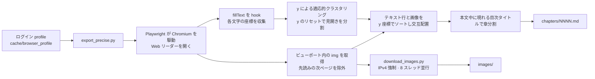
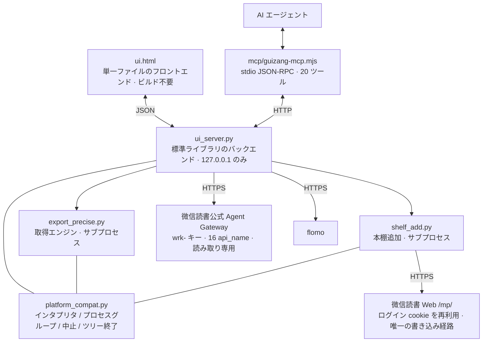

[中文](README.md) | [English](README.en.md) | **日本語**

# 帰蔵 · weread-guizang

微信読書の閲覧データをローカルにエクスポートします。書籍全体の Markdown 出力、ローカルのマルチフォーマットリーダー、本棚とノートの管理、AI エージェント向けの MCP アダプタを提供します。すべて本機で動作し、サーバは `127.0.0.1` のみをリッスンします。

## 課題

微信読書は閲覧データを AI エージェント専用のインターフェース（Agent Gateway）として公開しています。`skill_version` と一連の `api_name` により、本棚・ストア検索・書籍詳細・ハイライト・アイデア・閲覧統計・レコメンドなどのデータを、`wrk-…` 形式のキーで認証して提供します。これには二つの制約があります。

- **読み取り専用**：ホワイトリストに書き込み用のエンドポイントがなく、書籍の追加や本棚の変更ができません。
- **エージェント専用**：人間向けのインターフェースがありません。

そのため、書籍の全文を取得できず、コードを書かずにこのデータを利用することもできません。

## 解決策

帰蔵はこのインターフェースを実用的なローカルツールとして再構築し、不足している部分を補います。

- 公式 Gateway が提供するデータは、ローカルの Web UI として提供します：本棚、ストア検索、書籍詳細、閲覧統計、レコメンド、すべてのハイライトとアイデア。
- Gateway が提供しない機能（全文エクスポート、画像のダウンロード、本棚への追加）は、ログインセッションを再利用して Web 側のエンドポイントを直接呼び出します。
- エージェント向けに、UI とは別にゼロ依存の MCP アダプタ（20 ツール）を同梱します。

三つの機能はすべて本機で完結し、サーバは `127.0.0.1` のみをリッスンして、サードパーティのサーバを経由しません。

## 機能

- **書籍全体を Markdown に出力**：本文と挿絵を閲覧順に交互配置し、画像は 8 スレッドで並行ダウンロード、章ごとに保存、レジューム対応。
- **ローカルのマルチフォーマットリーダー**：取り込んだ書籍を UI 上で閲覧。左右分割、スクロール追従の目次ハイライト、キーボードでの章移動。インポートした EPUB / TXT / PDF も同じ操作で読めます。
- **閲覧中に選択範囲で AI に質問**：本文で一節を選択すると「コピー / 中国語に翻訳 / アシスタントに質問」のバーが表示され、その文をそのままリーダー内のエージェントに渡せます。AI モデルの API キーは設定で自身で入力します。
- **外国語リーディングの最適化**：任意の段落を長押し選択すると中国語訳または原文コピーができます。英語本文では単語をワンクリックすると意味と用法がポップアップ表示されます（ワンクリック辞書は英語のみ、他言語は長押し選択）。
- **閲覧時間の二重記録**：微信読書の時間とローカル（帰蔵）の時間を別々に記録し、自動で 1 つの統合時間にまとめます。2 つの内訳を並べて表示し、どこから統合されたかが分かります。
- **独立したローカル本棚**：微信読書とは別に表示し、取り込み済みと自作インポートの書籍をまとめて一覧。ワンクリックでファイルの場所へ移動でき、Markdown / TXT / EPUB / PDF をインポートできます。
- **EPUB / PDF のエクスポート**：取り込んだ書籍を汎用の電子書籍形式に変換。EPUB は挿絵と章構成を保持します。
- **WebDAV / OneDrive のクラウド同期**：閲覧時間・閲覧記録・書籍ファイルを自分のクラウドストレージ（Jianguoyun、Nextcloud、OneDrive など）に同期。3 項目は個別に切り替えでき、認証情報は端末内に留まります。
- **UI 内の AI エージェントアシスタント**：右下の吹き出しから呼び出せます。選択範囲からそのまま質問でき、コピー＆ペーストは不要です。
- **微信読書を開かずにデータを閲覧**：ストア検索、書籍の概要、著者と出版社、カテゴリ、閲覧進捗と最終閲覧日時をローカルで表示します。
- **検索から直接取得**：検索結果をそのままエクスポートタスクに変換。すべてのハイライトを索引化し全文検索できます。
- **ハイライトの復習と Anki エクスポート**：すべてのハイライトからランダムにカードを引き、`.apkg` にエクスポートできます。
- **MCP 連携**：20 ツール。取得は長いタスクですが呼び出しをブロックせず、サーバが起動していなければアダプタが自動で起動します。
- **ハイライトを flomo へ移行**：選択したハイライトを一括転送。原文を「」で囲み、書名とタグを付与します。
- **同梱スキル**：リポジトリ内の [`skills/`](skills/) をそのままインストールできます。UI の「ワンクリック MCP 設定」で連携プロンプトをエージェントにコピーできます。

## 動作要件

- Python 3.10 以上（パッケージ済みの macOS アプリを使用する場合は 3.9 以上）
- Node（MCP アダプタのみで必要。`node -v` がバージョンを返せれば可）
- 有効な微信読書アカウントと、対象書籍の閲覧権限（読み放題または購入済み）

## インストール

### 方法 1：macOS アプリをダウンロード

[**帰蔵-0.9.7.dmg をダウンロード**](安装包/归藏-0.9.7.dmg)（約 2 MB、macOS 13 以上、Intel と Apple シリコンに対応）

1. dmg をダブルクリックし、**帰蔵.app** を「アプリケーション」にドラッグします。
2. 初回起動時に **「帰蔵」は壊れているため開けません。ゴミ箱に入れる必要があります。** と表示される場合、これは未署名アプリに対する macOS の既定のブロックであり、ファイルの破損ではありません。次を実行します。

   ```bash
   xattr -dr com.apple.quarantine /Applications/归藏.app
   ```

   別の場所にインストールした場合はパスを置き換えます。`Operation not permitted` と表示されたら先頭に `sudo` を付けます。または **システム設定 → プライバシーとセキュリティ → セキュリティ** でブロックされた項目を探し、「このまま開く」をクリックします。

3. 初回はセットアップ画面です。「我思故我在」をクリックして初期化を開始します。仮想環境の作成、依存関係のインストール、Chromium のダウンロード（約 370 MB、インターネット接続が必要）を行います。プロキシを使う場合はプロキシクライアントで「システムプロキシ」を有効にすると、アプリがそれを引き継ぎます。続いてブラウザが開き、QR コードでログインします。以降の起動は直接 UI に入ります。

   Python 3.9 以上がインストールされている必要があります。<https://www.python.org/downloads/> から入手できます。インストール後の再起動は不要です。パッケージには初回起動時の説明ファイルも同梱されています。詳細と代替手順は [部署说明.md](部署说明.md) を参照してください。

### 方法 2：ソースから実行

#### macOS / Linux

```bash
git clone https://github.com/KEQingFeng/weread-guizang.git
cd weread-guizang
python3 -m venv .venv
.venv/bin/pip install -r requirements.txt
.venv/bin/python -m playwright install chromium     # 約 368 MB
.venv/bin/python ui_server.py --port 8770
```

`启动归藏.command` をダブルクリックしてもかまいません。ディレクトリを自動判別し、仮想環境がなければ作成して依存関係をインストールし、サーバが起動済みなら UI を開きます。

ダブルクリックで起動する macOS アプリをビルドする場合：

```bash
./shell/build_macos.sh          # dist/帰蔵.app を生成
```

`dist/归藏.app` を「アプリケーション」にドラッグします。シェルは Swift + WKWebView のネイティブアプリで、UI は `ui.html` をそのまま使用します。初回起動はセットアップ画面で、初期化と QR ログインの流れは同じです。ビルドには完全な Xcode は不要で、CommandLineTools があれば十分です。

実行に必要なファイル（仮想環境、キャッシュ、ログイン状態）は `~/Library/Application Support/归藏/` に保存されるため、アプリ本体は読み取り専用のまま任意の場所へ移動できます。取り込んだ書籍とインポートした書籍は `~/Documents/归藏/`（インストール時に自動作成）に保存されます。

配布用の dmg を作成する場合：

```bash
./shell/make_dmg.sh             # ~/Desktop/帰蔵-<バージョン>.dmg を生成
```

#### Windows

```bat
git clone https://github.com/KEQingFeng/weread-guizang.git
cd weread-guizang
py -3 -m venv .venv
.venv\Scripts\python.exe -m pip install -r requirements.txt
.venv\Scripts\python.exe -m playwright install chromium
.venv\Scripts\python.exe ui_server.py --port 8770
```

`启动归藏.bat` をダブルクリックすると、上記 4 ステップをまとめて実行します。

その後、<http://127.0.0.1:8770> を開きます。

### 初回の使用

1. 左上の歯車 → **アカウント接続** → 開いたブラウザウィンドウで微信の QR コードを読み取ります。セッションは `cache/browser_profile/` に保存され、以降は自動で再利用されます。
2. **API キー**を入力します。微信読書 Web 版の「設定 → 開放 API」で `wrk-…` 形式のキーをコピーして保存します。キーは本機の `cache/config.json`（権限 600）に保存され、UI には末尾 4 文字のみ表示されます。本棚・ノート・統計・レコメンド・ストア検索・書籍詳細はすべてこれに依存します。未入力の場合はローカルでエクスポート済みの書籍のみが表示されます。
3. ハイライトを flomo に取り込む場合は **flomo** 欄を入力します（flomo Web 版 → 設定 → API、`https://flomoapp.com/iwh/xxxx/` の形式）。flomo PRO が必要です。
4. リーディング中の**選択範囲の翻訳 / 単語クリックの辞書 / アシスタントへの質問**を使うには、設定の **AI アシスタント** 欄を入力します：OpenAI 互換のエンドポイント（アドレスは `/v1` まで）、キー、モデル名。アドレスとキーは端末内に留まり、UI には入力済みかどうかだけを表示します。選択した内容は質問したときだけそのエンドポイントに送信されます。

## コマンドライン

以下は UI を起動せずに使用できます。

```bash
# macOS / Linux
.venv/bin/python export_precise.py <書籍URLまたはID>        # URL からは ID を自動抽出
.venv/bin/python export_precise.py <ID> --headed          # ページ送りの過程を表示
EXPORT_DEBUG=1 .venv/bin/python export_precise.py <ID>    # 停止時に 60 秒ごとに Python スタックを出力

# Windows
.venv\Scripts\python.exe export_precise.py <書籍URLまたはID>
.venv\Scripts\python.exe export_precise.py <ID> --headed
set EXPORT_DEBUG=1 && .venv\Scripts\python.exe export_precise.py <ID>
```

ログインと本棚への追加も単独で実行できます：`login.py`（ログインとログイン状態の検出）、`shelf_add.py <ストア ID>`。

## AI エージェント連携（MCP）

リポジトリにはゼロ依存の Node アダプタ（`mcp/guizang-mcp.mjs`、stdio + JSON-RPC 2.0）が含まれます。MCP 設定に 1 項目を追加し、パスを実際の帰蔵ディレクトリに置き換えます。

```json
"guizang": {
  "type": "stdio",
  "command": "node",
  "args": ["<帰蔵ディレクトリ>/mcp/guizang-mcp.mjs"],
  "timeout": 180000,
  "env": { "GUIZANG_REPO": "<帰蔵ディレクトリ>" }
}
```

Qoder CN は設定ファイルの `mcpServers` に、ZCode は `config.json` の `mcp.servers` に記述します。設定後にエージェントを再起動してください（MCP は起動時に読み込まれ、ホットリロードには対応しません）。

アダプタは次の順序でプロジェクトディレクトリを探します：環境変数 `GUIZANG_REPO` →「本ファイルがプロジェクトの `mcp/` 配下にある」ことからの推定 → 一般的なパスへのフォールバック。インタプリタはプラットフォームごとに選択し（Windows は `.venv\Scripts\python.exe`、macOS / Linux は `.venv/bin/python`）、いずれもない場合はシステムの `python` にフォールバックします。サーバが起動していなければ自動で起動します。

**20 ツール**を 4 分類で提供します。

| 分類 | ツール |
| --- | --- |
| 本棚と状態 | `shelf_list`、`app_status`、`task_log`、`book_files`、`folder_create`、`book_move` |
| 取得 | `book_fetch`、`task_stop`、`batch_fetch`、`account_connect` |
| 書籍とノート | `book_detail`、`search_books`、`notes_index`、`notes_search`、`notes_random`、`book_mark`、`shelf_add` |
| エクスポート | `apkg_export`、`zip_export`、`cache_delete` |

二つの制約はアダプタのツール説明に記載され、エージェントが読み取れます。

- 取得は分〜時間単位の長いタスクです。`book_fetch` / `batch_fetch` は即座に戻り、進捗は `app_status` / `task_log` でポーリングします。ツール呼び出し内で完了を待つと、必ずタイムアウトします。
- `shelf_add` は唯一の書き込み操作で、実際の微信読書の本棚を変更します。`cache_delete` は既定では一覧のみで、`confirm=true` を付けた場合にのみ実際に削除します。

## 同梱スキル

[`skills/`](skills/) ディレクトリには読書と学習のためのスキルが含まれます。該当フォルダを自身のスキルディレクトリにコピーしてください（Qoder CN は `~/.qoder-cn/skills/`、その他のプラットフォームはそれぞれのディレクトリ）。

| スキル | 用途 |
| --- | --- |
| [`skills/guizang/`](skills/guizang/) | 帰蔵を読書アシスタントとして接続します。まず状態を確認してから実行し、長いタスクは一度だけ発行してポーリングし、書き込みは明確に要求されたものだけを実行します。書籍を探す→取得→ハイライト検索→カードを引く→Anki エクスポートの一連の手順とトラブルシューティングの指針を含みます |
| [`skills/book-speedrun/`](skills/book-speedrun/) | 一冊の本を一度に講義します。導入マップ → 核心講義 → 全体の通し解説 → 1 ページ要約と段階的な行動リスト。各部分の末尾に即実行できる項目を付けます。記入済みのサンプル付き |

役割分担の基準：**内容**（本を講義し、読後すぐ使える形にする）には `book-speedrun`、**データ**（本をローカルに取り込み、ハイライトを検索し、Anki に出力する）には `guizang` を使用します。両者は連携でき、まず帰蔵で取得し、次に `book-speedrun` で講義します。

> `book-speedrun` に登場する `grace-coach`、`learn-from-materials`、`learn-anything-skill` は同じエコシステムの別スキルで、**本リポジトリには含まれません**。役割の区別のためにのみ言及しています。

UI の「**ワンクリック MCP 設定**」は、連携プロンプトをクリップボードにコピーします。エージェントに貼り付けてください。このプロンプトには本機のパス、ユーザー名、ポートは含まれず、そのまま共有できます。

## 出力構成

書籍は `~/Documents/归藏/` に保存されます。微信読書から取り込んだ書籍は書籍 ID で命名し、インポートした書籍は `imp_<名前の断片>_<ランダム文字列>` で命名します。構造は同一のため、リーダー、EPUB/PDF エクスポート、ファイル位置への移動は両者を同じように扱います。

```
~/Documents/归藏/
├── <書籍ID>/                 # 微信読書から取り込んだ書籍
│   ├── chapters/NNNN.md      # 章ごとの本文、図と文が交互
│   ├── images/               # 挿絵 chXXXX_imgNN.jpg
│   ├── raw/NNNN.json         # 各章の画像 URL と文字数
│   ├── _catalog.json         # 目次の章タイトル（巻末判定に使用）
│   ├── _progress.json        # 取得進捗（UI の進捗バーのデータ源）
│   └── meta.json             # 書名/著者/エクスポート完了
├── imp_<名前>_<文字列>/       # インポートした書籍（MD / TXT / EPUB / PDF）、構造は同一
│   └── meta.json             # source:"local" と format フィールドが追加される
├── <書名>.md                 # 結合版（画像は相対パス。単体でコピーすると画像が切れる）
└── <書名>.apkg               # Anki デッキ（ハイライト出力）
```

結合版 `.md` の画像は相対パス `images/…` のため、単体でコピーすると画像が表示されません。UI の「完全パッケージ」ZIP は本文と画像を平坦にまとめています。

結合版 `.md` を Typora / Obsidian で開くと、図が揃った完全な本として読めます。

## 仕組み





取得エンジンの主要な決定とその理由：

- **章分割には「本文中に実際に描画された目次タイトル」を使用**し、ヘッダーバーは使いません。ヘッダーはページを送るたびに変化するため、初期版では一括の内容が一つのタイトルに集約され、残りの節が空になっていました。目次タイトルはそれぞれ一度だけ現れるため、自然に重複が排除されます。
- **ページ送りは方向キーのみで、本文中央をクリックしません。** クリックは微信読書の「前回の閲覧位置に戻る」を発火し、目次から冒頭へ飛んでも閲覧記録は更新されないため、「クリック → 安定待ち → 冒頭へ戻る」が収束せず、冒頭の数章がまるごと失われていました。
- **ページ送りごとにハードタイムアウトを設定。** Playwright の `page.evaluate` は既定でタイムアウトがなく、レンダラプロセスが固まると呼び出しが永久にハングします。`asyncio.wait_for` はキャンセルに応答しない呼び出しには効果がないため、`asyncio.wait` でタイムアウト時に戻し、ブラウザを終了して接続を回収します。
- **画像ダウンロードは IPv4 を強制。** macOS では urllib がまず IPv6 を試し、経路がない場合は画像ごとに約 120 秒停止します。

## 変更履歴

**0.9.7**

- リーダー本文の組版を刷新：段落末の孤立した一字を抑え、中国語の約物を版面外にぶら下げ、見出しが段落末に取り残されないようにし、英文やリンクが混じる長い行の折り返しを安定化。
- 章の読み込み時、静的な「読み込み中…」に代えて同幅のスケルトンを表示。データ到着時にそのまま差し替わり、本文の高さが一度つぶれてから伸びることがなくなりました。
- スクロールを滑らかに：進捗計算をフレーム単位で間引き、本文を下へ送ると上下のバーに淡い影を表示。本文・コードブロック・目次のスクロールバーを細身の同スタイルに統一。
- 画像はフェードインで表示（パッと開く感じを解消）。本文内の幅広テーブルは横スクロールになり、狭い画面や集中レイアウトでも本文の段組みを崩しません。
- キーボードに PageUp / PageDown のページ送りを追加（Space、Shift+Space、Home/End と統一）。

**0.9.6**

- 閲覧中に選択範囲で AI に質問：本文で一節を選ぶと「コピー / 中国語に翻訳 / アシスタントに質問」のバーが表示され、その文をそのままリーダー内のエージェントに渡せます。
- 外国語リーディングの最適化：長押し選択でコピーまたは中国語訳。英語本文では単語をワンクリックで意味がポップアップ（他言語は長押し選択）。
- 閲覧時間の二重記録：微信読書とローカルの時間を別々に記録し、1 つの統合時間に自動でまとめ、内訳を並べて表示。
- クラウド同期：WebDAV と OneDrive を追加。閲覧時間 / 閲覧記録 / 書籍ファイルをそれぞれ個別に同期でき、認証情報は端末内に留まります。
- リーダー UI をさらに調整：ページ送り、選択、ポップアップの動きを滑らかに。
- 安定性の修正：ローカルの台帳を並行書き込みする際の競合と更新消失、不正なリクエストボディによる接続断などを修正（負荷テスト 48 項目すべて合格）。

**0.9.3**

- マルチフォーマットの内蔵リーダーを追加：Markdown をネイティブに閲覧し、インポートした EPUB / TXT / PDF にも対応。スクロール追従の目次、キーボードでの章移動、左右分割。
- 独立したローカル本棚を追加：微信読書とは別に表示し、ローカルの既存書籍（インポート含む）を一覧。ワンクリックでファイルの場所へ移動、Markdown / TXT / EPUB / PDF のインポートに対応。
- EPUB / PDF エクスポートを追加：取り込んだ書籍を汎用の電子書籍形式に変換。EPUB は挿絵と章構成を保持。
- アプリフォルダを追加：インストール時に `~/Documents/归藏` を自動作成し、取り込んだ書籍を保存。
- リーダーの操作を改善：章移動、スクロール、ホバーのフィードバックを滑らかに。
- Markdown 閲覧体験を調整：分割切り替え、文字サイズと行間。

**0.9.2 以前**

- 内蔵 Markdown リーダー（0.9.2）：取り込んだ書籍を UI 上で閲覧。
- UI 内 AI エージェントアシスタント（0.9.1）：右下の吹き出しから呼び出し。
- ビジュアルとモーション体系、設定のモーダル化などの UI 調整。

## トラブルシューティング

**「アカウント接続」や他のボタンをクリックしても反応しない。**
サーバを起動したウィンドウを確認してください。実際の「インタプリタ」と「ブラウザ」のパスが出力されており、これが調査の起点です。実際のエラー時にはバックエンドは接続を切断せず、例外と末尾数行のスタックを UI の「進捗」欄に書き込み、ページにも赤字で表示します。

**本棚への追加が「ログインタイムアウト」で失敗する。**
Web の `/mp/` エンドポイントは二つの cookie を検証します：`wr_vid`（長期の識別）と `wr_skey`（約 30 日のセッション）。`wr_skey` が期限切れの場合、サーバは **HTTP 200** を返しつつ本文は `{"errcode":-2012,"errmsg":"登录超时"}` となります。同じ profile で任意の微信読書ページを開くと、サーバが `wr_skey` を再発行します。スクリプトも一度だけ更新して再送します。サーバの `errmsg` をそのまま確認し、コードの意味を推測しないでください。

**取得が途中で応答しなくなる。**
ページ送りごとに 45 秒のハードタイムアウトがあり、タイムアウトするとブラウザを開き直してレジュームするため、全体が失敗することはありません。詳細が必要な場合は `EXPORT_DEBUG=1` で 60 秒ごとに Python スタックを出力し、ログには 10 ページごとにハートビートがあります。セッション切り替え時に数十秒応答しないことがありますが、これは設計どおりの動作です（12 ページで新規内容なしと判定し、ブラウザを開き直します）。

**エクスポートした章数が目次より少ない。**
本文は Canvas の hook に依存し、リーダーは描画済みのキャッシュを再利用するため、全体の取得は 100% を保証しません。エンジンは目次タイトルで章分割し、レジュームに対応しています。もう一度実行すると通常は補完されます。

**本棚が空。**
API キーが未入力です。入力すると本棚・ノート・統計・レコメンドが表示されます。未入力でもローカルでエクスポート済みの書籍は一覧に表示されます。

**検索エンジンでプロジェクトが見つからない。**
リポジトリ名は `weread-guizang`、プロジェクト名は「帰蔵」です。

## 既知の制限

- 有効な微信読書アカウントと、対象書籍の閲覧権限（読み放題または購入済み）が必要です。
- 一部の出版社は Web 閲覧を制限しており（「アプリで読む」と表示）、そのような書籍はエクスポートできません。
- 取得は 100% を保証しません。リーダーは描画済みのキャッシュを再利用するため一部のページは実際に `fillText` を発火せず、章の割り当ても 2 回のエクスポート間でわずかに異なる場合があります（描画バッチの違い）。ただし本文の総量は安定しています。
- 画像のみのギャラリー章で画像が密集する場合、図注と画像の対応が稀に一つずれます。本文章では段落に対する画像の位置は正確です。
- エクスポート速度は約 1 ページ 1.1 秒（同一の 14 ページの書籍での A/B 実測：固定待機 2.12s/ページ → 描画完了で即進行 1.08s/ページ、ページごとの本文は 14/14 一致）。さらに短縮するには「この画面の描画完了を待つ」判定を短くする必要があり、文字の欠落が始まります。
- Canvas の文字単位抽出は行をまたぐ分断で少数の文字を失います（例：`multi-agent` が `ulti` に切れる）。
- 公式 Gateway は「書単（ブックリスト）」のエンドポイントを公開しておらず、パネルに書単はありません。最も近いのは「レコメンド」です。
- flomo のリクエスト形式は公式の例がなく、ここでは一般的な取り決めに従って JSON を送信し、失敗時はフォームエンコーディングにフォールバックします。**実際の送信は検証されていません**。
- 選択範囲の翻訳 / 単語の辞書 / アシスタントへの質問は、自身で設定した OpenAI 互換エンドポイントに依存します。一般的な `/chat/completions` のレスポンス形式を解析しており、**ベンダーごとの個別検証は行っていない**ため、特殊なレスポンス形式では失敗する可能性があります。
- クラウド同期は WebDAV と Microsoft Graph の公開 API に対して実装していますが、**実際のクラウドアカウントでのエンドツーエンド検証は行っていません**。初回同期はまず小さな書籍 1 冊で試し、問題がないことを確認してから全体を同期してください。
- クロスプラットフォーム：Windows の分岐は単体テストで mock したプラットフォームフラグにより実行済みですが、**実機の Windows でのエンドツーエンド検証は行っていません**。

## 出典とライセンス

取得エンジン（`export_precise.py`、`download_images.py`）は [lbq110/weread-exporter](https://github.com/lbq110/weread-exporter) に由来し、その上で二次開発を行っています。

**上流リポジトリはいかなるオープンソースライセンスも宣言していません。** したがってここでは上流の代わりにライセンスを決定しません。これらのファイルの著作権とライセンス状態は上流に従うため、再配布や商用利用の前に上流へ確認してください。

帰蔵が追加した部分——`ui_server.py`、`ui.html`、`mcp/guizang-mcp.mjs`、`platform_compat.py`、`shelf_add.py`、`login.py`、`skills/`、`tools/`、起動スクリプトとドキュメント——は **MIT** で利用できます。

リポジトリのルートには**あえて `LICENSE` ファイルを置いていません**。ルートの LICENSE はリポジトリ全体を覆ってしまい、上流コードのライセンスはここでは決められないためです。上流が明確なライセンスを付与した後、適切なライセンスを追加するのが望ましい形です。

## 免責事項

個人の学習・研究、および**自身が購入済み**のコンテンツのバックアップにのみ使用してください。エクスポートした成果を配布したり、商用利用したりしないでください。著作権とプラットフォームの利用規約を尊重してください。本ツールはループバックアドレスのみをリッスンし、アカウント・キー・書籍の内容をサードパーティのサーバへ送信しません。
