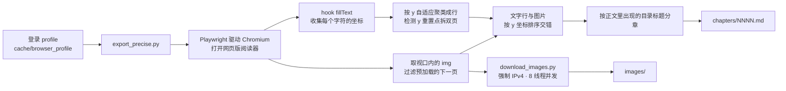
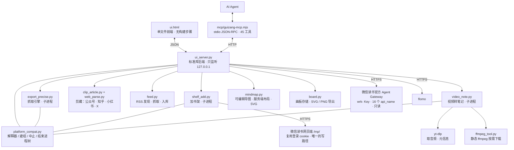

**中文** | [English](README.en.md) | [日本語](README.ja.md)

# 归藏 · weread-guizang

把微信读书的书籍以md格式导出到本地，也把外部内容（公众号文章、知乎 / 小红书 / X 的帖子、RSS 订阅、视频）收进同一个本地书架：整本导出为 Markdown、本地多格式阅读器、书架与笔记管理，以及面向 AI Agent 的 MCP 适配器。全部在本机运行，服务只监听 `127.0.0.1`。

## 问题

微信读书把阅读数据封装成一套只服务 AI Agent 的接口（Agent Gateway）：以 `skill_version` 和一组 `api_name` 提供书架、书城搜索、书籍详情、划线、想法、阅读统计、推荐等数据，用形如 `wrk-…` 的 Key 鉴权。它有两个边界：

- **只读**：白名单里没有写接口，无法加书或修改书架。
- **只服务 Agent**：没有面向人的界面。

用户因此拿不到整本书的正文，也无法在不写代码的情况下使用这批数据。

## 方案

归藏把这套接口还原成可用的本地工具，并补齐它没有的部分：

- 官方 Gateway 提供的数据，做成本地网页界面：书架、书城搜索、书籍详情、阅读统计、推荐、全部划线与想法。
- Gateway 不提供的功能——正文导出、图片下载、把书加入书架——复用登录态直接调用网页端接口。
- 面向 Agent，除界面外另提供一套零依赖的 MCP 适配器（45 个工具）。

三项能力都在本机完成，服务只监听 `127.0.0.1`，不经第三方服务器。

## 功能

- **整本导出为 Markdown**：文字与插图按阅读顺序交错，插图 8 线程并发下载，逐章落盘，支持断点续传。
- **本地多格式阅读器**：取回的书直接在界面内阅读，左右分栏、目录随滚动高亮、键盘翻章；本章还有「大纲」（O 键）列出这一章的小标题，点一条就滚过去；重开一本书回到上次停下的那一行，不只是回到那一章；导入的 EPUB / TXT / PDF 以同一套交互阅读。
- **阅读中划句问 AI**：在正文里选中一段，就地弹出「复制 / 译成中文 / 问小助手」，可直接把这句话交给阅读器内的 Agent 追问。需在设置里自行填写 AI 模型的 API。
- **外文阅读优化**：长按选中任意段落即可译成中文或复制原文；英文正文里单击一个单词，直接弹窗给出释义与用法（仅英文支持单击取词，其他语言用长选）。
- **阅读时长双源记录**：分别记录微信读书与本机（归藏）的阅读时长，并自动合并为一个统一时长；两份账目分列展示，看得出合并从哪两段拼出来。
- **独立的本地书架**：与微信读书书架分开显示，集中列出已取回与自行导入的书；可一键定位到文件所在位置，也可导入自己的 Markdown / TXT / EPUB / PDF。
- **剪藏文章**：粘贴微信公众号推文链接即可解析正文、加入书架并阅读；解析结果走取书那套分章与目录，因此导出 EPUB / PDF、定位文件对剪藏的文章同样可用，读完还能点回原链接看配图版式。公众号之外，**知乎 / 小红书 / X（推特）**也有各自的专门解析：X 的推文能直接取到正文，知乎和小红书要先对方放行——未登录时它们常常只回「安全验证」页，这时如实说拿不到，不会把验证页当成正文存进书架。
- **RSS 订阅**：一个三栏的订阅阅读器，不是一个订阅列表。粘一个网址或订阅地址即可（只给站点首页也行，会自己从 `<link rel="alternate">` 里挑最好的那个源，RSS / Atom / JSON Feed 都认）；左栏管源（分组、改名、退订、刷新进度），中栏是条目清单（未读 / 全部 / 本组 / 按标签几种筛法，加搜索、勾选批量标已读、标签片点开来就能改），右栏直接读正文（抓回来的内容按数据渲染，不当指令执行）。条目多了有「再来一批」，界面轮询只补需要变的那几行，不会把你正看着的第 30 条拽回顶上。单条可一键入本地书架——全文够长的直接入库，只有摘要的才回源抓正文，同一条不重复入库。整包支持 OPML 导入导出（导出先把文本摊开给你看），清理先报数再动手、删完还能撤。
- **视频转笔记**：贴 B 站 / YouTube 链接，先用 yt-dlp 取音频、用本地 Whisper（mlx-whisper / faster-whisper）或云端接口转成文字，再交给 AI 归纳成笔记与思维导图，最后当成一本书落进本地书架，之后与取回的书一样读、一样记。多 P 视频只转你点的那一 P，界面上写清是哪一 P。音频只落在临时目录，转完即清。转完还有一张**转写工作台**：逐段列出来（每屏 240 段，能按关键词筛），改字、删段、插段都有，改完当场显示「待存几处」；存下去之前一定先取无筛法的全量再合并，所以筛着一个词保存不会把整本转写改剩那一段。改完可以「重建章节」让正文跟着变（旧稿留备份），也能导出 SRT 字幕；点每段时间戳复制 `mm:ss`，或直接跳回原片的这个位置。
- **边读边记**：正文里选中一段就能高亮、加粗、划线、删除线或写批注；右栏笔记与正文互相跳转，读到哪条一点就回到原句。侧栏与目录都能收起，收起后只留正文。
- **两类笔记分开**：随手划的高亮配一句话想法（轻量、成批）与独立笔记条目（可以很长、可以引用书里别处的句子）分开存放。划词即记：选中后在浮层里直接写想法，保存时自动带上原文与位置。
- **高亮分色就是语义标签**：论点 / 疑问 / 可引用 / 待查 / 灵感各一色，颜色标的是「这句我打算怎么用它」。
- **模板、导图与导出**：可用官方读书笔记模板起手，也能把自己写的一篇存成模板；整篇笔记按大纲画成一张思维导图（SVG），并可导出 Markdown。笔记就写在这本书自己的目录里（notes.json / notes.md / mindmap.svg），不进数据库，拷走书等于拷走笔记。
- **可编辑思维导图**：笔记里那张按大纲现算的图是只读的，这一张是自己画的，存在同目录的 `mindmap.json` 里，两份互不覆盖。四种形态——括号图 / 辐射图 / 鱼骨图 / 概念图，同一棵树换形态是重新排的布，不是换个名字。节点可以就地改名、加下一层、加同级、折起一支、连一条带关系词的线（概念图的用处就在这）；坐标由后端算，拖过的位置钉得住，撤销 / 重做、缩放、「适应」都在。一张节点都没有时给的不是一句小字，是一张能点的卡：从起点开始，或者把这本书的笔记画成一棵树。能复制成 Markdown 大纲，也能存一份 SVG 发给别人。
- **画板涂鸦**：一本书可以开好几块板，边看书边画，画完并进笔记。用的是随包带的 fabric.js（不连 CDN），纸面有空白 / 方格 / 点阵 / 横线 / 黑纸五种，笔、荧光笔（压在字上也看得清底下的字）、橡皮、直线箭头、文字框、颜色与粗细齐备；黑纸配深墨这种「画了跟没画一样」的组合会自己掰到对面那支墨并说一声。每块板存的是画布 JSON（所以随时能再编辑），导出 SVG / PNG 落在书目录的 `boards/` 下，并进笔记的 Markdown——图没随书带出来时留一句明说的话，不留一条点开是坏图的链接。
- **书架两种摆法**：瀑布（羊皮卷逐张展开）与叠卡（放大成一本书，左右像折叠屏那样张合切换，方向键直接翻）。叠卡是左右对称的：当前这本两侧各摊开三张，看得见也点得着，点左边那张就往前翻、点右边那张就往后翻，不是只能往一个方向推；真正甩出画外的才不收点击，也从无障碍树里摘掉。鼠标掠过卡片只有动效反馈，再点一下才出现「取书 / 查看详情」。
- **导出 EPUB / PDF**：把取回的书导成通用电子书格式，EPUB 保留插图与章节结构。
- **WebDAV / OneDrive 云同步**：把阅读时长、阅读记录、书籍文件同步到自己的网盘（坚果云、Nextcloud、OneDrive 均可），三项可分别勾选；凭据只留在本机。
- **界面内 AI Agent 助手**：右下角气泡随时呼出；选中正文即问，不必复制粘贴。
- **不打开微信读书即可查看数据**：书城搜索、书籍简介、作者与出版社、分类、阅读进度与最近阅读时间，都在本地显示。
- **搜索即抓取**：搜索结果直接转为导出任务；全部划线建索引后可全文检索。
- **划线回顾与 Anki 导出**：随机从全部划线中抽卡回顾；划线导出为 `.apkg`。
- **MCP 接入**：45 个工具，取书为长任务、不阻塞调用；服务未启动时适配器自行拉起。
- **划线迁移到 flomo**：多选划线批量转发，原文以「」包裹，附书名与标签。
- **配套 Skills**：仓库内 [`skills/`](skills/) 可直接安装；界面提供「一键建立 MCP」，把接入提示词复制给 Agent。

## 环境要求

- Python 3.10+（使用打包好的 macOS 程序时为 3.9+）
- Node（仅 MCP 适配器需要，`node -v` 能输出版本号即可）
- **微信读书账号（可选）**：只有取微信读书的书、看划线笔记与统计时才需要，且要对目标书有阅读权限（无限卡或已购买）。剪藏、RSS 订阅、视频转笔记这三条不依赖它。
- **ffmpeg（仅视频转笔记需要）**：不必预先装好。界面上点「装 ffmpeg」会下载一份静态版放进归藏自己的数据目录，不动系统；系统里已有 ffmpeg 时直接复用。
- **转写引擎（仅视频转笔记需要，本地与云端任选）**：本地用 mlx-whisper（Apple 芯片，最快）或 faster-whisper（其他平台通用），也可在设置里填一个兼容 OpenAI 的转写接口走云端。本地引擎不含在默认依赖里，点「视频转笔记」时若没装，界面会写清该装哪一个。

## 安装

### 方式一：下载 macOS 程序

[**下载 归藏-0.9.9.dmg**](安装包/归藏-0.9.9.dmg)（约 2 MB，要求 macOS 13 以上，支持 Intel 与 Apple 芯片）

1. 双击 dmg，把 **归藏.app** 拖入「应用程序」。
2. 首次打开：若提示 **「归藏」已损坏，无法打开。你应该将它移到废纸篓。**，这是 macOS 对未签名应用的默认拦截，并非文件损坏。执行：

   ```bash
   xattr -dr com.apple.quarantine /Applications/归藏.app
   ```

   装在别的位置请替换路径；提示 `Operation not permitted` 时在命令前加 `sudo`。也可以在 **系统设置 → 隐私与安全性 → 安全性** 中找到被拦截的条目，点「仍要打开」。

3. 首次进入为配置页，点「我思故我在」开始初始化：创建虚拟环境、安装依赖、下载 Chromium（约 370 MB，需能访问外网；使用代理时请在代理软件中开启「系统代理」，程序会自动继承）。随后弹出浏览器完成扫码登录。此后每次打开直接进入界面。

   机器需已安装 Python 3.9+，可从 <https://www.python.org/downloads/> 安装；安装后无需重启。包内另附《首次打开必读.txt》。细节与替代做法见 [部署说明.md](docs/部署说明.md)。

### 方式二：从源码运行

#### macOS / Linux

```bash
git clone https://github.com/KEQingFeng/weread-guizang.git
cd weread-guizang
python3 -m venv .venv
.venv/bin/pip install -r requirements.txt
.venv/bin/python -m playwright install chromium     # 约 368 MB
.venv/bin/pip install mlx-whisper                  # 可选：视频转笔记的本地转写引擎，Apple 芯片用这个
.venv/bin/python ui_server.py --port 8770
```

其他平台把 `mlx-whisper` 换成 `faster-whisper`（mlx 只在 Apple 芯片上跑）。两者都不想装也行，在设置的 AI 助手一栏把转写接口填上即可走云端。ffmpeg 不用先装：界面上点「装 ffmpeg」会自己下一份静态版。

也可双击 `启动归藏.command`：自动识别目录，缺虚拟环境则创建并安装依赖，服务已在运行时直接打开界面。

构建为可双击运行的 macOS 程序：

```bash
./shell/build_macos.sh          # 产出 dist/归藏.app
```

将 `dist/归藏.app` 拖入「应用程序」即可。外壳为 Swift + WKWebView 原生应用，界面仍使用 `ui.html`，未作改动。首次打开为配置页，初始化与扫码流程同上；之后每次打开直接进入。构建不需要完整 Xcode，安装 CommandLineTools 即可。

程序运行所需文件（虚拟环境、缓存、登录态）存放在 `~/Library/Application Support/归藏/`，应用包本身保持只读、可任意移动。取回的书与自行导入的书统一存放在 `~/Documents/归藏/`（安装后自动创建），可在「文档」中直接访问。

打包为分发给他人使用的 dmg：

```bash
./shell/make_dmg.sh             # 产出 ~/Desktop/归藏-<版本>.dmg
```

#### Windows

```bat
git clone https://github.com/KEQingFeng/weread-guizang.git
cd weread-guizang
py -3 -m venv .venv
.venv\Scripts\python.exe -m pip install -r requirements.txt
.venv\Scripts\python.exe -m playwright install chromium
.venv\Scripts\python.exe -m pip install faster-whisper   :: 可选：视频转笔记的本地转写引擎
.venv\Scripts\python.exe ui_server.py --port 8770
```

也可双击 `启动归藏.bat`，等同于依次执行上述四步。

启动后打开 <http://127.0.0.1:8770>。

### 首次使用

1. 左上角齿轮 → **连接账号** → 在弹出的浏览器窗口中使用微信扫码。会话持久化于 `cache/browser_profile/`，之后自动复用。
2. 填写 **接口 Key**：微信读书网页版「设置 → 开放 API」，复制形如 `wrk-…` 的 Key 并保存。Key 存放在本机 `cache/config.json`（权限 600），界面仅回显末 4 位。书架、笔记、统计、推荐、书城搜索、书籍详情均依赖它；未填写时仅列出本地已导出的书。
3. 若需将划线导入 flomo，填写 **flomo** 栏（flomo 网页版 → 设置 → API，形如 `https://flomoapp.com/iwh/xxxx/`），需要 flomo PRO。
4. 若要使用**阅读划句翻译 / 单击查词 / 问 AI 助手**，在设置里填 **AI 助手** 一栏：一个兼容 OpenAI 的接口（地址写到 `/v1` 为止）、Key 与模型名。地址与 Key 只存在本机，界面仅回显是否已填；问了才会把选中的内容发给该接口。

## 命令行

以下命令可在不启动界面的情况下使用。

```bash
# macOS / Linux
.venv/bin/python export_precise.py <书籍链接或ID>          # 链接会自动提取 ID
.venv/bin/python export_precise.py <ID> --headed          # 显示翻页过程
EXPORT_DEBUG=1 .venv/bin/python export_precise.py <ID>    # 卡住时每 60 秒输出 Python 栈

# Windows
.venv\Scripts\python.exe export_precise.py <书籍链接或ID>
.venv\Scripts\python.exe export_precise.py <ID> --headed
set EXPORT_DEBUG=1 && .venv\Scripts\python.exe export_precise.py <ID>
```

登录与加书架也可单独运行：`login.py`（登录与登录态检测）、`shelf_add.py <书城 id>`。

剪藏、订阅、视频这几条也各有可以直接跑的命令，用于排查而不必开界面（macOS / Linux 用 `.venv/bin/python`，Windows 换成 `.venv\Scripts\python.exe`）：

```bash
.venv/bin/python clip_article.py <文章链接>          # 看这一篇能解析出什么（公众号 / 知乎 / 小红书 / X 自动选路）
.venv/bin/python web_parse.py <链接>                 # 看这条链接被归到哪个站，以及正文前 1200 字
.venv/bin/python feed.py <站点或订阅地址>             # 从任意网址里找出订阅源
.venv/bin/python feed.py --list                     # 现有订阅与各条目的抓取状态
.venv/bin/python feed.py --refresh                  # 刷新全部订阅
.venv/bin/python video_note.py <视频链接> [输出目录]   # 打印视频信息，再整条跑一遍转笔记
.venv/bin/python video_note.py --task <链接>         # 界面用的那条路：选项走 GUIZANG_VIDEO_OPTS、结果打 ##GUIZANG## 一行
.venv/bin/python ffmpeg_tool.py --status            # 看 ffmpeg 备好没有
.venv/bin/python ffmpeg_tool.py --ensure            # 下一份静态 ffmpeg 放进数据目录
```

## 接入 AI Agent（MCP）

仓库自带零依赖的 Node 适配器（`mcp/guizang-mcp.mjs`，stdio + JSON-RPC 2.0）。在 MCP 配置中加入一项，路径替换为实际的归藏目录：

```json
"guizang": {
  "type": "stdio",
  "command": "node",
  "args": ["<归藏目录>/mcp/guizang-mcp.mjs"],
  "timeout": 180000,
  "env": { "GUIZANG_REPO": "<归藏目录>" }
}
```

Qoder CN 写在设置文件的 `mcpServers`；ZCode 写在 `config.json` 的 `mcp.servers`。配置完成后重启 Agent（MCP 在启动时加载，不支持热加载）。

适配器按以下顺序查找项目目录：环境变量 `GUIZANG_REPO` → 依据「本文件位于项目 `mcp/` 下」推断 → 常见路径回退。解释器按平台选择（Windows 用 `.venv\Scripts\python.exe`，macOS / Linux 用 `.venv/bin/python`），均不存在时回退至系统 `python`。服务未启动时自行拉起。

共 **45 个工具**，分为九类：

| 分类 | 工具 |
| --- | --- |
| 书架与状态 | `shelf_list`、`app_status`、`task_log`、`book_files`、`folder_create`、`book_move` |
| 取书与账号 | `book_fetch`、`task_stop`、`batch_fetch`、`account_connect` |
| 书与笔记 | `book_detail`、`search_books`、`notes_index`、`notes_search`、`notes_random`、`book_mark` |
| 写回与导出 | `shelf_add`、`apkg_export`、`zip_export`、`cache_delete` |
| 网页剪藏 | `clip_url` |
| 订阅（RSS） | `feed_list`、`feed_discover`、`feed_add`、`feed_entries`、`feed_entry`、`feed_refresh`、`feed_to_shelf`、`feed_remove` |
| 视频转笔记 | `video_capability`、`video_plan`、`video_to_shelf`、`video_books`、`video_transcript`、`video_transcript_save`、`video_rebuild`、`video_export` |
| 思维导图 | `map_show`、`map_from_notes`、`map_save` |
| 画板 | `board_list`、`board_show`、`board_new`、`board_save`、`board_delete` |

四条约束写入适配器的工具说明，Agent 可读取：

- 取书、批量取书、视频转笔记、刷新订阅都是分钟到小时级的长任务，调用会立即返回，进度通过 `app_status` / `task_log` 轮询。不要等待其执行完毕，否则必然超时。
- 后端的三个写口都是**整本 / 整块覆盖**：改转写只用 `video_transcript_save` 的 `edits` / `drop` / `add`（只说改了哪几段，适配器自己读回整本再写盘），`map_save` 不带 `nodes` 就只改标题 / 形态，`board_save` 不带 `canvas` 就不动画面。把整本抄一遍发上去，或者顺手清空用户手画的东西，都是这一层要挡住的事故。
- `shelf_add` 是唯一会改动**真实微信读书书架**的写操作；`cache_delete` 默认只列出，需带 `confirm=true` 才真正删除；`board_delete` 不可恢复。`feed_add` / `feed_remove` / `feed_refresh` / `feed_to_shelf` 只动本机的订阅与本地书架。
- 视频这条路要先具备工具链：`video_capability` 报现在还缺什么（yt-dlp / ffmpeg / 本地转写引擎），缺了就先补齐再发起，不要盲发。

## 配套 Skills

[`skills/`](skills/) 目录包含用于读书与学习的 Skill，将对应文件夹复制到本机 skills 目录即可（Qoder CN 为 `~/.qoder-cn/skills/`，其他平台使用各自的目录）：

| Skill | 用途 |
| --- | --- |
| [`skills/guizang/`](skills/guizang/) | 将归藏接入为读书助手：先查看状态再执行，长任务仅发起一次并轮询，写操作仅执行明确要求的那一个；包含找书→取书→划线检索→抽卡→导出 Anki 的完整动作序列与排障口径 |
| [`skills/book-speedrun/`](skills/book-speedrun/) | 将一本书一次讲透：前导地图 → 核心讲义 → 全书串讲 → 一页速记与分层行动清单，每部分末尾附一条可立即执行的动手项。含完整示例 |

分工判据：需要**内容**（把书讲透、读完即用）使用 `book-speedrun`；需要**数据**（把书取到本地、检索划线、导出 Anki）使用 `guizang`。两者可衔接：先用归藏取书，再用 `book-speedrun` 讲透。

> `book-speedrun` 中提到的 `grace-coach`、`learn-from-materials`、`learn-anything-skill` 属于同一生态的其他 Skill，**不在本仓库**，仅用于划分职责。

界面中的「**一键建立 MCP**」会把接入提示词复制到剪贴板，粘贴给 Agent 即可。该提示词不含任何本机路径、用户名或端口，可直接分享。

## 产物结构

书统一存放在 `~/Documents/归藏/` 下，结构一致，因此阅读器、EPUB/PDF 导出、定位文件、笔记等功能对它们一视同仁。命名前缀标明来源：

| 来源 | 目录名 | `meta.json` 的 `source` |
| --- | --- | --- |
| 微信读书取回 | `<书籍 id>` | 无（按书籍 id 命名） |
| 自行导入 | `imp_<名字片段>_<随机串>` | `local` |
| 剪藏文章 | `clip_<名字片段>_<随机串>` | `clip` |
| RSS 订阅 | `feed_<名字片段>_<随机串>` | `feed` |
| 视频转笔记 | `video_<名字片段>_<随机串>` | `video` |

```
~/Documents/归藏/
├── <书id>/                   # 微信读书取回的书
│   ├── chapters/NNNN.md      # 逐章正文，图文交错
│   ├── images/               # 插图 chXXXX_imgNN.jpg
│   ├── raw/NNNN.json         # 每章的图片 URL 与字数
│   ├── _catalog.json         # 目录章节标题（用于判定全书末尾）
│   ├── _progress.json        # 抓取进度（界面进度条的数据源）
│   └── meta.json             # 书名/作者/是否导完
├── imp_<名>_<串>/            # 自行导入的书（MD / TXT / EPUB / PDF），结构同上
├── clip_<名>_<串>/           # 剪藏的文章，meta 里多 url（一键回原文）
├── feed_<名>_<串>/           # 订阅条目，meta 里多 feed_id / feed_title / date
├── video_<名>_<串>/          # 视频转笔记，meta 里多 url / asr_engine / duration
│   ├── transcript.json       # 带时间戳的转写全文（工作台上逐段改的就是它）
│   ├── transcript.txt        # 同一份的纯文本，给人整篇读
│   └── exports/*.srt         # 导出的字幕
├── 书名.md                   # 合并稿（图片为相对路径，单独拷走会断图）
└── 书名.apkg                 # Anki 卡包（划线导出）
```

上面那五类目录**同形**，所以每一本都可以带同一套笔记文件：`notes.json`（划线想法与条目）、
`notes.md`（导出稿）、`mindmap.svg`（按大纲现算的那张只读导图）、`mindmap.json`（自己画的那张，
四种形态）、`boards/<id>.json` 加同名 `.svg` / `.png`（画板：JSON 是真相，图片是导出物）。

除微信读书取回的书之外，其余四种的 `meta.json` 都带 `format` 字段（`local` / `clip` / `feed` / `video`），界面据此在书架里分组显示来源。

合并稿中的图片是相对路径 `images/…`，单独拷走会导致断图；界面中的「完整包」ZIP 已将正文与图片平铺。

用 Typora / Obsidian 打开合并稿 `.md` 即可阅读图文完整的书。

## 工作原理





抓取引擎中几个关键决定及其原因：

- **分章依据为「正文中实际绘制的目录标题」**，不使用顶栏标题。顶栏每翻一页都会变化，早期版本因此将整批内容归到同一标题下，其余小节只剩空壳；目录标题每个只出现一次，天然去重。
- **翻页只使用方向键，不点击正文中心**。点击会触发微信读书的「回到上次阅读位置」，而从目录跳到开头不会更新阅读记录，导致「点击 → 等待 → 跳回开头」无法收敛，表现为开头数章整片丢失。
- **每轮翻页设硬超时**。Playwright 的 `page.evaluate` 默认无超时，渲染进程卡死时调用永久挂起；`asyncio.wait_for` 对不响应取消的调用无效，因此使用 `asyncio.wait` 取得超时后直接返回，再终止浏览器回收连接。
- **图片下载强制 IPv4**。macOS 上 urllib 默认先尝试 IPv6，路由不通时每张图约卡 120 秒。
- **订阅源判定只认「根元素就是 feed」**。博客页脚常夹一块创作共用的 `<rdf:RDF>` 授权声明（还裹在 HTML 注释里），见着 `<rdf` 就当 RSS，会把整页 HTML 认成订阅源，反而把页面里 `<link alternate>` 指着的真源挡在后面用不上。判据改为：feed 的根元素之前不先出现 `<!doctype` / `<html`。
- **知乎 / 小红书 / X 各走各的取法，不进通用解析器**。X 的正文根本不在页面里（得问 syndication 那个公开接口），小红书把正文塞进 `<script>` 里的一坨 `window.__INITIAL_STATE__`，知乎对未登录读者时而给正文、时而给验证页。这些差异属于「同一个站一种取法」，塞进通用解析器会改坏所有站点的剪藏，因此独立成模块；哪一家改版失效，只动那一段，并在注释里写清现状，不留一个看着正常、其实永远抛错的空壳。
- **视频只转用户点的那一 P**。多 P 视频整条转可能几小时，而用户要的多半只是其中一集；认链接时先把分 P 列出来，只把选中那一 P 交给 yt-dlp。音频只在临时目录里存在，转完即删——用户要的是那本书，不是那段音轨。
- **转写引擎点名就点名**。用户指定 mlx 而机器上没装时直接说清原因，不偷偷降级成 faster——「我要用大模型」被静默换成小模型，比报错更让人火大。
- **改转写永远先取无筛法的全量**。后端那个写口是整本覆盖的，而界面上常常带着一个筛子（筛一个词只为改那一两句）。保存如果拿「当前看见的那几段」去写，整本转写就改剩那几段。因此保存 = 取全量 → 按 id 合改动 → 整体写回，前端只交「改了哪几段 / 删了哪几段 / 在哪段后面插一段」。MCP 那一层同理包住了 `map_save` 与 `board_save`：不给 `nodes` 就只改标题与形态，不带 `canvas` 就不动画面——用户手画的图和涂鸦覆盖不了第二次。
- **导图的坐标必须在服务端算完**。命令行、MCP 适配器和 `tests/` 里的自测都没有浏览器，却都要能出图；前端若自己再排一遍就是两份真相，存回去的坐标和屏幕上看见的会越用越歪。前端只管照 `boxes` / `edges` 画、把编辑动作回传。
- **画板存 JSON，不存图片**。JSON 是真相（随时能再编辑），SVG / PNG 只是导出物；后端一行不解析 canvas 里那一坨，`board.py` 只把它当数据落进书目录的 `boards/<id>.json`，于是 fabric 的版本、对象和路径随它去。路径纪律也只有一个地方要审：板 id 一律先过 `slug()`，产物只能落在 `boards/` 下面。
- **数据跟着书走，不进数据库**。`notes.json` / `notes.md` / `mindmap.svg` / `mindmap.json` / `boards/` 全部写在那一本书自己的目录里；拷走这本书等于拷走它所有的笔记与画板。手画的那张（`mindmap.json`）和按大纲现算的那张（`mindmap.svg`）是两个文件名，各写各的——自动图冲掉手画图是这一轮最不能接受的事故。

## 仓库结构

```
仓库根      运行期代码：后端 ui_server.py、界面 ui.html、引擎与各功能模块
            （取书 export_precise.py、剪藏 clip_article.py / web_parse.py、
              订阅 feed.py、视频 video_note.py / ffmpeg_tool.py、
              导图 mindmap.py、画板 board.py）
            —— 这一层刻意不分包：任务子进程以数据目录为工作目录，靠
               dirname(__file__) 找同伴模块，移动即断
tests/      验证门禁。一条命令跑全套：bash tests/run_all.sh（--fast 只跑静态检查）
tools/      只在开发机上跑：出图标、打源码包、窗口截图
docs/       四份文档：部署说明、架构与模块地图、开发规范、交接说明
shell/      macOS 原生壳与打包脚本：Swift 外壳 → dist/归藏.app → 安装包/*.dmg
mcp/        MCP stdio 适配器：把本地接口包成 45 个工具给 Agent 用
skills/     给 Agent 看的说明书（不含可执行逻辑）
vendor/     随包的三方前端库（markdown-it、fabric.js）及其 LICENSE，界面不连 CDN
安装包/     只保留最新那一个 dmg
```

| 文档 | 什么时候看 |
| --- | --- |
| [部署说明.md](docs/部署说明.md) | 装、跑、排障、接 MCP |
| [架构与模块地图.md](docs/架构与模块地图.md) | 动手改代码之前：谁调谁、数据落在哪、两套书籍 id、加一个功能的最短路径 |
| [开发规范.md](docs/开发规范.md) | 提改动之前：目录与路径契约、哪些事实只准写一处、界面零 emoji、隐私红线、验证门禁与发版流程 |
| [交接说明.md](docs/交接说明.md) | 接手这个项目时：这一轮修了什么、每个 bug 的根因在哪、还差哪些没验过 |

## 更新记录

**0.9.9**

- 外部内容进同一个书架。这一轮打开三条取内容的通路，都落到 `~/Documents/归藏/` 下同一个书库，之后与取回的书一样读、一样记、一样导出：
  - **剪藏扩到知乎 / 小红书 / X**。公众号照旧；知乎、小红书、X 各有专门解析（X 走 syndication 公开接口，小红书读页面里那坨 `window.__INITIAL_STATE__`，知乎按未登录能读到的范围取）。这三家未登录时常常只回「安全验证」页，认出来就如实说拿不到，不把验证页当正文存进书架。
  - **RSS 订阅**。粘一个网址即可，只给站点首页也行——会自己从 `<link rel="alternate">` 里挑最好的那个源（RSS / Atom / JSON Feed 都认，GBK 编码的老站有兜底）。订阅列表可刷新、可逐条读，单条一键入本地书架：全文够长的直接入库，只有摘要的才回源抓正文；同一条不重复入库。
  - **视频转笔记**。贴 B 站 / YouTube 链接 → yt-dlp 取音频 → 本地 Whisper（mlx-whisper / faster-whisper）或云端接口转成文字 → AI 归纳成笔记与思维导图 → 当成一本书落进本地书架。多 P 视频只转你点的那一 P，界面上写清是哪一 P。音频只落临时目录，转完即清。AI 那段没配 LLM 时书照常可用，只存转写全文，并在任务结果里写明这次 AI 缺席的原因。
- 视频那条线的工具链按需补齐：ffmpeg 不必预装，点「装 ffmpeg」会下一份静态版放进归藏自己的数据目录（不动系统，系统里已有就复用）；yt-dlp 与 feedparser 进了默认依赖；转写引擎因为体积与平台差异（mlx 只在 Apple 芯片上跑）留在可选，缺件时界面写清该装哪一个。
- MCP 适配器从 20 个工具扩到 32 个：新增剪藏 1 个（`clip_url`）、订阅 8 个（`feed_list` / `feed_discover` / `feed_add` / `feed_entries` / `feed_entry` / `feed_refresh` / `feed_to_shelf` / `feed_remove`）、视频 3 个（`video_capability` / `video_plan` / `video_to_shelf`）。工具说明里补了一条：视频转笔记与取书一样是长任务，`video_to_shelf` 立即返回，用 `app_status` / `task_log` 轮询。
- 界面新增「订阅」与「视频转笔记」两个视图，以及对应设置项（转写引擎、语言、ffmpeg 状态）；剪藏输入框写明四家平台的差别，哪家免登录能取、哪家要对方放行，一眼看得出。
- 修：订阅源判定误把整页 HTML 当 RSS。博客页脚常夹一块创作共用的 `<rdf:RDF>` 授权声明（还裹在 HTML 注释里），原来看见 `<rdf` 就认成 RSS，结果把页面本身当成订阅源，把 `<link alternate>` 指着的真源挡在后面用不上，刷新回来 0 条。判据改为「feed 的根元素之前不先出现 `<!doctype` / `<html`」，并补了回归用例。
- 修：视频认链接时那条「有几个分 P」的提示从来不显示——模块给的是 `pages` / `count`，界面读的是 `parts`，字段名对不上就永远取到空。现在按 `count` 报总数，并用 plan 回来的地址对出「这次转的是哪一 P」。
- 修：视频的「转写设置」按钮点开就关——那个按钮在弹层之外，被全局「点别处就收起弹层」的监听立刻关掉；补 `stopPropagation` 挡住，与齿轮按钮同一处理。
- 修：视频书架的「一本都没有」空态从不显示——空列表的指纹是空串，而初值也是空串，等于永远认为没变化；指纹里带上条数，才铺得出那句说明。
- 门禁：新增离线套件 `tests/check_web_parse.py`、`tests/check_feed.py`、`tests/check_ffmpeg_tool.py`、`tests/check_video_note.py`（后者的真跑链路要 `GUIZANG_VIDEO_LIVE=1` 另开）与浏览器套件 `tests/check_media_views.py`（订阅与视频两屏、元素溢出、分 P 卡片）。全仓 18 项门禁通过。
- 这些新增都尽量借现成项目，不另起炉灶：RSS 解析用 feedparser，视频下载用 yt-dlp，转写用 MLX Whisper / faster-whisper，思维导图与笔记沿用本仓库原有的那一套（`book_notes.py` / `notes.json` / `mindmap.svg`）。
- 修：取书取到一半就再也走不动。实测《你身体里的奥秘》卡在 84 / 223——阅读器自己记的「上次读到」停在了一个再也翻不出内容的地方，重跑照样落在同一点，而外层一遇到「本轮没写出新章节」就收工，于是永久停住。现在一轮 0 章之后改用目录把落点钉到「最后一个已写出项的下一项」再续，每轮都能往前推进。这**不是回填缺项**：目录里的「缺」有一大半是标题没被正文单独画出来、文字其实已在相邻章节里，按第一个缺项重读反而会把已写出的几章整段重一遍。目录末项都写出来了就干脆收尾，不再空转。
- 修：笔记栏里那道划线下的「写想法」点了没反应。那颗钮是在 click 里同步把小条 show 出来的，而这一下 click 还会继续冒泡到 document 上「点别处就把小条收掉」那条监听——同一个事件里刚摊开就被自己收走。改成错开一帧再开，与划词那条路一致。
- 修：书架这一趟没拉下来，却被说成「书架是空的」，用户以为书丢了。现在「筛没了 / 还没连上 / 这一趟没拉到」三种成因分开说；拉的时候先摆骨架，不再先闪一句「书架是空的」再被卡片顶掉；真的没拉到就照实说，并给一颗「再试一次」。
- 修：连点侧边栏时整屏闪好几下。每点一下都会给同一块 pane 新起一条从 `opacity:0` 起手的入场动画，几条叠在一起就闪；点得再密一点，pane 被反复拽回半透明，看着像「书没加载出来」。同一块 pane 上只留一条：正在进场就让它跑完，不再重开。
- 修：筛选框每敲一下都会攒下一个没人管的 `IntersectionObserver`（「加载更多」那颗钮每次重画都换新节点，旧观察器还盯着已摘出文档的那颗）。现在换节点前先收掉。
- 门禁：新增 `tests/check_resume.py`（续传锚点的语义：前沿 = 最后写出项的下一项、中间缺口不回填、目录末项即收尾、没有目录就放弃，共 12 项）；`tests/check_notes_editor.py` 补了一组「写想法」的真鼠标走查（划到那一行 → 点按钮 → 小条摊开 / 带着原文 / 光标落进输入框 / 存盘 / 钮改口叫「改想法」/ 再点把存过的那句捞回来）。这条走查故意让事件照常冒泡，才守得住上面那个 bug。全仓 19 项门禁通过。

这一轮把「订阅」和「视频转笔记」当成两个功能做完整，并补上「画一张能改的导图」与「一块能涂的画板」；同时修掉一批只在真机上暴露的交互与显示事故。

- **订阅升成三栏阅读器**：左栏管源（分组、改源名、退订、刷新进度），中栏条目清单（未读 / 全部 / 本组 / 按标签 + 搜索，勾选出一排批量动作，标签片直接点开来改），右栏直接读正文（随包带的 markdown-it 渲染，`html:false`，抓回来的内容按数据对待）。清单是**定点更新**的：轮询只补需要变的那几行，不再把你正看着的第 30 条拽回顶上；多了给「再来一批」，窄屏收成单列并把筛选栏让掉。「全标已读」只在能安全按刀时（只筛着「未读」这一档、没被搜索词或标签挡着）才露面——后端那一刀按源 / 按组切，筛着的时候按下去会把没看见的也标掉。清理先 `dry_run` 报数再动手、删完给撤销；OPML 导出先把文本摊开（要粘进别的阅读器的人拿不走一个路径），导入同一份不会把源订第二遍。
- **视频那屏升成转写工作台**：任务区（能力灯 / 贴链接 / 进度）在上，左栏挑书（读得到的和已经转出来的都算，一本视频书的「一句身份证」= 站点 · 第几 P · 时长 · 引擎 · 改过没有），右栏逐段列出来——每屏 240 段、能按关键词筛，改字 / 删段 / 插段都算「待存几处」，新插那段没有可靠时间就由左右邻居推出来。存下去之前一定先取**无筛法的全量**再按 id 合并：界面带着筛子，写盘却是整本覆盖，戴着筛子保存会把没匹配上的段落整批抹掉。改完能「重建章节」让正文跟上（旧稿留备份），能导出 SRT，点时间戳复制 `mm:ss` 或直接跳回原片那一句（B 站带 `p=`，多 P 不带会跳回第 1 P）。
- **可编辑思维导图**（`mindmap.py`）：笔记里那张按大纲现算的是只读的，这一张是自己画的，存同目录 `mindmap.json`，两份名字不同、各写各的——手画的图被自动图冲掉是这一轮最不能接受的事故。括号图 / 辐射图 / 鱼骨图 / 概念图四种形态，坐标一律后端算完再交给前端画（命令行、MCP、自测都没有浏览器却都要出图；前端再排一遍就是两份真相，存回去的坐标和屏幕上看见的会越用越歪）。就地改名、Tab 加下一层、回车加同级、折起一支、连一条带关系词的线、拖过的位置钉得住（只在概念图里生效，那一种形态的意义就是让用户自己摆）、撤销 / 重做 / 缩放 / 「适应」、上限内裁掉超量并说清裁了几个。能复制成 Markdown 大纲、存一份 SVG。
- **画板**（`board.py` + 随包的 fabric.js 5.3.0，MIT，不连 CDN）：一块板 = 书目录里 `boards/<id>.json` 一份画布，JSON 是真相（随时能再编辑），SVG / PNG 是导出物。纸面五种（空白 / 方格 / 点阵 / 横线 / 黑纸），笔、荧光笔、橡皮、直线箭头、文字框、颜色粗细齐备；「并进笔记」先把图落盘、再让后端按盘上有没有图来拼那条 Markdown——顺序反了就是在 `notes.md` 里留一条点开是坏图的链接，而那份 md 是要被别的软件读走的。一块书最多 200 板，id 一律先过 slug，产物只能落在 `boards/` 下面。
- **书架叠卡改成左右对称**：摆位只看「离当前这本有几张」，`d=±1..±3` 都摊在画内、看得见也点得着，点哪张就往那边翻，不必一下一下按；真正甩出画外的（`d>3` / `d<-3`）才不收点击、不进无障碍树。卡宽与扇形步长改按**舞台自己**算（容器宽度单位），不再按视口；窗口 ≤560 宁可少摊一张，也不让人去点看不见的地方。两侧摊开那六张不再印书名与「已取回 N 章」——叠在一起全是糊掉的字，文字只给正面那一张。
- MCP 适配器从 32 个工具扩到 **45 个**：视频 5（`video_books` / `video_transcript` / `video_transcript_save` / `video_rebuild` / `video_export`）、思维导图 3（`map_show` / `map_from_notes` / `map_save`）、画板 5（`board_list` / `board_show` / `board_new` / `board_save` / `board_delete`）。三个「整本 / 整块覆盖」的后端写口在适配器层包住了：改转写只收 `edits` / `drop` / `add`，`map_save` 不给 `nodes` 就只改标题与形态，`board_save` 不带 `canvas` 就不动画面。界面「一键建立 MCP」那段提示词里的工具数改成**现读适配器源码**——上一版写死 20，这轮涨到 45 时它还写着 20，那种说明比没有更误导。
- 修：窄窗（≤840px）里阅读器的进度线、续读、空格翻屏一起失灵。那条媒体查询把 `#rdScroll` 的 `overflow` 放开了，于是整页滚：容器的 `scrollTop` 恒为 0，`scroll` 事件落在 `document` 上，挂在容器里的捕获监听根本收不到。判据改成读当前生效的 CSS 本身（`overflow-y: visible` 就是「不自己滚」），不再抄 840 这个数——改断点时不会漏改这里；纵向坐标也统一了（整页滚时 `scrollTop` 本来就是文档绝对位置，再减一次容器顶边会偏出一屏）。
- 修：「一按 Esc 整个阅读器都没了」。浮窗在捕获阶段关掉最上面那一层，可这一发事件接着冒到阅读器的处理函数身上，而它最后一句是「退回上一屏」。现在关掉一层就把这一发咽下去。同一类还有两处：画板上正打字时 Esc 的意思是「字打完了」，而那条监听挂在捕获阶段、比 fabric 自己的处理更早听见；气泡输入框里的 Esc 是「不问了」，不是「关窗」。
- 修：订阅里「新建一组 / 改源名 / 挂标签 / 导 OPML」那几个弹层全都打不进字。解开只读时写的是 `el.readonly`——DOM 上没有这个属性（只有 `readOnly`），赋小写那个只是往对象上挂了个没人读的字段，`readonly` 一直留在标签上（标签默认还带 `readonly` + `hidden`）。自查也读了同一个小写名，于是实现和检查一起漏。同时修掉「批量那排按钮从来没露过面」：点勾选时调的是一个从没写出来的 `fePick`，当场抛 `ReferenceError`。为此新开的门禁 `tests/check_js_refs.py` 两条规则都算硬失败：调了没写出来的函数；`readonly` / `contenteditable` 这类拼错但读着不报错的 DOM 属性。
- 修：戴着筛子保存把整本转写改剩一段（工作台最容易出的事故，前端才有筛子和待存队列，所以这条只能在真机上验到磁盘）；「待存 3 处」报数比实际多（新插一段本身就是一处待存，再往 `edits` 记一条就数成两处）；转完的那本书不进左栏（列表只认 `mode=books` 那份详情，stamp 变了要重拉）；导出之后「导 1」那盏灯要等下一次轮询才亮。
- 修：思维导图点不中一颗节点、连线点不动。拖完松手时在 `mouseup` 里重画了一次，把那颗节点整块换掉，紧跟着的 `click` 就落不到节点上了。另外黑纸配深墨「画了跟没画一样」——原来只掰「还是默认那支深墨」的情况，用户自己挑过颜色（比如那支深红）就照样一片黑，现在按 sRGB 相对亮度判纸墨是不是一个调子；一张节点都没有时原来只在最底下写一行小字，用户对着整片白纸以为卡在加载，现在是一张摆在画布正中的卡、带两个能点的钮；「复制文字」原来开出一个空白的问框，里面什么都没有，那比失败更糟，现在复用长选复制那条路（剪贴板被拦时自己退到 textarea）。
- 修：脑图换了一种排法，停手一秒半它自己跳回括号图，而且跳回的结果被存进盘里——钮上亮着鱼骨图、纸上画着括号图。根因是形态只存在界面的一份状态里，没写进文档；自动保存发出去的还是旧文档，后端按文档算回来的布局把画面和 `mindmap.json` 一起拽回上一形态。现在形态是文档的一部分（换形态同时改两处），存完与撤销 / 重做之后都以磁盘上那份为准（后端把不认识的形态洗成默认、或超上限裁掉节点时，高亮的那一颗跟着改）。走查里补了一条硬断言：切鱼骨图 → 越过自动保存 → 屏上、文档里、盘上三份必须一致。
- 修：本章大纲只列 60 条——讲义体一章里能有一百多个小标题，截断的那部分在大纲里根本不存在，读者点遍列表也找不到自己要的那节。放到 200，并在字号 / 行距变化后重量一遍（不然「在读」会指错节，没开浮窗就不量）；正文里没随书带出来的图，原来在页面上留一个透明的洞，现在换成一句明说的话，且「已经坏了」的检查按是否重写 `src` 分开挂（缓存里的 404 不会再补发一次 `error`，只能当场判）。划词小条在鼠标还停在它上面、或「记一笔」已经拿到焦点时不再被滚动收掉——一边打字一边往下翻是常态，收一次就是丢一份没保存的想法。
- 门禁：新增 7 份——`tests/check_mindmap.py`（清洗 / 上限 / 环检测 / 四种形态的坐标差分 / SVG 转义）、`tests/check_board.py`（存得下、读得出、导得走、删得掉、不越界）、`tests/check_board_map_ui.py`（脑图与画板的真机走查）、`tests/check_video_workbench.py`（改字 → 保存 → 重建 → 导出，两边都去磁盘上数段落）、`tests/check_feed_ui.py`（自己起服务、自己一个沙盒，把订阅当工具用一遍）、`tests/check_mcp_tools.py`（现读 `tools/list`，逐条走三条新线并查那三种护栏，另查接入说明里的工具数与清单是否跟着代码走）、`tests/check_js_refs.py`。全仓 26 项门禁通过。

**0.9.8**

- 新增剪藏文章：粘贴微信公众号推文链接即可解析正文、入书架、直接读。解析后走的是取书那套分章与目录，所以导出 EPUB / PDF、定位文件、阅读器里的全部交互对剪藏进来的文章同样成立。抓取只取正文：脚本与样式整块丢弃，`javascript:` / `data:` / `vbscript:` 这类链接一律丢掉，本机与内网地址一律拒绝，反爬提示页认出来说人话而不是当成正文存进书库。
- 阅读器右栏笔记系统：选中正文一段即可高亮、加粗、划线、删除线或写批注；右栏与正文互相跳转，点一条笔记回到原句，读的位置不丢。侧栏与目录都能收起，收起后只剩正文。
- 两类笔记分开：随手划的高亮 + 一句话想法（轻量、成批）与独立笔记条目（可长、可引用书里别处的句子）分别存放；划词即记——选中后在浮层里写想法，保存时自动带上原文与所在章节位置。
- 高亮分色 = 语义标签：论点 / 疑问 / 可引用 / 待查 / 灵感五种颜色，颜色表达「这句打算怎么用」，不是装饰。
- 笔记支持 Markdown：一到五级标题、加粗、删除线、表格（选几乘几），长选直接出浮窗工具条。可套官方模板或自建模板起手，整篇按大纲画成思维导图（SVG），可导出 Markdown。数据写在这本书自己的目录里（notes.json / notes.md / mindmap.svg），不进数据库。
- 书架新增显示样式切换：瀑布（羊皮卷逐张展开）与叠卡（放大成一本书，左右以折叠屏式的张合切换，方向键可翻）。鼠标掠过卡片只给动效反馈，再次点击才出现「取书 / 查看详情」。
- 详情页瘦身：去掉完整包与正文 / EPUB / PDF / 目录四颗按钮，这些操作统一交给阅读器，一个地方做完。
- 修复：中止取书之后仍显示「已抓取」，且无法重新取。完成标记改为只有章节文件确实全部落盘时才置位；中止或失败后卡片给「续取」，详情页与任务记录里给「清掉重取」——后者先把上一次留下的残稿与浏览器临时分片删干净，再从头取一遍。
- 细节：阅读器底栏按栏宽分三档降级，窗口最小尺寸上调到 480×620；叠卡的扇形按舞台宽度收拢，窄窗口下不再出现「提示叫你去点、实际却越出窗口」的卡片。
- 切屏不再空一帧：第一次进的屏先铺与真实结构同形的骨架（统计是格子、书架是卡、划线是一行行），数据到了就地换上，不把整屏重画。按 600ms 的网关往返量过：统计页的空白从 714ms 到 3ms，为我推荐从 1637ms 到 1ms（顺手把排着队的两个请求并起来，内容到齐从 1640ms 到 708ms），划线笔记 20ms 到 1ms，搜索 7ms 到 2ms；再看过的屏 0~2ms。
- 悬停即预备：鼠标在导航或卡片上停住（90ms 起算），那一屏的数据就先取回来，10 秒内不重复取。点下去多半是直接用缓存，不再站在那里等接口。
- 不透明纸面：Markdown 写作与笔记编辑器的背景改为实心纸（浅色 `#fff` / `#f7f8fc`，深色 `#1e2229` / `#242935`），后面正文的字不再透上来。这一层刻意不跟「磨砂」滑杆走。
- 更省的一层玻璃：收着的浮层改用 `visibility` 收掉，不再只调透明度——每个 `backdrop-filter` 层都是一块离屏缓冲。同一次量法下带模糊的节点从 103 到 37，真正参与合成的从 56 到 8，每帧涂抹面积从 284 万像素到 218 万。
- 换章那一下更省：淡入换成直接播放，去掉「逼一次同步布局」的写法。一轮翻八章的布局次数从 39 到 32，脚本从 56ms 到 50ms，主线程任务从 748ms 到 685ms。多出来的账也写明白：每章约 3ms，用在记读到哪一行和铺本章大纲上。
- 阅读器续读回到上次停下的那一行，不再只回到那一章的顶上；新增本章大纲（`O`），随滚动指出在读的一节，点一条跳过去，下次打开还接着亮。
- 统计数字进场时滚到位（ease-out，只算一次），尊重系统的「减少动效」；数值到齐才开始滚，滚完不再变。
- 本轮新增门禁 `tests/check_reader_flow.py`（续读位置、本章大纲、数字滚落共 24 项），全仓 13 项门禁通过。
- 借鉴自成熟项目：不透明内容色 token 走 VitePress 的路子（内容底色不吃半透明变量），骨架微光取自 Element Plus 的 skeleton，章内定位的思路来自 VS Code 大纲面板与 markdown-it-anchor。

**0.9.7**

- 阅读器正文重排：段落收束孤字、中文标点悬挂出格，标题不再孤零零落在段尾，长句里夹英文/链接时断词更稳。
- 换章读取由静态的「正在读取…」换成同宽字形骨架，数据到达直接换上去，正文高度不再先塌再撑。
- 滚动更顺：进度计算按帧节流，正文往下滚时顶/底两条浮起淡影；正文、代码块、目录三处滚动条统一为同款细样式。
- 图片加载化入（淡入而非「啪」地裂开一块）；正文里的宽表格改为横向滚动，窄屏与专注模式下不再顶破版心。
- 键盘补充 PageUp / PageDown 翻屏，与空格、Shift+空格、Home/End 统一。

**0.9.6**

- 阅读中划句问 AI：选中正文一段，就地弹出「复制 / 译成中文 / 问小助手」，直接交给阅读器内的 Agent 追问。
- 外文阅读优化：长选可复制或译成中文；英文正文单击单词直接弹窗给释义（其他语言用长选）。
- 阅读时长双源记录：微信读书与本机时长分别统计，自动合并为一个统一时长，分列展示来源。
- 云同步：新增 WebDAV 与 OneDrive，可分别勾选同步阅读时长 / 阅读记录 / 书籍文件，凭据只留在本机。
- 阅读器界面进一步打磨：翻页、选中、弹窗的动效与流畅度优化。
- 稳定性修复：并发写本地账本时的竞态与丢更新、异常请求体导致连接中断等问题（冒火测试 48 项全过）。

**0.9.3**

- 新增多格式内置阅读器：Markdown 原生日读，导入的 EPUB / TXT / PDF 一并支持，目录随滚动高亮、键盘翻章、左右分栏。
- 新增独立的本地书架：与微信读书分开显示，集中列出本地已有的书（含自行导入的），支持一键定位到文件所在位置，支持导入 Markdown / TXT / EPUB / PDF。
- 新增导出 EPUB / PDF：取回的书可导成通用电子书格式，EPUB 保留插图与章节结构。
- 新增应用文件夹：安装后自动创建 `~/Documents/归藏`，取回的书自动存入，不再散落。
- 阅读器交互升级：翻章、滚动、悬停反馈更流畅。
- Markdown 阅读体验优化：分栏切换、字号与行距调整。

**0.9.2 及更早**

- 内置 Markdown 阅读器（0.9.2）：取回的书直接在界面内阅读。
- 界面内 AI Agent 助手（0.9.1）：右下角气泡随时呼出。
- 视觉与动效体系、设置弹窗化等界面打磨。

## 常见问题

**点击「连接账号」或某个按钮没有反应。**
查看启动服务的窗口，它会打印实际的「解释器」与「浏览器」路径，这两行是排查起点。真实出错时后端不会掐断连接，而是将异常与最后几行栈写入界面的「进展」栏，页面同时显示红字。

**加书架失败，提示「登录超时」。**
网页端 `/mp/` 接口校验两个 cookie：`wr_vid`（长期身份）与 `wr_skey`（约 30 天会话）。`wr_skey` 过期时服务端返回 **HTTP 200**，内容为 `{"errcode":-2012,"errmsg":"登录超时"}`。用同一 profile 打开任意微信读书页面，服务端会重新下发 `wr_skey`；脚本也会自动续期一次后重发。请照抄服务端 `errmsg`，不要推测码值含义。

**取书中途停止响应。**
每轮翻页有 45 秒硬超时，超时后重开浏览器续传，不会整场报废。需要更多信息时，设 `EXPORT_DEBUG=1` 每 60 秒输出一次 Python 栈；日志每 10 页有一次心跳。会话切换时可能有数十秒无响应，属设计内行为（判定 12 页无新内容并重开浏览器）。

**导出的章节数少于目录。**
正文依赖 hook Canvas 取字，阅读器会复用已绘制的缓存，因此整本抓取不保证 100%。引擎已按目录标题分章并支持断点续传，再运行一次通常可补齐。

**书架为空。**
未填写接口 Key。填写后书架、笔记、统计、推荐都会出现；未填写时本地已导出的书仍会列出。

**在搜索引擎中搜不到本项目。**
仓库名为 `weread-guizang`，项目名为「归藏」。

## 已知限制

- 取微信读书的书需要有效账号，且对目标书有阅读权限（无限卡或已购买）；剪藏、RSS 订阅、视频转笔记三条不用登录微信读书。
- 部分出版社限制网页端阅读（显示「去 App 阅读」），此类书无法导出。
- 抓取不保证 100%：阅读器会复用已绘制的缓存，部分页确实不触发 `fillText`；章节归属在两次导出之间可能略有差异（绘制批次不同），但正文总量稳定。
- 纯图廊章节图片密集时，图注与图的配对偶尔相差一位；正文章节中图片相对段落的位置准确。
- 导出速度约每页 1.1 秒（同一本书 14 页 A/B 实测：固定等待 2.12s/页 → 画完即走 1.08s/页，逐页正文 14/14 一致）。继续压缩需缩短「等待本屏画完」的判定，会开始丢字。
- Canvas 逐字抓取对跨行断字仍会丢失少量字符（如 `multi-agent` 被截为 `ulti`）。
- 官方 Gateway 不开放「书单」接口，面板中没有书单，最接近的是「推荐」。
- flomo 请求格式官方未提供示例，此处按通行约定发送 JSON，失败时回退为表单编码；**真实发送未经过验证**。
- 阅读划句翻译 / 查词 / 问助手依赖你自己填的兼容 OpenAI 接口；本地按常见的 `/chat/completions` 返回结构解析，**未对具体厂商逐一联调**，返回格式特殊时可能失败。
- 知乎 / 小红书 / X 的解析依赖对方「现在」怎么发页面，随时可能失效。未登录时知乎与小红书多数情况只回验证页，这是平台限制，不是可以绕过的 bug——归藏选择如实报错，不做登录态绕过（也就没有你的 cookie 上传问题）。
- RSS 只做「订阅 → 读 → 入书架」这条最小闭环：不做已读/未读同步、不做双向同步、不在后台定时轮询（要新内容时点一下刷新）。
- 视频转笔记第一版只支持 B 站与 YouTube。转写用通用 Whisper 模型，专有名词、多人对话、强口音的准确度不保证；本地转写首次使用要下载模型（large-v3-turbo 约 1.5 GB），下过一次就常驻本机。
- yt-dlp 属于「随平台改版天天要更新」的工具：视频取不到时先 `.venv/bin/pip install -U yt-dlp` 再试一次。
- 视频的 AI 笔记与思维导图依赖你自己填的兼容 OpenAI 接口；没填时就只存转写全文——这是有意为之，不在你没配的情况下把音频或文字发给第三方。
- 云同步按 WebDAV 与 Microsoft Graph 的公开接口实现；**未在真实网盘账号上端到端验证**，首次同步建议先用一本小书试通，确认无误再同步全部。
- 跨平台：Windows 分支已在单元测试中以 mock 平台标志运行，但**未在真实 Windows 机器上端到端验证**。

## 来源与许可

抓取引擎（`export_precise.py`、`download_images.py`）来自 [lbq110/weread-exporter](https://github.com/lbq110/weread-exporter)，在此之上做了二次开发。

**上游仓库未声明任何开源许可证。** 因此这里不替上游做授权决定：上述文件的著作权与授权状态以上游为准；如需再分发或商用，请先向上游确认。

归藏新增的部分——`ui_server.py`、`ui.html`、`mcp/guizang-mcp.mjs`、`platform_compat.py`、`shelf_add.py`、`login.py`、`skills/`、`tools/`、`tests/`、`docs/`、启动脚本与文档——按 **MIT** 使用。

仓库根目录**刻意不放 `LICENSE` 文件**：一份根 LICENSE 会覆盖整个仓库，而上游代码的授权不由此处决定。待上游明确授权后，再补充合适的许可证。

## 免责声明

仅供个人学习研究及备份**自己已购**的内容使用。请勿传播导出成果，勿用于商业用途，尊重著作权与平台服务条款。工具只监听本机回环地址，不会把账号、Key 或书籍内容发往任何第三方服务器——**唯一的外发是你自己填的那些接口**：划句翻译 / 问助手会把你选中的那段发给你在设置里填的 AI 接口，视频转笔记在选了云端转写时会把音频发给你填的转写接口、在填了 AI 接口时会把转写文本交给它做总结。这些地址都由你自己填写，归藏不预置、不代传。
