# 归藏 · weread-guizang

把微信读书的书籍以 md 格式导出到本地，也把外部内容（公众号文章、知乎 / 小红书 / X 的帖子、RSS 订阅、视频）与安娜的档案下载的书收进同一个本地书架：整本导出为 Markdown、本地多格式阅读器，外加一个 AI 只搭手不代笔的写作台，每本书还能定一份阅读计划。

## 方案

归藏把微信读书那套只服务 AI Agent、且只读的接口还原成可用的本地工具，并补齐它没有的部分：

- 官方 Gateway 提供的数据，做成本地网页界面：书架、书城搜索、书籍详情、阅读统计、推荐、全部划线与想法。
- Gateway 不提供的功能——正文导出、图片下载、把书加入书架——复用登录态直接调用网页端接口。
- 面向 Agent，除界面外另提供一套零依赖的 MCP 适配器（56 个工具）。

三项能力都在本机完成，服务只监听 `127.0.0.1`，不经第三方服务器。

## 它可以做什么

一句话：**把「读写」这件事的产出——正文、划线、想法、笔记、导图、画板，以及你自己写下的稿子——都落到你自己的文件夹里**，顺带把你在别处读的东西（公众号、知乎 / 小红书 / X、RSS 订阅、视频）和你在别处记的东西（flomo 导出的便签）也收进同一个本地书架。

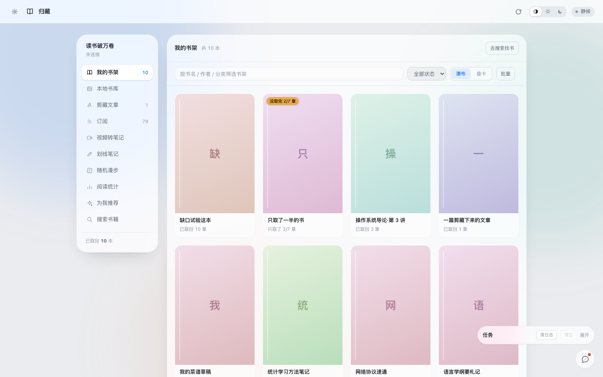

**取书与导出**

- 微信整本导出为 Markdown：文字与插图按阅读顺序交错，插图并发下载、逐章落盘，断了能接着续。
- 导出 EPUB / PDF；也可只把划线导成 Anki 卡包（`.apkg`）。
- 书城搜索、书籍详情、作者与出版社、阅读进度与最近阅读时间，都在本地看，不必打开微信读书。

**搜书：微信读书书城**

- 搜索那一屏搜的是微信读书书城：点了是「加入书架」——把书收进我的书包，再回书架整本取回。
- 想直接下载一份文件到本地，用左侧导航最下面那一栏「安娜的档案」。

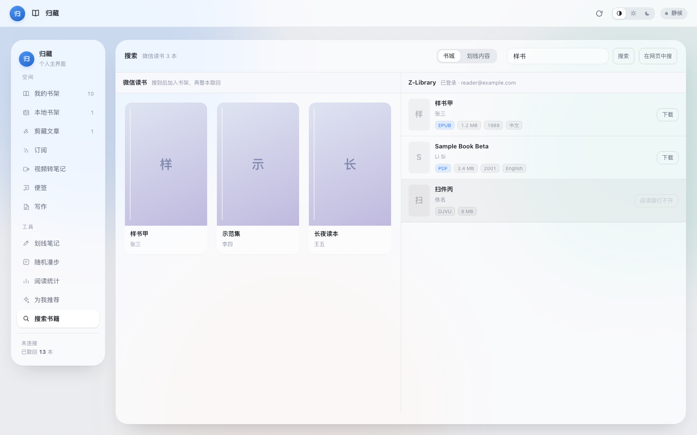

**安娜的档案：工具自己开一个浏览器窗口**

- 这一栏不代抓网页：点「打开浏览器窗口」，归藏自己起一个浏览器，把安娜的档案首页领到你面前——搜书、翻页、点下载都在那个真网页里做，跟平时上网没区别。
- 你在窗口里点下载，归藏在后台盯住下载夹：接住落进来的文件，认出格式就转成书收进「本地书架」，跟你自己导入的书走同一条路。这一屏同时列着「最近收进本地书架」「下载夹里（转成书之前的原始文件）」「没收进来的」三串记录。
- 只收阅读器读得动的格式（EPUB / PDF / TXT / MD）：MOBI、AZW3、DJVU 一律不入库，原文件留着不动，行下面写清为什么没收。
- 关键词框里写个书名点「让窗口去搜」，归藏只是把窗口领到那个搜索页——不代填表单、不碰它的 cookie，也不把你的任何凭据发出去。
- 对方现在要先登录才给下载，所以第一次得在那个窗口里自己登一次；登录态只存在本机那个浏览器档案（`cache/anna_profile/`）里，归藏不读它，设置里的「清除本地数据」会连它一起清掉。镜像域名轮换时在同一栏填新域名点「存这个镜像域名」，不用改代码。
- 为什么做成窗口、而不是把那一页嵌进来：对方响应头写着 `X-Frame-Options: SAMEORIGIN`，iframe 一律空白；而它的域名字面在轮换、直连时常 TLS 断——只有真浏览器能稳定走完它自己的流程。所以这颗按钮要等浏览器组件就绪（没就绪时设置里点「修复」）。

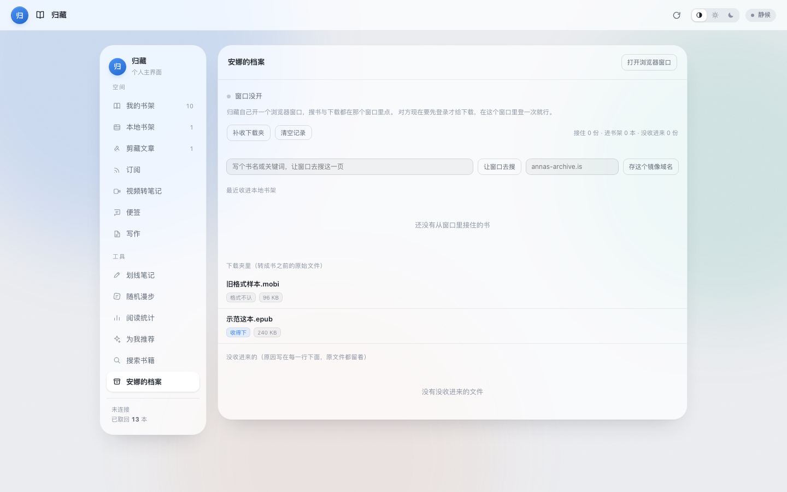

**本地阅读器**

- 取回的书直接在界面里读：左右分栏、目录随滚动高亮、键盘翻章。
- 重开一本书回到上次停下的**那一行**，不只是回到那一章。
- 本章「大纲」列出这一章的小标题，点一条就滚过去。
- 自行导入的 Markdown / TXT / EPUB / PDF 用同一套交互读。

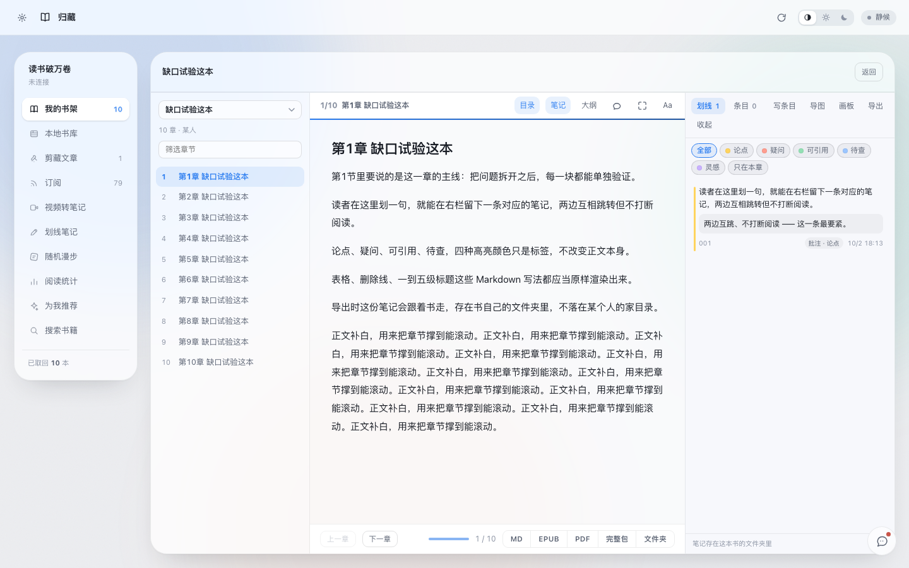

**每本书的阅读计划**

- 给一本在读书定个节奏：**每天读几页**或**每周读几页**，起读日一算，就知道按这个节奏哪天能读完，还剩多少页也随时看得到。
- 「一页」锚在正文本身（每 1000 字算一页），跟你的字号、窗口宽度都无关——今天明天是同一个数，「稳定的节奏」才立得住。
- 进度只记**只增不减的高水位**：翻回上一章查一个词，位置往回走了，「今天读了 30 页」也不会缩水成 8 页。
- 阅读器底栏实时显示今日读数与还剩多少，读到哪一页心里有数。
- 读完那一刻自动留一份完整记录（当时的目标、起止日期、一共读了几天），之后再定新计划也不会把它冲掉——给每本书一个交代。

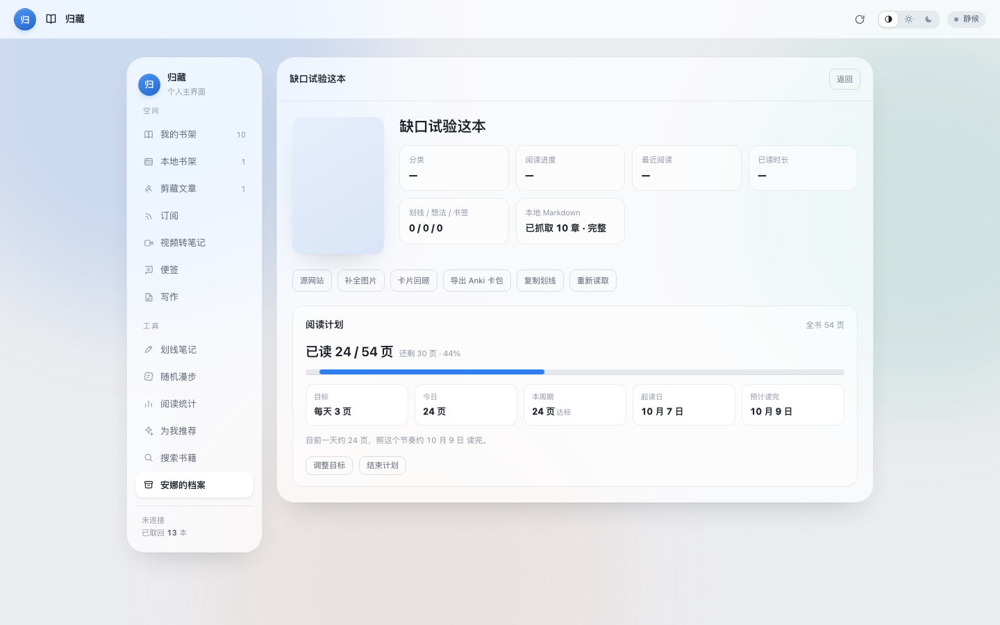

**边读边记**

- 正文里选中一段就能高亮、加粗、划线、删除线或写批注；右侧笔记与正文互相跳转，读到哪条一点就回到原句。
- 划词即记：选中后在浮层里直接写想法，保存时自动带上原文与位置。高亮分五色，颜色标的是「这句我打算怎么用它」——论点 / 疑问 / 可引用 / 待查 / 灵感。
- 随手划的一笔（轻量、成批）与独立笔记条目（可以很长、能引用书里别处）分开存。
- 笔记写在这本书自己的目录里（`notes.json` / `notes.md` / `mindmap.json` / `boards/`）：**拷走书就等于拷走笔记**，不进数据库。
- 官方读书笔记模板起手，也能把自己写的一篇存成模板。
- 阅读中划句问 AI：选中一段就地弹出「复制 / 译成中文 / 问小助手」；英文正文单击一个单词直接弹释义。

**笔记脑图与画板**

- 可编辑思维导图：四种形态（括号图 / 辐射图 / 鱼骨图 / 概念图），就地改名、加层、折起、连一条带关系词的线，撤销 / 重做 / 缩放 / 适应都在。坐标由后端算，拖过的位置钉得住；能复制成 Markdown 大纲，也能存一份 SVG。
- 画板涂鸦：一本书可以开好几块板，边看书边画，画完并进笔记。纸面五种（空白 / 方格 / 点阵 / 横线 / 黑纸），笔、荧光笔、橡皮、箭头、文字框齐备。
- 用的是随包带的 fabric.js，不连 CDN。

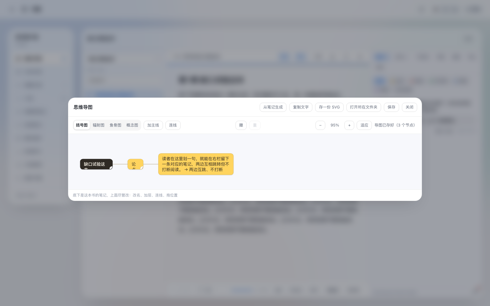

**书架**

- 六格各自独立：**读书**（微信读书）、**本地书架**、**剪藏**、**订阅**、**视频**、**便签**——一篇文章只落在它自己那一格，别处搜不到、翻不到。**写作**不住在这排芯片里，它自己一整屏，但稿子照样住在同一个书库。
- 每格有自己的文件夹、状态标签、标签和排序：给公众号建的「随笔」夹子不会出现在整本书的分组里，挪剪藏的顺序也不带动微信读书那一堆。
- 每页右上角的三点菜单里都能新建文件夹、改分类、给这一页的东西打标签。
- 两种摆法：**瀑布**（羊皮卷逐张展开）与**叠卡**（放大成一本书，左右像折叠屏那样张合，方向键直接翻；两侧各摊三张，左右都能点）。
- 与微信读书的书架分开显示，集中列出已取回与自行导入的书；一键定位到文件所在位置。
- 落在硬盘上也是分开的：`~/Documents/归藏/` 下按这**七**格各一个文件夹（写作那格装你的稿子），访达里一眼能认出哪本是从哪来的。
- 剪藏拿文章首图当封面，视频拿视频封面当封面——挑图时避开页头 logo 与头像，不会满书架一张脸。

**剪藏**

- 粘贴微信公众号推文链接就能解析正文、进书架、按取书那套分章与目录读，导出 EPUB / PDF、定位文件同样可用，读完还能点回原链接。
- 知乎 / 小红书 / X 各有专门解析：X 能直接取正文；知乎与小红书未登录时常只回「安全验证」页——归藏如实说拿不到，**不会把验证页当正文存进书架**。

**订阅阅读器**

- 一个三栏的阅读器，不是一张订阅列表：左栏管源（分组、改名、退订、刷新进度），中栏是条目（未读 / 全部 / 本组 / 按标签筛，加搜索、勾选批量、标签片点开就改），右栏直接读正文。
- 粘站点首页也行：会自己从 `<link rel="alternate">` 里挑最好的那个源，RSS / Atom / JSON Feed 都认。
- 条目多了有「再来一批」；轮询只补需要变的那几行，不会把你正读着的第 30 条拽回顶上。
- 单条一键入本地书架；整包 OPML 导入导出；清理先报数再动手，删完还能撤。

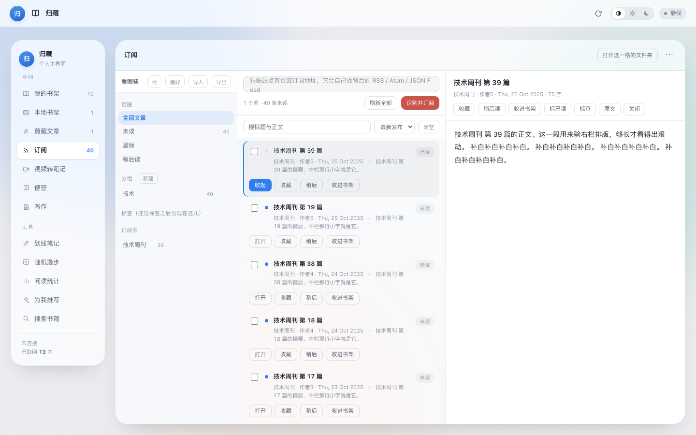

**视频转笔记**

- 贴 B 站 / YouTube 链接：取音频 → 你填的云端转写接口转文字 → AI 归纳成笔记与思维导图 → 当成一本书落进书架，之后跟取回的书一样读、一样记。
- **转写只走云端**：填一个兼容 OpenAI 的语音转写接口地址与 Key 就能用，本机不装引擎、不下权重、不占那几个 GB。没填时视频页那盏灯会写明「云端转写未配置」，旁边那颗钮直接把你送到设置里那一段。
- 多 P 视频只转你点的那一 P，界面上写清是哪一 P；音频只落临时目录，转完即清。
- 转写工作台：逐段列出（每屏 240 段，可按关键词筛），改字 / 删段 / 插段，改完当场显示「待存几处」；保存前一定取无筛法的全量再合并，所以**筛着一个词保存不会把整本改剩那一段**。改完可「重建章节」，也能导出 SRT。

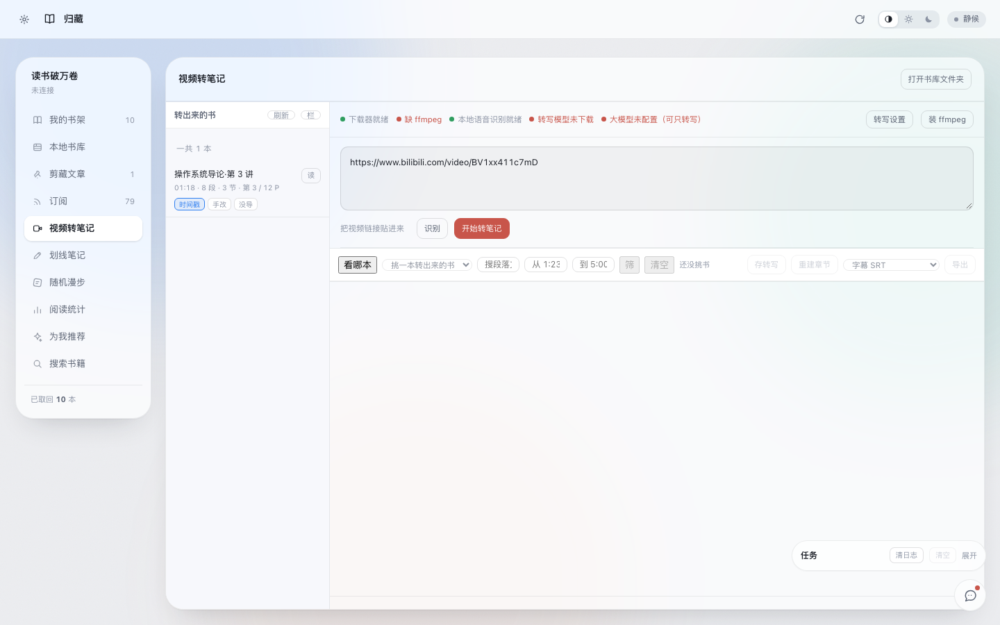

**AI 小结：一个入口，两种模式**

- 读书、剪藏、视频、便签四条来路共用一个「总结一下」，不再各处一个按钮。
- 范围按内容本身来：整本书一次只处理**当前这一章**（整本喂进去既烧钱又答得空），剪藏文章 / 视频转写 / 一条便签这类「本来就是一篇」的，整篇读。
- 两种模式挑一枚芯片：**学习理解**走费曼那一路——先讲透，再给最小执行步骤，最后问一句「你打算怎么用它」，逼你输出一次；**归纳**把水分挤掉，只留能扫完的要点。
- 同一份内容两种模式各存一份，互不覆盖；换一章或改了正文，旧的会自动重算。
- 一键出 SVG 思维导图：骨架由模型给、坐标由后端算，四形态照旧可编辑。没配 AI 时不谎称总结过，只把范围与字数报给你。

**便签（flomo）**

- flomo 导出的 zip 直接拖进来：条数、每张图都收进本机账，之后离线也能看。
- 作为普通笔记条目展示，时间精确到分，标签、字数、图数都摆在卡头上；按天分组，一天一根分隔线。
- 标签按层级认：点 `读书` 会把 `读书/神经科学` 一起捞上来；下面那排药丸写着几条，点进去就筛出几条。
- 长条目自动折叠，点开看全文；一条笔记可以整条收成一本书，进书架跟别的内容一样读、一样记。
- Agent 侧多两个工具：`flomo_notes` 按标签 / 关键字 / id 取原文，`flomo_portrait` 读那份「记忆画像」。
- 首次接入时 Agent 会读完你的笔记，生成一份**用户记忆画像**存在本机（`cache/flomo/portrait/`），此后每次任务先读画像再动手——画像只有骨架数字与分类习惯，不含任何一条笔记原文。

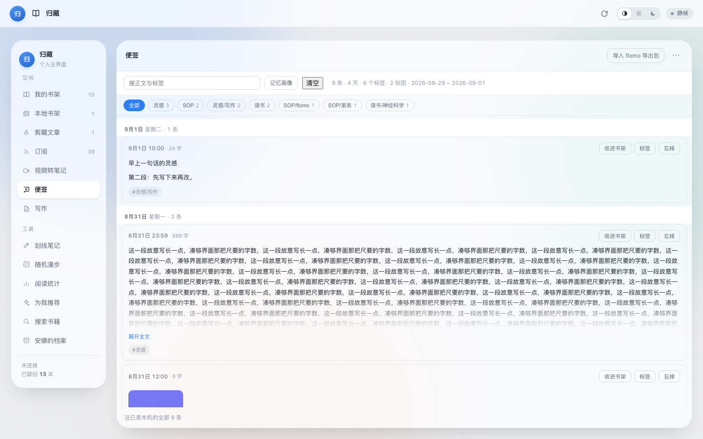

**写作平台**

- 定位是**「AI 只搭手，不代笔」**：字是你自己敲的，卡住了才叫它。一篇稿子就是书库里的一本书（住在第七格 `书库/写作/write_*`），于是目录、标签、封面、清理、MCP 那一整批能力，稿子一行接口都没改就全跟着走。
- **续写**：按你点的那一档接着写——**一句 / 一段 / 三个要点 / 写完这一节**。写多长你说了算，不让模型自己拿主意；素材可以从你的划线、便签里挑，也可以现打一段丢给它。
- **灵感**：卡壳时让它给**三个**方向，只给方向、不给成稿；不满意点刷新就换一批，已经给过的角度它记着，不会翻来覆去说同一句。
- **润色改写**：先选中那一段再动手，语气几档可选；回来的是**按差异切好的一块一块**，你逐块接受或退回——这条路上没有任何一步会直接盖掉你的正文。
- **存盘认版本号，不认时间戳**：界面、Agent、命令行同时改一篇稿子，后写的不会被先写的悄没声地盖掉，对不上就把两边都摆给你看。每存 20 次拍一份快照、最多留 30 份，空转的自动存盘不占位置；回退只回退到真改过的那一版。
- **导出四样：图片 / PDF / 电子书（EPUB）/ Markdown。** 图片有四种排版模板——**黑白简约、商务蓝、青翠、米白书简**；页眉页脚可以带上**工具名（归藏）与日期**，也能带上「字数 · 日期」那一行，三样都能分别关掉。
- 屏幕上预览的那一份，和导出来的那一份，是同一份 HTML：换模板预览立刻跟着变，存下来的就是你看见的。

**个人主界面与两张热力图**

- 左上角那颗头像点开就是个人主界面：**本地上传头像、改名字与简介**（名字 40 字、简介 200 字封顶），原「设置」那一格挪到了这一页最下面。
- 两张热力图各记一本账，互不串味：**学习时长**是「归藏开着在干活的累计时长」，**写作时长**是「人待在写作平台那一格里的时长」。它们和「本机阅读时长」是三笔账，谁也不挪用谁——三件事会同时发生，揉成一个「今日时长」等于什么都没说清。
- 账本写得很克制，为的是让格子诚实：单次最多计 **300 秒**（标签页被冻结、电脑睡过去，不会第二天冒出一根通天柱），单日封顶 **12 小时**，只留最近 **400 天**。
- 每张图上方六个数：今天 / 本周 / 日均 / 连续 / 有记录天数 / 累计。

**侧边栏与导航**

- 十二个入口：七个空间（我的书架、本地书架、剪藏文章、订阅、视频转笔记、便签、写作）+ 五个工具（划线笔记、随机漫步、阅读统计、为我推荐、搜索书籍）。
- 侧边栏默认**常驻摊开**；想清静可以在设置里切成**靠左缘滑出**——鼠标往左边缘一靠，它带着一套果冻式的弹出动效滑出来，头像也像一直长在那儿一样跟着浮起，指针移回内容区就自己收回去。
- **点一下才切换**：点哪一格就切到哪一屏；指针划过不会自己跳页（早年试过「悬停即切」，窗口一重排就容易被误触，已改回点击）。
- 入口能**长按拖拽**重排，顺序跨重启留着；不想要的在设置里取消勾选即可（不许全关，至少留一个）。
- 每次重启落回「我的书架」，不记上次停在哪一屏。

**统计、回顾与同步**

- 阅读时长双源记录：微信读书与本机各记一份，再合并成一个统一时长，两份账目分列，看得出合并从哪两段拼出来。
- 随机漫步：从全部划线里抽卡回顾。划线可批量转 flomo（原文以「」包裹，附书名与标签）。
- **划线笔记可勾选范围导出 CSV**：右栏每条带一个勾选框，勾好几条点「导出 CSV」，出来的就是 flomo 的导入格式（带 BOM 与 `content,created_at` 表头，时间写 `YYYY-MM-DD HH:MM:SS`）——直接拿去「flomo → 导入」就能把这批划线变成笔记，不用一条条手抄。文件落在你选的导出文件夹里（没选就落在数据目录下的 `downloads/`），重名自动加序号，不覆盖旧的；导出完那颗提示上挂着「打开文件夹」。
- WebDAV / OneDrive 云同步：阅读时长、阅读记录、书籍文件三项可分别勾选，凭据只留本机。

**界面自己盯得住后端的成色**

- 每次进页面都跟本机后端对一次代码指纹。对不上就在页顶出一条横幅，两边版本号各写各的，右边一颗「换新后端」——点一下后台换班，新进程绑回同一个端口，页面自己刷新。
- 换不成时说的是什么就是什么：后端正在跑任务就写「不打断它，等这一趟跑完再换」；那个进程确实比界面旧就给你手动重启的路径；真连不上才说连不上。
- 四个入口（两个启动脚本、MCP 适配器、macOS 壳）认的是同一把尺子，不会出现「脚本以为壳起了、壳以为脚本起了」这种两边干等的局面。

**给 AI Agent 用**

- 零依赖的 MCP 适配器，56 个工具（取书、批量取书、视频转笔记都是长任务、不阻塞调用；服务没起时适配器自己把它拉起来）。
- 仓库内 [`skills/`](skills/) 可直接安装；界面里「一键建立 MCP」把接入提示词复制给你的 Agent。

## 它在细节上在意什么

这个工具是围绕几件很具体的事在做取舍，写在这里，方便你判断它合不合你的用法。

**东西是你的，就得放在你能看见的地方。** 取回的书、导入的书、笔记、脑图、画板，统一放在 `~/Documents/归藏/`；笔记跟着书走，跟着目录一起搬走就行。应用包本身始终只读、可以随便挪；运行时要写的（虚拟环境、缓存、登录态）都在 `~/Library/Application Support/归藏/`。**设置里的「清除本地数据」不会碰你的书**——它清的是登录态、索引、封面、下载中间件这些它自己攒的东西。

**不替你连任何第三方。** 服务只绑 `127.0.0.1`，不经任何中转。往外的连接只有你自己点名的那几处：划句翻译 / 问助手会把你选中的那一段发给你填的 AI 接口，视频转笔记在选了云端转写时把音频发给你填的转写接口，「安娜的档案」那一栏只连安娜的档案自己的站点（而且是**你自己在那个窗口里浏览**，归藏不代抓、不代填、不读它的 cookie）。归藏不预置任何地址、不代传，没填就不发——所以没配 AI 时它只存转写全文，没开那个窗口时这一栏就是「窗口没开」。

**密钥只回显末 4 位。** Key 存在本机 `cache/config.json`（权限 600），界面上永远只看到尾巴四位；所有按目录 id 取路径的接口都过一遍正则 + `realpath`，图片写盘前校验魔数。

**大东西不拦门。** Chromium 那 368 MB 是取书的硬前置，所以放在配置页等；ffmpeg 那几十 MB 也一样在安装那一步到位。转写自 1.0.8 起只走云端，本机不再下 GB 级权重——省下来的空间与时间都是你的。组件下载失败也不堵住取书：它只是视频那条线暂时不能用，进门后在设置里补一下就行。

**删东西都给一次反悔。** 划掉一条笔记，右下角那条提示上挂一颗「撤销」，点一下就原样放回去；订阅的清理先跑一遍「会删多少条」给你看，点了才真动手。比起弹个确认框拦在前面问一遍，这样更省事。

**抓回来的东西是数据，不是命令。** 订阅正文、剪藏正文一律按数据渲染（Markdown 渲染器关掉 HTML 直通），标签和正文里写什么都不会被执行。

**两处真相会越用越歪。** 导图的坐标一律在后端算完再交给前端画——命令行、MCP 适配器和自测都没有浏览器，却都要能出图；前端要是再排一遍，存回去的坐标和屏幕上看见的就会一天天对不上。

**含密钥的字段只回末四位。** 微信读书的 Key、云端转写的接口 Key、云同步的密码，界面上回显的都只是「有没有」和最后四位——明文既不往界面送，也不进日志。

**报错那句不能编。** 界面每 2.6 秒跟后端对一次话，对不上的种类是有区别的：连不上、后端比界面旧、后端回了一句看不懂的话。以前这三样揉成一条「本机服务没在跑」，于是明明服务跑着、只是旧，人被引去查一件本来没事的事。现在这四条各说各的话，页顶横幅还会把两边版本号打出来，点一下就能换。存转写也一样：回执说「存好了 8 段」的那一帧，按钮上那颗「待存 3 处」的红点必须同时退掉，不能等下一次刷新才想起来。

**窄的地方不牺牲最要紧的那两颗钮。** 划词小条在窄窗里会折行、宽度封顶，但「写想法」「写条目」一定留着——被挤出去过的正是这两个。

**装过的能卸干净。** 设置 → 维护里有「卸载组件」与「清除本地数据」两步：前者卸 ffmpeg、Chromium（几百 MB），后者清登录态与各种索引；软件本体你自己拖进废纸篓就行。

**这些不是说说而已。** 仓库里那套自测是真开一个 Chromium 点一遍的：

```bash
bash tests/run_all.sh          # 静态检查 + 真机走查
bash tests/run_all.sh --fast   # 只跑静态那几项，秒级
```

每一次改动都在这个门禁里过一遍才提交——包括上面这些「细节」：截图里的排版、笔记能不能点、删掉能不能撤、服务没起时适配器能不能自己把它拉起来。

## 环境要求

- **Python 3.9+**：后端就跑在它上面。装成 macOS 程序也要求机器上有一个（3.9 即可）；从源码跑建议 3.10+。
- **Node**（可选）：只有 MCP 适配器要用，`node -v` 能输出版本号就行。其余功能都不需要它。
- **微信读书账号（可选）**：只有取微信读书的书、看划线笔记与统计时才需要，且要对目标书有阅读权限（无限卡或已购买）。剪藏、RSS 订阅、视频转笔记这三条不依赖它。
- **走「视频转笔记」才需要的只有 ffmpeg**：它在安装那一步自动到位，不必你预先准备。转写本身用云端接口，本机不装引擎也不下模型（想腾空间就到设置 → 维护里点「卸载组件」，随时能再补回来）。

## 安装

### 装（macOS，三步）

**1 · 下载**　[归藏-1.0.8.dmg](安装包/归藏-1.0.8.dmg)　（约 3 MB · macOS 13+ · Intel 与 Apple 芯片）

**2 · 拖进「应用程序」，双击打开**

若弹出 **「归藏」已损坏，无法打开**：这是 macOS 对未签名应用的默认拦截，不是文件坏了。粘这一行就好（装在别处请改路径；提示 `Operation not permitted` 就在前面加 `sudo`）：

```bash
xattr -dr com.apple.quarantine /Applications/归藏.app
```

也可以在 **系统设置 → 隐私与安全性 → 安全性** 里找到被拦的那条，点「仍要打开」。

**3 · 点一下「我思故我在」**

剩下交给它：装依赖、下取书用的 Chromium（约 370 MB）、备好 ffmpeg，然后弹出浏览器让你扫码。**装完直接进界面**；之后每次打开都是直接进。

> 需要机器上已有 Python 3.9+：[python.org/downloads](https://www.python.org/downloads/) 装一个，装完不用重启。包里另附《首次打开必读.txt》，细节与替代做法见 [部署说明.md](docs/部署说明.md)。

### 装（Windows，两步）

**1 · 下载**　[归藏-Windows-1.0.8.zip](安装包/归藏-Windows-1.0.8.zip)　（约 0.9 MB · 解压即用 · Windows 10+）

**2 · 解压后双击「安装归藏.bat」**

它把程序复制到 `%USERPROFILE%\归藏`，再在桌面放一个「归藏」快捷方式。第一次打开会建虚拟环境、装依赖、下取书用的 Chromium（约 370 MB）—— 那个黑窗口别关，它就是后端，界面会自动开出来。

不想装也行：双击 `启动归藏.bat` 就地跑，程序和数据都留在解压出来的文件夹里。首次运行 Windows 会拦一下（**更多信息 → 仍要运行**），因为这份包没有代码签名证书。

> 需要机器上已有 Python 3.10+：[python.org/downloads](https://www.python.org/downloads/) 装一个，安装第一步勾上 *Add python.exe to PATH*。包内另附一页《首次打开必读.txt》。

> **如实说明**：这个包是在 macOS 上打的，装与跑**没有在 Windows 机器上实测过**。安装脚本、启动脚本、跨平台那几处都按 Windows 的规矩写，仓里也有对着平台标志跑的单元测试，但没有从头到尾跑过一遍。

### 从源码跑

```bash
# macOS / Linux
git clone https://github.com/KEQingFeng/weread-guizang.git
cd weread-guizang
python3 -m venv .venv
.venv/bin/pip install -r requirements.txt
.venv/bin/python -m playwright install chromium     # 约 368 MB
.venv/bin/python ui_server.py --port 8770           # 打开 http://127.0.0.1:8770

# Windows（把上面最后两条换成）
.venv\Scripts\python.exe -m playwright install chromium
.venv\Scripts\python.exe ui_server.py --port 8770
```

也可双击 `启动归藏.command`（Windows 上是 `启动归藏.bat`）：自动识别目录、缺虚拟环境就创建并装依赖，服务已在跑就直接开界面。

想装成可双击的 macOS 程序、或打成可分发的 dmg：

```bash
./shell/build_macos.sh     # 产出 dist/归藏.app
./shell/make_dmg.sh        # 产出桌面上的 归藏-<版本>.dmg
```

外壳是 Swift + WKWebView 的原生应用，界面仍是 `ui.html`；构建只要 CommandLineTools，不需要完整 Xcode。

### 首次使用

1. 齿轮 → **连接账号**：在弹出来的浏览器窗口里用微信扫码。登录态持久化在 `cache/browser_profile/`，之后自动复用。
2. 填 **接口 Key**：微信读书网页版「设置 → 开放 API」里复制形如 `wrk-…` 的 Key。存本机 `cache/config.json`（权限 600），界面只回显末 4 位。书架、笔记、统计、推荐、书城搜索、书籍详情都靠它；不填也能用（只列出本地已导出的书）。
3. 想用**划句翻译 / 单击查词 / 问小助手**（这三样都在阅读器里），在「小 Agent」一栏填一个兼容 OpenAI 的接口（地址写到 `/v1` 为止）、Key 与模型名。
4. 想用**视频转笔记**：B 站 / YouTube 直接贴链接就行。转写走云端 —— 在设置 → **视频转写**里填一个兼容 OpenAI 的语音转写地址与 Key；AI 归纳与上面第 3 步那个小 Agent 接口共用，没填就只存转写全文。
5. 想把划线**转进 flomo**：一种是在设置里填 flomo 的 API（形如 `https://flomoapp.com/iwh/xxxx/`），需要 flomo PRO；另一种更省事 —— 在「划线笔记」里勾选要的那几条，点「导出 CSV」，拿到的就是 flomo 的导入格式，直接在 flomo 里点导入即可。
6. 想从**安娜的档案**下载书：点左侧最下面那一栏，再点「打开浏览器窗口」——归藏会自己起一个浏览器把那一页领到你面前，搜书、登录、点下载都在那个窗口里做。下完的文件自动收进「本地书架」，这一屏能看到它接住了什么、什么没收进来。

## 命令行

以下命令可在不启动界面的情况下使用。

```bash
# macOS / Linux
.venv/bin/python export_precise.py <书籍链接或ID>          # 链接会自动提取 ID
.venv/bin/python export_precise.py <ID> --headed          # 显示翻页过程
EXPORT_DEBUG=1 .venv/bin/python export_precise.py <ID>    # 卡住时每 60 秒输出 Python 栈

# Windows
.venv\Scripts\python.exe export_precise.py <书籍链接或ID>
.venv\Scripts\python.exe export_precise.py <ID> --headed
set EXPORT_DEBUG=1 && .venv\Scripts\python.exe export_precise.py <ID>
```

登录与加书架也可单独运行：`login.py`（登录与登录态检测）、`shelf_add.py <书城 id>`。

剪藏、订阅、视频这几条也各有可以直接跑的命令，用于排查而不必开界面（macOS / Linux 用 `.venv/bin/python`，Windows 换成 `.venv\Scripts\python.exe`）：

```bash
.venv/bin/python clip_article.py <文章链接>          # 看这一篇能解析出什么（公众号 / 知乎 / 小红书 / X 自动选路）
.venv/bin/python web_parse.py <链接>                 # 看这条链接被归到哪个站，以及正文前 1200 字
.venv/bin/python feed.py <站点或订阅地址>             # 从任意网址里找出订阅源
.venv/bin/python feed.py --list                     # 现有订阅与各条目的抓取状态
.venv/bin/python feed.py --refresh                  # 刷新全部订阅
.venv/bin/python video_note.py <视频链接> [输出目录]   # 打印视频信息，再整条跑一遍转笔记
.venv/bin/python video_note.py --task <链接>         # 界面用的那条路：选项走 GUIZANG_VIDEO_OPTS、结果打 ##GUIZANG## 一行
.venv/bin/python ffmpeg_tool.py --status            # 看 ffmpeg 备好没有
.venv/bin/python ffmpeg_tool.py --ensure            # 下一份静态 ffmpeg 放进数据目录
```

## 接入 AI Agent（MCP）

仓库自带零依赖的 Node 适配器（`mcp/guizang-mcp.mjs`，stdio + JSON-RPC 2.0）。在 MCP 配置中加入一项，路径替换为实际的归藏目录：

```json
"guizang": {
  "type": "stdio",
  "command": "node",
  "args": ["<归藏目录>/mcp/guizang-mcp.mjs"],
  "timeout": 180000,
  "env": { "GUIZANG_REPO": "<归藏目录>" }
}
```

Qoder CN 写在设置文件的 `mcpServers`；ZCode 写在 `config.json` 的 `mcp.servers`。配置完成后重启 Agent（MCP 在启动时加载，不支持热加载）。

适配器按以下顺序查找项目目录：环境变量 `GUIZANG_REPO` → 依据「本文件位于项目 `mcp/` 下」推断 → 常见路径回退。解释器按平台选择（Windows 用 `.venv\Scripts\python.exe`，macOS / Linux 用 `.venv/bin/python`），均不存在时回退至系统 `python`。服务未启动时自行拉起。

共 **56 个工具**，分为十一类：

| 分类 | 工具 |
| --- | --- |
| 书架与状态 | `shelf_list`、`app_status`、`task_log`、`book_files`、`folder_create`、`book_move` |
| 取书与账号 | `book_fetch`、`task_stop`、`batch_fetch`、`account_connect` |
| 书与笔记 | `book_detail`、`search_books`、`notes_index`、`notes_search`、`notes_random`、`book_mark` |
| 写回与导出 | `shelf_add`、`apkg_export`、`zip_export`、`cache_delete` |
| 网页剪藏 | `clip_url` |
| 订阅（RSS） | `feed_list`、`feed_discover`、`feed_add`、`feed_entries`、`feed_entry`、`feed_refresh`、`feed_to_shelf`、`feed_remove` |
| 视频转笔记 | `video_capability`、`video_plan`、`video_to_shelf`、`video_books`、`video_transcript`、`video_transcript_save`、`video_rebuild`、`video_export` |
| 思维导图 | `map_show`、`map_from_notes`、`map_save` |
| 画板 | `board_list`、`board_show`、`board_new`、`board_save`、`board_delete` |
| 便签（flomo） | `flomo_notes`、`flomo_portrait` |
| 写作 | `writer_list`、`writer_read`、`writer_create`、`writer_save`、`writer_versions`、`writer_snapshot`、`writer_restore`、`writer_export`、`writer_ai` |

六条约束写入适配器的工具说明，Agent 可读取：

- 取书、批量取书、视频转笔记、刷新订阅都是分钟到小时级的长任务，调用会立即返回，进度通过 `app_status` / `task_log` 轮询。不要等待其执行完毕，否则必然超时。
- 后端的三个写口都是**整本 / 整块覆盖**：改转写只用 `video_transcript_save` 的 `edits` / `drop` / `add`（只说改了哪几段，适配器自己读回整本再写盘），`map_save` 不带 `nodes` 就只改标题 / 形态，`board_save` 不带 `canvas` 就不动画面。把整本抄一遍发上去，或者顺手清空用户手画的东西，都是这一层要挡住的事故。
- `writer_save` 也是**整篇覆盖**：要改哪一段，先用 `writer_read` 把最新正文取回来、改完整篇存回；带上 `rev` 时版本对不上会被拒，防的就是拿着旧稿盖新稿。后端存前自动留快照，退错了用 `writer_restore` 退回来。`writer_ai` 的 `polish` 只回差异建议、不动原文。
- `shelf_add` 是唯一会改动**真实微信读书书架**的写操作；`cache_delete` 默认只列出，需带 `confirm=true` 才真正删除；`board_delete` 不可恢复。`feed_add` / `feed_remove` / `feed_refresh` / `feed_to_shelf` 只动本机的订阅与本地书架。
- 视频这条路要先具备工具链：`video_capability` 报现在还缺什么（yt-dlp / ffmpeg / 云端转写接口填没填），缺了就先补齐再发起，不要盲发。
- 谈这位用户的笔记之前先读 `flomo_portrait`：那份记忆画像只有骨架数字与分类习惯，读它比翻一百条原文便宜，也不会把原文一次性搬进上下文；要原话再用 `flomo_notes` 按标签 / 关键字 / id 取，一条一条来。

## 配套 Skills

[`skills/`](skills/) 目录包含用于读书与学习的 Skill，将对应文件夹复制到本机 skills 目录即可（Qoder CN 为 `~/.qoder-cn/skills/`，其他平台使用各自的目录）：

| Skill | 用途 |
| --- | --- |
| [`skills/guizang/`](skills/guizang/) | 将归藏接入为读书助手：先查看状态再执行，长任务仅发起一次并轮询，写操作仅执行明确要求的那一个；包含找书→取书→划线检索→抽卡→导出 Anki 的完整动作序列与排障口径 |
| [`skills/book-speedrun/`](skills/book-speedrun/) | 将一本书一次讲透：前导地图 → 核心讲义 → 全书串讲 → 一页速记与分层行动清单，每部分末尾附一条可立即执行的动手项。含完整示例 |

分工判据：需要**内容**（把书讲透、读完即用）使用 `book-speedrun`；需要**数据**（把书取到本地、检索划线、导出 Anki）使用 `guizang`。两者可衔接：先用归藏取书，再用 `book-speedrun` 讲透。

> `book-speedrun` 中提到的 `grace-coach`、`learn-from-materials`、`learn-anything-skill` 属于同一生态的其他 Skill，**不在本仓库**，仅用于划分职责。

界面中的「**一键建立 MCP**」会把接入提示词复制到剪贴板，粘贴给 Agent 即可。该提示词不含任何本机路径、用户名或端口，可直接分享。

## 工作原理

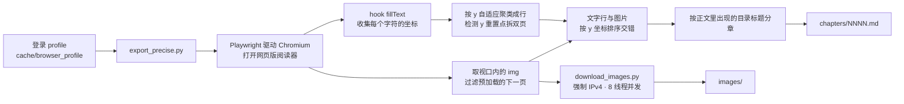

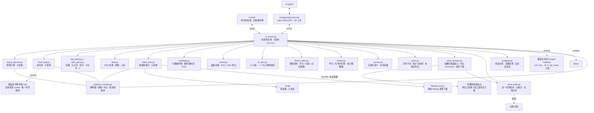

抓取引擎中几个关键决定及其原因：

- **分章依据为「正文中实际绘制的目录标题」**，不使用顶栏标题。顶栏每翻一页都会变化，早期版本因此将整批内容归到同一标题下，其余小节只剩空壳；目录标题每个只出现一次，天然去重。
- **翻页只使用方向键，不点击正文中心**。点击会触发微信读书的「回到上次阅读位置」，而从目录跳到开头不会更新阅读记录，导致「点击 → 等待 → 跳回开头」无法收敛，表现为开头数章整片丢失。
- **每轮翻页设硬超时**。Playwright 的 `page.evaluate` 默认无超时，渲染进程卡死时调用永久挂起；`asyncio.wait_for` 对不响应取消的调用无效，因此使用 `asyncio.wait` 取得超时后直接返回，再终止浏览器回收连接。
- **图片下载强制 IPv4**。macOS 上 urllib 默认先尝试 IPv6，路由不通时每张图约卡 120 秒。
- **订阅源判定只认「根元素就是 feed」**。博客页脚常夹一块创作共用的 `<rdf:RDF>` 授权声明（还裹在 HTML 注释里），见着 `<rdf` 就当 RSS，会把整页 HTML 认成订阅源，反而把页面里 `<link alternate>` 指着的真源挡在后面用不上。判据改为：feed 的根元素之前不先出现 `<!doctype` / `<html`。
- **知乎 / 小红书 / X 各走各的取法，不进通用解析器**。X 的正文根本不在页面里（得问 syndication 那个公开接口），小红书把正文塞进 `<script>` 里的一坨 `window.__INITIAL_STATE__`，知乎对未登录读者时而给正文、时而给验证页。这些差异属于「同一个站一种取法」，塞进通用解析器会改坏所有站点的剪藏，因此独立成模块；哪一家改版失效，只动那一段，并在注释里写清现状，不留一个看着正常、其实永远抛错的空壳。
- **视频只转用户点的那一 P**。多 P 视频整条转可能几小时，而用户要的多半只是其中一集；认链接时先把分 P 列出来，只把选中那一 P 交给 yt-dlp。音频只在临时目录里存在，转完即删——用户要的是那本书，不是那段音轨。
- **云端转写点名就点名**。老配置里若还写着 `mlx` / `faster`，不静默当云端用，而是当面报「本地转写已移除，去设置里填云端地址」——把「我要用大模型」悄悄换成别的，比报错更让人火大。
- **改转写永远先取无筛法的全量**。后端那个写口是整本覆盖的，而界面上常常带着一个筛子（筛一个词只为改那一两句）。保存如果拿「当前看见的那几段」去写，整本转写就改剩那几段。因此保存 = 取全量 → 按 id 合改动 → 整体写回，前端只交「改了哪几段 / 删了哪几段 / 在哪段后面插一段」。MCP 那一层同理包住了 `map_save` 与 `board_save`：不给 `nodes` 就只改标题与形态，不带 `canvas` 就不动画面——用户手画的图和涂鸦覆盖不了第二次。
- **导图的坐标必须在服务端算完**。命令行、MCP 适配器和 `tests/` 里的自测都没有浏览器，却都要能出图；前端若自己再排一遍就是两份真相，存回去的坐标和屏幕上看见的会越用越歪。前端只管照 `boxes` / `edges` 画、把编辑动作回传。
- **画板存 JSON，不存图片**。JSON 是真相（随时能再编辑），SVG / PNG 只是导出物；后端一行不解析 canvas 里那一坨，`board.py` 只把它当数据落进书目录的 `boards/<id>.json`，于是 fabric 的版本、对象和路径随它去。路径纪律也只有一个地方要审：板 id 一律先过 `slug()`，产物只能落在 `boards/` 下面。
- **数据跟着书走，不进数据库**。`notes.json` / `notes.md` / `mindmap.svg` / `mindmap.json` / `boards/` 全部写在那一本书自己的目录里；拷走这本书等于拷走它所有的笔记与画板。手画的那张（`mindmap.json`）和按大纲现算的那张（`mindmap.svg`）是两个文件名，各写各的——自动图冲掉手画图是这一轮最不能接受的事故。
- **后端换不换，看代码指纹而不是端口号**。`/api/state` 里那个 `code` 是 `ui_server.py` 源码的 SHA-1 前 12 位，界面、启动脚本、MCP 适配器、macOS 壳问的都是同一句「你跑的是哪一份代码」，于是一台机器上不会出现两个都觉得自己该起的进程。判出来四种结果：`reuse`（就是这份，直接用）、`takeover`（是自家旧后端且闲着，停掉它、新进程绑回同一个端口）、`busy`（旧后端正在跑任务，绝不打断）、`stranger`（端口上是别人的程序，一个字节都不动）。接管只在「回话里带着归藏自己的身份」与「此刻没在跑任务」两条同时成立时才做，缺一条就退回报错，不硬来。
- **判「后端旧不旧」不能只比版本号**。`/api/state` 除了报进程里那份代码的指纹，还报**磁盘上这份**的指纹（`code_disk`，按 mtime + 大小缓存，不每问重算）。两者不一样就是「改过源码没重启」——这时两边版本号可能一模一样，只比版本号会一声不吭，界面少了的新东西看着像凭空消失。1.0.7 就是这么补上的：这一种情形横幅照样出现、照样给「换新后端」那一条出路，只是那句说的是「本机跑着的后端比磁盘上那份旧」。

## 仓库结构

```
仓库根      运行期代码：后端 ui_server.py、界面 ui.html、引擎与各功能模块
            （取书 export_precise.py、安娜的档案 anna_browser.py / anna_state.py、
              剪藏 clip_article.py / web_parse.py、
              订阅 feed.py、视频 video_note.py / ffmpeg_tool.py、
              导图 mindmap.py、画板 board.py、小结 ai_sum.py、
              便签 flomo_notes.py、写作 writer.py、阅读计划 readplan.py、
              时长账 activity.py、个人资料 person.py、
              书库目录结构 book_layout.py）
            —— 这一层刻意不分包：任务子进程以数据目录为工作目录，靠
               dirname(__file__) 找同伴模块，移动即断
tests/      验证门禁。一条命令跑全套：bash tests/run_all.sh（--fast 只跑静态检查）
tools/      只在开发机上跑：出图标、打源码包、窗口截图
docs/       四份文档：部署说明、架构与模块地图、开发规范、交接说明
shell/      原生壳与打包脚本：macOS 是 Swift 外壳 → dist/归藏.app → 安装包/*.dmg
            （shell/windows/ 下是 Windows 的入口：安装归藏.bat、启动归藏.bat
              的图标与必读 → 安装包/归藏-Windows-*.zip）
mcp/        MCP stdio 适配器：把本地接口包成 56 个工具给 Agent 用
skills/     给 Agent 看的说明书（不含可执行逻辑）
vendor/     随包的三方前端库（markdown-it、fabric.js）及其 LICENSE，界面不连 CDN
安装包/     只保留最新那一份：macOS 的 dmg + Windows 的 zip
```

| 文档 | 什么时候看 |
| --- | --- |
| [部署说明.md](docs/部署说明.md) | 装、跑、排障、接 MCP |
| [架构与模块地图.md](docs/架构与模块地图.md) | 动手改代码之前：谁调谁、数据落在哪、两套书籍 id、加一个功能的最短路径 |
| [开发规范.md](docs/开发规范.md) | 提改动之前：目录与路径契约、哪些事实只准写一处、界面零 emoji、隐私红线、验证门禁与发版流程 |
| [交接说明.md](docs/交接说明.md) | 接手这个项目时：这一轮修了什么、每个 bug 的根因在哪、还差哪些没验过 |

## 常见问题

**点击「连接账号」或某个按钮没有反应。**
查看启动服务的窗口，它会打印实际的「解释器」与「浏览器」路径，这两行是排查起点。真实出错时后端不会掐断连接，而是将异常与最后几行栈写入界面的「进展」栏，页面同时显示红字。

**点了画板、思维导图或导入 flomo 包，页顶说「界面是新的、后端是旧的」。**
界面是从磁盘现读的，路由表却是后端进程起来那一刻装进内存的。源码目录刚 `git pull` 过、或者旧窗口还开着的时候，就会出现「页面已经是新版、正在应答的那个进程还是旧版」——旧版没长这些接口，一律回 404，看着像后端没启动。点页顶那颗「换新后端」，旧进程退出、新进程绑回同一个端口，页面自己刷新。横幅上写的两串版本号就是答案本身：一致说明这一条接口确实没有，不一致就是后端该换了。旧后端正在跑任务时它不会动手，会写清楚「不打断它」。

**加书架失败，提示「登录超时」。**
网页端 `/mp/` 接口校验两个 cookie：`wr_vid`（长期身份）与 `wr_skey`（约 30 天会话）。`wr_skey` 过期时服务端返回 **HTTP 200**，内容为 `{"errcode":-2012,"errmsg":"登录超时"}`。用同一 profile 打开任意微信读书页面，服务端会重新下发 `wr_skey`；脚本也会自动续期一次后重发。请照抄服务端 `errmsg`，不要推测码值含义。

**取书中途停止响应。**
每轮翻页有 45 秒硬超时，超时后重开浏览器续传，不会整场报废。需要更多信息时，设 `EXPORT_DEBUG=1` 每 60 秒输出一次 Python 栈；日志每 10 页有一次心跳。会话切换时可能有数十秒无响应，属设计内行为（判定 12 页无新内容并重开浏览器）。

**导出的章节数少于目录。**
正文依赖 hook Canvas 取字，阅读器会复用已绘制的缓存，因此整本抓取不保证 100%。引擎已按目录标题分章并支持断点续传，再运行一次通常可补齐。

**书架为空。**
未填写接口 Key。填写后书架、笔记、统计、推荐都会出现；未填写时本地已导出的书仍会列出。

**在搜索引擎中搜不到本项目。**
仓库名为 `weread-guizang`，项目名为「归藏」。

## 已知限制

- 取微信读书的书需要有效账号，且对目标书有阅读权限（无限卡或已购买）；剪藏、RSS 订阅、视频转笔记三条不用登录微信读书。
- 部分出版社限制网页端阅读（显示「去 App 阅读」），此类书无法导出。
- 抓取不保证 100%：阅读器会复用已绘制的缓存，部分页确实不触发 `fillText`；章节归属在两次导出之间可能略有差异（绘制批次不同），但正文总量稳定。
- 纯图廊章节图片密集时，图注与图的配对偶尔相差一位；正文章节中图片相对段落的位置准确。
- 导出速度约每页 1.1 秒（同一本书 14 页 A/B 实测：固定等待 2.12s/页 → 画完即走 1.08s/页，逐页正文 14/14 一致）。继续压缩需缩短「等待本屏画完」的判定，会开始丢字。
- Canvas 逐字抓取对跨行断字仍会丢失少量字符（如 `multi-agent` 被截为 `ulti`）。
- 官方 Gateway 不开放「书单」接口，面板中没有书单，最接近的是「推荐」。
- flomo 请求格式官方未提供示例，此处按通行约定发送 JSON，失败时回退为表单编码；**真实发送未经过验证**。
- 便签这一格是**只进不出**：认 flomo 官方导出包（zip / 两个 JSON 都收），存进本机账后不再往 flomo 回写，也不做双向同步——改了本机的条目，flomo 那边还是老的。导入按「时间 + 正文」认人，重复导同一个包不会翻倍。
- AI 小结依赖你自己填的兼容 OpenAI 接口，没填时那两枚芯片会如实说没配：总结不产生假内容，也不会替你猜。
- 阅读划句翻译 / 查词 / 问助手依赖你自己填的兼容 OpenAI 接口；本地按常见的 `/chat/completions` 返回结构解析，**未对具体厂商逐一联调**，返回格式特殊时可能失败。
- 知乎 / 小红书 / X 的解析依赖对方「现在」怎么发页面，随时可能失效。未登录时知乎与小红书多数情况只回验证页，这是平台限制，不是可以绕过的 bug——归藏选择如实报错，不做登录态绕过（也就没有你的 cookie 上传问题）。
- RSS 只做「订阅 → 读 → 入书架」这条最小闭环：不做已读/未读同步、不做双向同步、不在后台定时轮询（要新内容时点一下刷新）。
- 视频转笔记目前只支持 B 站与 YouTube。转写走你自己填的云端接口（兼容 OpenAI 的 `/audio/transcriptions`），专有名词、多人对话、强口音的准确度取决于你选的那个模型，不保证。转写只走云端：本机不装引擎、不下权重，也就没有那几个 GB 要管。
- 云端转写只填域名也行：归藏会补成 `<你填的地址>/v1/audio/transcriptions`（填到 `/v1` 就补后半段，已经是完整端点就原样用）。地址填错或连不通时，任务会如实报错、视频页那盏灯也会写清原因，不会假装在转。
- macOS 才会自动下载 ffmpeg（下的是静态版，放在归藏自己的数据目录里、不动系统）。Windows / Linux 请自己装一份放进 `PATH`。
- yt-dlp 属于「随平台改版天天要更新」的工具：视频取不到时先 `.venv/bin/pip install -U yt-dlp` 再试一次。
- 视频的 AI 笔记与思维导图依赖你自己填的兼容 OpenAI 接口；没填时就只存转写全文——这是有意为之，不在你没配的情况下把音频或文字发给第三方。
- 云同步按 WebDAV 与 Microsoft Graph 的公开接口实现；**未在真实网盘账号上端到端验证**，首次同步建议先用一本小书试通，确认无误再同步全部。
- 「换新后端」这一键是在**手搓的旧版后端**上验的：一个自报旧版本号、没有新接口的进程，换班成功、旧后端正在跑任务时不打断、端口上站着别人家程序时不动手，三条都摆成了可失败的断言；**没有在你从前跑过的那个真旧实例上走过一遍**。万一没换成，横幅会说是哪种原因，退出归藏再打开一次同样能到新代码。
- 跨平台：Windows 这一路写了安装脚本、启动脚本，也在单元测试里以 mock 的平台标志跑过，但**没有在真实 Windows 机器上端到端跑过一遍**。上面那个 Windows zip 就是这么打出来的（打包机是 macOS，做不出真 .exe）；装与跑的结果还没人见过——跑到哪一步卡住，都请当它是「第一次跑」，报错窗口里最后几行最有用。
- 写作助手（续写 / 灵感 / 润色）与阅读助手走同一个兼容 OpenAI 接口，没填时按钮如实说没配；**未对具体厂商逐一联调**。稿子的图片 / PDF 导出走随包 Chromium 渲染，EPUB 与 Markdown 由标准库直接写出，不引第三方排版库。
- 随时长账（学习 / 写作两张热力图）的停靠口径：学习时长按应用在后台运行的累计秒数记，写作时长按停在写作页的累计秒数记，都靠界面心跳上报，**没有在长时间挂机场景下核过对**。
- 「安娜的档案」这一路依赖对方站点**现在**怎么服务，而它一直在动：2026-10-07 在有头窗口里实测，只有 `annas-archive.is` 这个域答话（`.gd` 回 502、`.org` 与 `.se` 直连不通），域名字面还在轮换——失效时在这一栏填一个新镜像就行，不用改代码。国内访问借你本机现有的代理，代理不通时那句人话会点出来。
- 对方**现在要求登录才给下载**：详情页每个下载钮都先跳 `/account`。所以第一次得在那个窗口里自己登一次，登录态只留在本机那个浏览器档案里；归藏不代填表单、不读它的 cookie。
- 这一栏**嵌不进界面**：对方响应头写着 `X-Frame-Options: SAMEORIGIN`，iframe 一律空白，所以做成工具自己开的窗口。
- 只收阅读器读得动的格式（EPUB / PDF / TXT / MD）：MOBI、AZW3、DJVU 不入库，原文件留在下载夹里不动，那一行下面写清为什么没收。**下载成功率不做保证**——受账号额度、条目本身有没有可下载文件、镜像可用性影响。
- 「接住下载 → 转成书 → 上本地书架」这一段在沙盒里端到端跑过（含不覆盖同名、按内容指纹去重、格式不认的兜底），但**没有在你的真账号上走过一遍**：真下第一本要在窗口里登录之后才算完全验过。
- 那个窗口最长活 4 小时就自己收摊，免得留一个占着任务槽的僵尸窗口；要接着用再点一次「打开浏览器窗口」。
- 阅读计划的「页」是按正文**每 1000 字**折算的，不是纸书的物理页数；进度取**只增不减的高水位**，所以翻回前面重读不会把今日读数减下去。读完的留档每本书最多留 **40** 条，超出后最旧的会被挤掉。

## 来源与许可

抓取引擎（`export_precise.py`、`download_images.py`）来自 [lbq110/weread-exporter](https://github.com/lbq110/weread-exporter)，在此之上做了二次开发。

**上游仓库未声明任何开源许可证。** 因此这里不替上游做授权决定：上述文件的著作权与授权状态以上游为准；如需再分发或商用，请先向上游确认。

归藏新增的部分——`ui_server.py`、`ui.html`、`mcp/guizang-mcp.mjs`、`platform_compat.py`、`shelf_add.py`、`login.py`、`writer.py`、`activity.py`、`person.py`、`skills/`、`tools/`、`tests/`、`docs/`、启动脚本与文档——按 **MIT** 使用。

仓库根目录**刻意不放 `LICENSE` 文件**：一份根 LICENSE 会覆盖整个仓库，而上游代码的授权不由此处决定。待上游明确授权后，再补充合适的许可证。

## 免责声明

仅供个人学习研究及备份**自己已购**的内容使用。请勿传播导出成果，勿用于商业用途，尊重著作权与平台服务条款。工具只监听本机回环地址，不会把账号、Key 或书籍内容发往任何第三方服务器——**往外的连接只有你自己点名的那几处**：划句翻译 / 问助手会把你选中的那段发给你在设置里填的 AI 接口，视频转笔记在选了云端转写时会把音频发给你填的转写接口、在填了 AI 接口时会把转写文本交给它做总结，「安娜的档案」那一栏只连安娜的档案自己的站点（借你本机现有的代理，而且是**你自己在那个窗口里浏览与下载**）。这些地址都由你自己填写或自己点开，归藏不预置、不代传。
